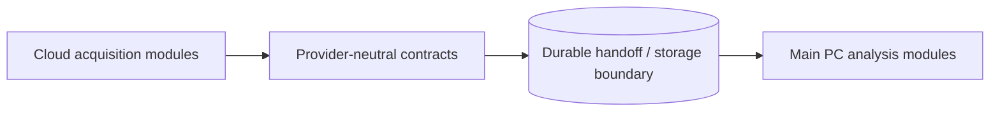

# Stock Monitoring Fact v0.1 — Design Decisions

Status: provisional, non-normative design decisions

This document records implementation-level decisions that do not change the four Code of Truth v0.1 specifications. Decisions are deliberately kept separate from normative product requirements so they can be revised without rewriting product semantics.

## DD-DEPLOY-001 — Cloud + Main PC initial deployment

Status: Accepted for initial v0.1 design; reversible

### Decision

Use a split deployment for the initial implementation:

- **Cloud** for acquisition-oriented workloads that benefit from availability and scheduled/event-triggered execution.
- **Main PC** for heavier numerical analysis, exploratory processing, bulk recomputation and locally accelerated/LLM-assisted work.

A dedicated always-on server is not required for initial v0.1.

### Rationale

The current market-data contract includes historical retrieval, so missing scheduled market-data coverage can be recovered through catch-up where the upstream provider retains the required history. This reduces the need to maintain an always-connected collector solely for OHLCV acquisition.

The design must still preserve event/retrieval timestamps for News, SEC and Official Signal records because historical market bars alone cannot reconstruct when external information was first observed by the system.

### Architecture rule

Deployment placement must not alter Core-facing contracts.

The same logical provider-neutral models must remain usable if Cloud execution is later replaced or supplemented by an always-on server.

### Cloud-preferred workloads

- scheduled acquisition,
- provider polling / API invocation,
- historical catch-up,
- incremental SEC / News / Official Signal retrieval,
- lightweight normalization,
- acquisition checkpoints,
- durable handoff.

### Main-PC-preferred workloads

- FFT,
- correlation analysis,
- exploratory analysis,
- bulk recomputation,
- locally accelerated event extraction / LLM processing,
- research and backtesting.

### Not decided by this decision

- cloud vendor,
- serverless vs container vs VM,
- database/storage engine,
- scheduler product,
- queue/event bus,
- VPN/private network arrangement,
- Main-PC invocation model,
- retry/backoff policy,
- exact polling frequency,
- storage replication / backup.

### Revisit triggers

Re-evaluate this decision if one or more of the following becomes required:

- sub-minute or continuous signal detection,
- permanent WebSocket/tick/quote collection,
- very low-latency notification,
- real-time order-flow analysis,
- automatic trading,
- provider data that cannot be recovered historically,
- cloud cost/limits make a dedicated server more economical,
- Main-PC availability becomes part of an operational SLO.

### Related design

- `HLD-SCH-001`
- `HLD-PROV-001`
- `HLD-MKT-001`
- `HLD-FFT-001`
- `DETAILED_DESIGN_CFG_PROVIDER_v0.1.md`

## DD-PRED-001 — Isolate Japan-to-U.S. prediction as a research extension

Status: Accepted for provisional design; reversible; not a v0.1 Definition-of-Done requirement

### Decision

- Keep Japanese predictor instruments in a separate versioned `PredictionInputRegistry`; do not add them to the fixed U.S. monitoring `UniverseSnapshot`.
- Keep U.S. target/label mappings in a separate versioned `PredictionTargetRegistry`.
- Reuse provider-neutral bar, calendar, provenance, completeness and durable-handoff semantics.
- Keep same-day desktop-only Japan sources behind a local adapter/bridge.
- Keep first model training, walk-forward evaluation and probabilistic inference on the Main PC.
- Persist outputs as Predictions and realized labels as Derived Metrics, never as observed Facts.

### Rationale

The Code of Truth fixes a U.S.-market monitoring Universe and says price prediction is not the primary purpose. A separate research boundary permits cross-market experimentation without changing current acquisition correctness, Universe semantics or v0.1 acceptance criteria.

The local bridge also preserves `DD-DEPLOY-001`: sources requiring Windows/Excel or a logged-in desktop process can publish provider-neutral snapshots while the Cloudflare Worker continues to own recoverable U.S. acquisition.

### Promotion boundary

Moving this extension into the normative Definition of Done requires an explicit Code of Truth change covering at least:

- approved Japanese predictor registry,
- approved U.S. target/label registry,
- required provider and availability behavior,
- output/evaluation requirements,
- acceptance thresholds.

### Related design

- `HLD-PRED-001`
- `PROVISIONAL_DESIGN_JP_US_PREDICTION_v0.1.md`

## Decision maintenance rule

A design decision may be replaced without changing Code of Truth when the replacement preserves externally required behavior. If changing a decision would alter a normative behavior or acceptance requirement, the Code of Truth must be reconsidered first.
