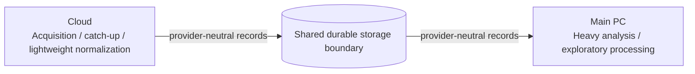
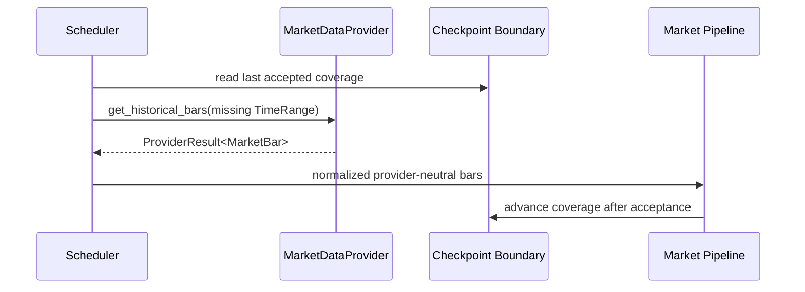

# Stock Monitoring Fact v0.1 — Detailed Design Slice 01

Status: provisional, non-normative detailed design derived from Code of Truth v0.1

Scope owners:

- `HLD-CFG-001` — Universe & Configuration Registry
- `HLD-PROV-001` — Provider Interface Layer

Primary requirement links:

- `REQ-UNI-001..010`
- `REQ-MD-001..007`
- `REQ-SRC-004..005`
- `REQ-SEC-001..006`
- `REQ-PROV-001..007`
- `REQ-SYS-005`
- `REQ-VER-001..003`

This document defines contracts and boundary models. It intentionally does not fix a programming language, framework, cloud vendor, database engine, message queue, or serialization technology.

If this document conflicts with a Code of Truth v0.1 document, the Code of Truth document is authoritative.

## 1. Design objectives

The first detailed-design slice has five objectives:

1. make Universe configuration independent of the provider implementation,
2. make provider adapters replaceable without Core changes,
3. keep vendor-specific schemas outside Core-facing boundaries,
4. make timestamps, identifiers, pagination/cursors and errors explicit,
5. allow Cloud collectors and Main-PC analysis to exchange the same provider-neutral models without changing domain contracts.

## 2. Deployment independence

The contracts in this document are logical boundaries, not process boundaries.

A module may run:

- in a Cloud scheduled job,
- in a Cloud long-running process,
- on the Main PC,
- in tests,
- in a future always-on server,

without changing the provider-neutral contract.

The provisional v0.1 deployment is:



The storage technology and transport are intentionally unresolved.

## 3. Contract layering

Provider-specific data must be converted before Core use.


Rules:

- Vendor field names must not leak into Core models.
- Authentication credentials must not appear in boundary records.
- HTTP status codes or vendor error codes may be preserved only inside adapter diagnostics, not as Core control flow.
- Provider adapters may expose capability metadata, but Core requirements must not depend on vendor marketing plans or plan names.

## 4. Common boundary primitives

### 4.1 Identifier primitives

#### InstrumentId

Stable internal identifier for an instrument.

Required semantics:

- independent of provider symbol format,
- immutable for the lifetime of the internal instrument record,
- one internal instrument may map to different provider symbols.

Minimum logical fields:

```text
InstrumentId
- value: opaque stable identifier
```

Ticker/symbol is not the primary identity.

#### ProviderId

Stable logical identifier for a provider adapter implementation.

Examples are illustrative only:

```text
alpaca
sec_edgar
future_vendor_x
```

#### SourceRef

Permanent source reference when available.

Minimum logical fields:

```text
SourceRef
- provider_id
- source_type
- external_id?       # stable upstream identifier if available
- canonical_url?     # durable URL if available
- accession?         # filing-specific when applicable
```

At least one durable locator must be present when the upstream source provides one.

### 4.2 Time primitives

All boundary timestamps entering Core must be timezone-aware.

Canonical rule:

- internal instant: UTC,
- market classification: `America/New_York`,
- display conversion: `Asia/Tokyo` outside provider adapters.

Use two concepts explicitly:

```text
EventTime     = when the upstream event/market observation occurred
RetrievedAt   = when this system obtained the record
```

Provider adapters must not overwrite EventTime with retrieval time.

When upstream time precision is limited, precision/quality metadata should be preserved instead of fabricating higher precision.

### 4.3 Cursor primitive

Incremental providers should expose an opaque continuation boundary.

```text
ProviderCursor
- provider_id
- stream_scope
- opaque_value
- observed_through?
```

Rules:

- Core must not parse `opaque_value`.
- A cursor must be scoped to the provider stream/query it belongs to.
- Cursor semantics must support replay/catch-up where the upstream API allows it.

### 4.4 Request window

```text
TimeRange
- start_inclusive
- end_exclusive
```

Use half-open intervals to reduce duplicate boundary ambiguity.

## 5. HLD-CFG-001 — Universe configuration contracts

### 5.1 Instrument

`Instrument` is the provider-neutral Universe record.

Minimum logical contract:

```text
Instrument
- instrument_id: InstrumentId
- symbol: string
- asset_type: enum
- enabled: boolean
- price_cadence: PriceCadence
- regime_tracking: boolean
- classifications: list<ClassificationRef>
- provider_mappings: list<ProviderSymbolMapping>
```

### 5.2 AssetType

Minimum v0.1 values:

```text
EQUITY
ETF
CRYPTO_PROXY_OR_DIRECT   # only where already present in the v0.1 Universe
```

This enum is a configuration classification, not a provider asset-class enum.

The precise treatment of directly referenced crypto symbols such as `BTCUSD` / `ETHUSD` remains subject to provider capability and must not distort the stock/ETF Core contract.

### 5.3 PriceCadence

Minimum v0.1 values:

```text
ONE_MINUTE
FIFTEEN_MINUTES
DAILY
```

The cadence is a desired acquisition/analysis cadence. It does not require a provider to expose exactly the same transport mode.

For example, a `FIFTEEN_MINUTES` instrument may be satisfied by native 15m bars or by a validated aggregation path if later design explicitly permits it.

No such aggregation fallback is mandated by this document.

### 5.4 ClassificationRef

```text
ClassificationRef
- kind
- value
```

`kind` must support at least:

```text
THEME
ROLE
CHARACTER
COUNTRY_PROXY
```

Regime membership is dynamic domain state and should not be treated as static configuration merely because the source specification describes many-to-many classification.

### 5.5 ProviderSymbolMapping

```text
ProviderSymbolMapping
- provider_id
- provider_symbol
- valid_from?
- valid_until?
- metadata?
```

Rules:

- Provider symbol mappings belong to configuration/boundary adaptation, not domain identity.
- Symbol renames must not require creation of a new InstrumentId unless the represented instrument itself changes.

### 5.6 UniverseSnapshot

The registry exposes the Universe as an immutable logical snapshot.

```text
UniverseSnapshot
- revision
- generated_at
- instruments: list<Instrument>
```

The storage format for `revision` is unresolved.

Consumer rule:

- acquisition/scheduling should operate against an explicit snapshot/revision,
- a run should be able to report which Universe revision it used.

This supports reproducibility without requiring hot reload.

### 5.7 UniverseRegistry contract

Logical operations:

```text
load_snapshot() -> UniverseSnapshot
get_instrument(InstrumentId) -> Instrument | NotFound
list_enabled() -> list<Instrument>
```

Optional future operation:

```text
resolve_symbol(provider_id, provider_symbol, at_time?) -> InstrumentId | NotFound | Ambiguous
```

The registry contract does not mandate YAML, JSON, SQL or another storage format.

## 6. Provider capability contract

Each provider adapter should expose capabilities separately from business data.

```text
ProviderCapabilities
- provider_id
- supported_record_types
- supported_asset_types
- supported_bar_intervals?
- supports_historical
- supports_latest
- supports_incremental
- supports_streaming
- supports_market_calendar
- max_history_hint?
- rate_limit_hint?
```

Capability fields are descriptive hints and may change by account/plan.

Core must not assume that capability metadata is static or contractual.

Commercial plan validation remains an operational/configuration concern under `REQ-PROV-007`.

## 7. Common provider result envelope

Provider calls return data plus provider-neutral execution metadata.

```text
ProviderResult<T>
- items: list<T>
- next_cursor?
- retrieved_at
- provider_id
- request_id?
- completeness: Completeness
- warnings: list<ProviderWarning>
```

### 7.1 Completeness

```text
COMPLETE
PARTIAL
UNKNOWN
```

A provider adapter must not silently present a known partial result as complete.

Examples:

- rate-limited page sequence stopped early → PARTIAL,
- upstream does not state completeness → UNKNOWN.

## 8. Provider error boundary

Errors are classified by recovery semantics rather than vendor code.

```text
ProviderError
- category
- provider_id
- operation
- retryable
- retry_after?
- message
- diagnostic_ref?
```

Minimum categories:

```text
AUTHENTICATION
AUTHORIZATION
RATE_LIMITED
TEMPORARY_UNAVAILABLE
TIMEOUT
INVALID_REQUEST
UNSUPPORTED_CAPABILITY
NOT_FOUND
UPSTREAM_DATA_INVALID
UPSTREAM_CONTRACT_CHANGED
CURSOR_INVALID
PARTIAL_RESULT
INTERNAL_ADAPTER_ERROR
```

Rules:

- Adapter diagnostics may retain vendor error codes separately.
- Core branches on `category` / `retryable`, not vendor-specific numbers.
- Retry/backoff scheduling policy is intentionally outside this slice.
- A parse/schema mismatch that suggests upstream API change must be distinguishable from ordinary invalid data.

## 9. MarketDataProvider contract

### 9.1 Logical operations

```text
get_historical_bars(
  instruments,
  interval,
  time_range
) -> ProviderResult<MarketBar>

get_latest_bars(
  instruments,
  interval
) -> ProviderResult<MarketBar>

get_market_calendar(
  market,
  date_range
) -> ProviderResult<MarketSessionCalendar>

get_capabilities() -> ProviderCapabilities
```

A streaming operation may be added by an adapter later, but v0.1 Core correctness must not require a streaming-only interface unless the Code of Truth changes.

### 9.2 MarketBar

```text
MarketBar
- instrument_id
- interval
- event_time
- open
- high
- low
- close
- volume
- trade_count?
- vwap?
- session_hint?
- source_ref?
```

Rules:

- OHLC prices must refer to one consistent interval.
- `event_time` meaning must be fixed by the internal contract (recommended: interval start).
- Adapter must normalize upstream timestamp to UTC.
- `trade_count`, `vwap`, `session_hint` are optional because not every provider/source guarantees them.
- Vendor exchange/feed metadata may be retained as optional provenance metadata outside the minimum Core contract.

### 9.3 BarInterval

Minimum values:

```text
1m
15m
1d
```

The internal representation must not use provider-specific interval tokens.

### 9.4 MarketSessionCalendar

```text
MarketSessionCalendar
- market
- session_date_local
- timezone
- regular_open?
- regular_close?
- is_trading_day
- is_shortened_session
- source_ref?
```

`session_date_local` is a market-local date, not a UTC date.

Premarket/after-hours boundaries may be represented later if required by the selected provider/calendar source; this contract only guarantees enough information to support the v0.1 regular/holiday/shortened-session rules.

## 10. NewsProvider contract

### 10.1 Logical operation

```text
get_news(
  instrument_ids?,
  time_range?,
  cursor?
) -> ProviderResult<NewsRecord>
```

At least one bounded retrieval mechanism must exist: time range, cursor, or another adapter-defined scope hidden behind the contract implementation.

### 10.2 NewsRecord

```text
NewsRecord
- article_id
- event_time          # published time
- retrieved_at
- headline
- publisher
- canonical_url
- instrument_ids
- body_access?
- source_ref
- source_hash?
```

### 10.3 Temporary body access

Raw body is intentionally separated from metadata.

```text
TemporaryContentRef
- content_ref
- expires_at?
- retention_class
```

The NewsProvider may return a `TemporaryContentRef` or equivalent temporary content handle rather than embedding a large raw body in the durable record.

This design allows `HLD-RET-001` to control deletion independently of the news provider adapter.

The exact physical storage and encryption of temporary content are unresolved.

## 11. FilingProvider contract

### 11.1 Logical operations

```text
get_filings(
  cik,
  form_types?,
  time_range?,
  cursor?
) -> ProviderResult<FilingRecord>

get_filing_document(source_ref) -> FilingDocument

get_xbrl_facts(source_ref) -> ProviderResult<XbrlFact>
```

### 11.2 FilingRecord

```text
FilingRecord
- cik
- accession_number
- form_type
- filed_at
- period_end?
- primary_document_ref?
- source_ref
- retrieved_at
```

`accession_number` is the primary SEC filing identity where applicable.

### 11.3 FilingDocument

```text
FilingDocument
- source_ref
- media_type?
- content_ref
- retrieved_at
- hash?
```

The boundary does not require the document body to be held in memory.

### 11.4 XbrlFact

```text
XbrlFact
- concept
- value
- unit?
- period_start?
- period_end?
- instant?
- dimensions
- filing_source_ref
```

Vendor- or library-specific XBRL object classes must not cross this boundary.

## 12. FundamentalProvider contract

### 12.1 Logical operation

```text
get_quarterly_segment_revenue(
  instrument_id,
  fiscal_period_range?
) -> ProviderResult<SegmentRevenueRecord>
```

### 12.2 SegmentRevenueRecord

```text
SegmentRevenueRecord
- instrument_id
- segment_id
- segment_name
- fiscal_year
- fiscal_quarter
- period_start?
- period_end
- revenue
- currency
- source_filing_ref
- extraction_method
- retrieved_at
```

### 12.3 Segment identity

`segment_id` is an internal stable identity when continuity can be established.

Segment rename / merge / split cannot be represented safely by name alone.

Future detailed design must define `SegmentIdentityHistory` before Revenue-based Regime implementation is considered complete.

### 12.4 ExtractionMethod

Minimum logical values reflecting the Code of Truth fallback sequence:

```text
COMPANY_FACTS
XBRL_DIMENSION
FILING_FALLBACK
```

The Fundamental Provider is responsible for reporting the method used; the Regime Engine should not infer it from raw source details.

## 13. OfficialSignalProvider contract

### 13.1 Logical operation

```text
get_signals(
  source_accounts?,
  time_range?,
  cursor?
) -> ProviderResult<OfficialSignalRecord>
```

### 13.2 OfficialSignalRecord

```text
OfficialSignalRecord
- signal_id
- source_actor_id
- source_account_id?
- event_time
- retrieved_at
- content_ref_or_text
- permanent_source_ref
- update_state?
- related_instrument_ids?
```

### 13.3 UpdateState

```text
ORIGINAL
UPDATED
DELETED
UNKNOWN
```

An upstream provider that cannot expose edits/deletions may return `UNKNOWN`; the adapter must not fabricate update state.

## 14. Provider-neutral provenance

All durable records derived from external data should be traceable to provider-neutral provenance.

```text
Provenance
- provider_id
- source_ref
- event_time
- retrieved_at
- raw_hash?
- adapter_version?
```

`adapter_version` is recommended for diagnostics/replay but is not a Code of Truth requirement.

## 15. Idempotency and duplicate boundaries

This slice does not choose a storage engine, but it defines candidate logical identities that later persistence design should use for idempotency.

Recommended identities:

```text
MarketBar:
  (instrument_id, interval, event_time, source/provider scope)

NewsRecord:
  (provider_id, article_id)

FilingRecord:
  (accession_number)

OfficialSignalRecord:
  (provider_id, signal_id)

SegmentRevenueRecord:
  (instrument_id, segment_id, fiscal period, source filing)
```

These are design defaults, not immutable product requirements. Provider behavior may require refinement.

Duplicate handling must occur without requiring Core to understand provider-specific IDs beyond the generic identity fields.

## 16. Catch-up / historical recovery boundary

To support Cloud scheduled execution without requiring continuous market-data connectivity, the market-data contract explicitly distinguishes historical retrieval from latest retrieval.

Logical recovery flow:



The checkpoint storage, overlap window, retry policy and maximum backfill horizon are unresolved and belong to the scheduler/market-data detailed-design slice.

## 17. Cloud + Main PC placement rule

Provisional v0.1 placement:

### Cloud-preferred responsibilities

- cadence/event trigger execution,
- provider API calls,
- historical catch-up,
- lightweight provider-neutral normalization,
- acquisition metadata / checkpoints,
- SEC/news/official-source incremental collection,
- durable handoff to shared storage.

### Main-PC-preferred responsibilities

- FFT and heavier numerical analysis,
- correlation analysis,
- exploratory/research processing,
- expensive event extraction where local compute is desired,
- bulk recomputation / backtests.

### Placement invariant

No Core-facing provider contract may depend on whether the caller is Cloud or Main PC.

A later move from Cloud to an always-on server should therefore change deployment/configuration, not provider-neutral domain contracts.

## 18. Security boundary

This slice defines only boundary ownership:

- provider credentials belong to provider adapter/runtime configuration,
- credentials must never be serialized into provider-neutral records,
- durable data exchange between Cloud and Main PC must not require sharing provider secrets with the Main PC unless the Main PC directly invokes that provider,
- source references and record provenance are not secrets by default, but the later deployment design must classify stored content and credentials separately.

Secret manager product and authentication scheme are unresolved.

## 19. Contract versioning

Each externally serialized provider-neutral model should eventually carry a schema/contract version at the envelope or transport boundary.

Recommended logical form:

```text
ContractEnvelope<T>
- contract_name
- contract_version
- payload: T
```

Versioning policy:

- additive optional fields should not require immediate consumer breakage,
- semantic reinterpretation of an existing field requires a contract-version change,
- vendor schema changes should be absorbed by the adapter whenever the internal contract semantics remain unchanged.

The concrete version format (integer, semver, date) is unresolved.

## 20. Test contracts

The first slice must be verifiable independently of concrete vendor choice.

### DLD-VER-001 — Universe load

Given a valid v0.1 configuration, `UniverseRegistry.load_snapshot()` yields approximately 100 configured instruments and preserves cadence/regime-tracking/classification metadata.

Links: `REQ-VER-001`.

### DLD-VER-002 — Provider substitution

Two conforming `MarketDataProvider` implementations producing equivalent boundary records can be substituted without changing Market Pipeline domain logic.

Links: `REQ-VER-003`.

### DLD-VER-003 — Timestamp normalization

Provider input timestamps representing the same instant in different source timezone formats normalize to the same UTC EventTime.

Links: `REQ-SYS-005`, `REQ-MD-006`.

### DLD-VER-004 — Partial-result visibility

A known incomplete upstream result is surfaced as `PARTIAL` or an explicit provider error and is never silently labeled complete.

### DLD-VER-005 — Vendor-schema containment

Core-facing test fixtures contain no vendor-required payload fields that are not represented by the provider-neutral contract.

### DLD-VER-006 — Historical catch-up

A caller can request an explicit historical TimeRange independently from `get_latest_bars`, allowing a later scheduler to recover missing coverage.

Links: `REQ-MD-004`.

## 21. Decisions intentionally deferred

The following remain outside this slice so they can change without destabilizing the contracts above:

- implementation language,
- sync vs async language API shape,
- HTTP client library,
- serialization format,
- configuration file format,
- database/storage engine,
- Cloud vendor,
- scheduler product,
- queue/event bus,
- retry/backoff policy,
- rate-limit coordination,
- overlap/backfill window,
- cache implementation,
- encryption product,
- secret manager,
- detailed authentication/authorization,
- FFT implementation,
- event-extraction model,
- Fact Store physical schema.

## 22. Handoff to next detailed-design slice

Recommended next slice:

`HLD-SCH-001 + HLD-MKT-001`

It should define:

- acquisition job/request contract,
- coverage checkpoint model,
- catch-up overlap semantics,
- cadence evaluation,
- market-session normalization,
- shortened-session behavior,
- idempotent MarketBar acceptance,
- Cloud scheduling responsibilities,
- failure/retry boundaries without coupling them to one cloud scheduler.

After that, `HLD-MKT-001 + HLD-FFT-001` can define numerical analysis contracts independently of acquisition runtime.