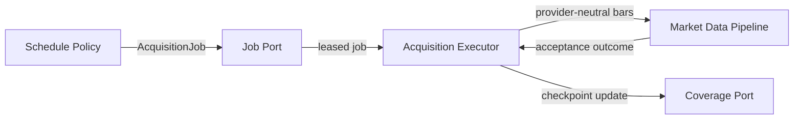
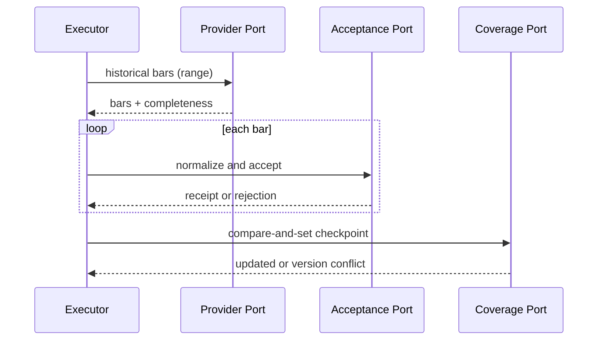

# Stock Monitoring Fact v0.1 — Detailed Design Slice 02

Status: provisional, non-normative detailed design derived from Code of Truth v0.1

Scope owners:

- `HLD-SCH-001` — Acquisition Scheduler / Trigger Boundary
- `HLD-MKT-001` — Market Data Pipeline

Primary requirement links:

- `REQ-SYS-004..005`
- `REQ-UNI-002`, `REQ-UNI-006..008`
- `REQ-MD-001..006`
- `REQ-CAL-001..005`
- `REQ-PROV-001`
- `REQ-VER-002..003`

This document defines logical contracts, state transitions and acceptance rules. It intentionally does not fix a programming language, scheduler product, cloud vendor, process topology, queue, database, serialization format, provider, retry library or deployment unit.

If this document conflicts with a Code of Truth v0.1 document, the Code of Truth document is authoritative.

## 1. Design objectives

This slice has eight objectives:

1. represent acquisition work independently from the scheduler that triggers it,
2. make coverage and recovery explicit rather than inferring success from job completion,
3. recover missed history using deterministic overlap semantics,
4. evaluate cadence against a fixed Universe snapshot and market calendar,
5. normalize market sessions without inventing bars for closed periods,
6. make repeated or overlapping delivery safe through idempotent acceptance,
7. separate retryable provider/runtime failures from terminal data or contract failures,
8. preserve the Cloud + Main-PC deployment decision without embedding placement in Core-facing contracts.

## 2. Boundary decomposition



The arrows express logical calls or messages, not a mandated network transport.

Module ownership:

| Module contract | Owns | Must not own |
|---|---|---|
| `SchedulePolicy` | determining due work from configuration, calendar and checkpoints | provider calls, storage writes, vendor rate limits |
| `AcquisitionJobPort` | durable or in-memory handoff, leasing and delivery | cadence calculation, bar validation |
| `AcquisitionExecutor` | executing one job through provider and pipeline ports | cron syntax, provider schema parsing, physical persistence |
| `MarketDataAcceptancePort` | session normalization, validation, idempotent acceptance outcome | retry timing, provider authentication |
| `CoverageCheckpointPort` | compare-and-set/read of logical coverage state | deciding what should be scheduled |
| `NormalizedBarStore` | atomic insert/match/conflict semantics | provider selection, job leasing |

## 3. Common time and interval rules

- All instants crossing module boundaries are timezone-aware UTC.
- Market-date and session classification use `America/New_York` and are stored separately from UTC instants.
- Display conversion to `Asia/Tokyo` is outside acquisition and acceptance.
- Request and coverage windows use half-open intervals `[start_inclusive, end_exclusive)`.
- A bar is identified by its opening instant. Its logical covered interval is `[bar_start, bar_end)`.
- The expected bar grid comes from the normalized market calendar plus interval and session scope; wall-clock division alone is insufficient.
- Daylight-saving changes are handled by timezone/calendar data. Fixed UTC offsets must not be embedded in scheduling or normalization.

## 4. Acquisition job contract

### 4.1 AcquisitionJob

```text
AcquisitionJob
- job_id: opaque stable identifier
- job_kind: MARKET_BARS | MARKET_CALENDAR
- created_at: UTC instant
- universe_revision: opaque revision
- instruments: list<InstrumentId>
- interval: ONE_MINUTE | FIFTEEN_MINUTES | DAILY
- requested_range: TimeRange
- session_scope: REGULAR | EXTENDED | ALL_TRADING
- mode: INCREMENTAL | CATCH_UP | RECONCILE
- provider_route: logical route/capability selector
- checkpoint_expectations: list<CheckpointExpectation>
- attempt: non-negative integer
- not_before?: UTC instant
- deadline?: UTC instant
- correlation_id?: opaque identifier
```

Rules:

- `job_id` identifies one logical work item and is stable across transport redelivery.
- A retry of the same logical job retains `job_id` and increments `attempt`.
- A newly planned catch-up/reconcile window receives a new `job_id`, even if its range overlaps older work.
- `provider_route` selects a logical capability; it must not expose credentials, HTTP endpoints or vendor payload fields.
- `universe_revision` makes the instrument/cadence decision reproducible.
- A job may contain multiple instruments only when the selected provider route and execution limits support the batch. Splitting must preserve each instrument's requested range and checkpoint expectation.
- The scheduler may enqueue duplicate jobs. Correctness depends on acceptance/checkpoint idempotency, not exactly-once delivery.

### 4.2 CheckpointExpectation

```text
CheckpointExpectation
- coverage_key: CoverageKey
- expected_version?: opaque version
- observed_complete_through?: UTC instant
```

This supports optimistic concurrency. A stale job may still submit bars, but it must not move a checkpoint backward or overwrite newer coverage state.

### 4.3 AcquisitionJobPort

```text
submit(job) -> SubmitOutcome
lease(worker_id, capabilities, now) -> JobLease | None
ack(lease_id, outcome_ref) -> AckOutcome
release(lease_id, disposition, not_before?) -> ReleaseOutcome
```

Required semantics:

- delivery is at-least-once,
- lease expiry makes an unacknowledged job eligible for redelivery,
- `ack` and `release` are idempotent for the same lease/disposition,
- transport poison/dead-letter behavior is exposed through a failure disposition rather than assumed from a queue product.

## 5. Coverage checkpoint contract

### 5.1 CoverageKey

```text
CoverageKey
- instrument_id
- interval
- session_scope
- logical_data_variant
```

`logical_data_variant` distinguishes incompatible adjusted/unadjusted or feed variants without encoding a vendor name. The concrete variants remain configuration/provider-capability concerns.

### 5.2 CoverageCheckpoint

```text
CoverageCheckpoint
- coverage_key: CoverageKey
- complete_through: UTC instant
- verified_range?: TimeRange
- state: COMPLETE | PARTIAL | UNKNOWN | BLOCKED
- missing_ranges: list<TimeRange>
- last_success_at?: UTC instant
- last_attempt_at?: UTC instant
- source_observed_through?: UTC instant
- universe_revision?: opaque revision
- version: opaque monotonic version
- blocker?: FailureSummary
```

Semantics:

- `complete_through` is the exclusive end of the largest contiguous accepted prefix on the expected trading grid.
- It advances only after all expected bars before the candidate instant are accepted or explicitly classified as not expected by the authoritative calendar/session scope.
- Later accepted bars beyond a gap may reduce `missing_ranges` but do not jump `complete_through` across that gap.
- `COMPLETE` means the evaluated requested range has no unresolved expected gaps and the upstream result was not known partial.
- `PARTIAL` means some useful data was accepted but expected coverage remains missing or the upstream marked the response partial.
- `UNKNOWN` means completeness cannot currently be proven.
- `BLOCKED` means automatic progress is stopped pending configuration, authorization, capability, contract or operator action.
- Empty provider results never prove a trading window complete unless the calendar says no bars were expected or the provider supplies an equivalent authoritative completeness indication accepted by the adapter.

### 5.3 CoverageCheckpointPort

```text
get(coverage_key) -> CoverageCheckpoint | None
list_due(scope, now) -> list<CoverageCheckpoint>
compare_and_set(expected_version, proposed_checkpoint) -> Updated | VersionConflict
record_attempt(coverage_key, attempt_summary) -> Recorded
```

Checkpoint writes and bar-store writes need not share one database, but the system must not claim coverage that cannot be traced to accepted bars. An implementation may provide atomic commit or use a recoverable acceptance receipt/reconciliation path.

## 6. Planning and cadence evaluation

### 6.1 SchedulePolicy

```text
plan(
  universe_snapshot,
  calendar_snapshot,
  checkpoints,
  now
) -> list<AcquisitionJob>
```

Inputs and output are deterministic for the same logical snapshots and time.

Cadence rules:

- `ONE_MINUTE` instruments are evaluated on the one-minute expected grid within the configured session scope.
- `FIFTEEN_MINUTES` instruments are evaluated on a 15-minute market-session-aligned grid, not on arbitrary worker wake-up time.
- `DAILY` instruments become due only after the applicable session is complete and the daily bar is expected to be final under provider capability/configuration.
- A scheduler wake-up is an opportunity to evaluate due work; it is not proof that a bar exists or is final.
- Closed, weekend and holiday periods create no intraday jobs.
- A shortened session produces jobs only for its actual trading intervals.
- Premarket and after-hours are planned separately from Regular when the configured `session_scope` includes them; their bars are never relabeled Regular.

The exact wake-up frequency, close/finality delay and batch size are replaceable policy/configuration values. They are not embedded in the job or provider contracts.

### 6.2 Calendar authority

The planner and normalizer consume a versioned logical calendar snapshot:

```text
MarketCalendarSnapshot
- market
- date_range
- sessions: list<NormalizedMarketSession>
- generated_at
- source_ref?
- revision
```

If the calendar is unavailable or contradictory, intraday work for affected dates becomes `UNKNOWN` or `BLOCKED`; the system must not synthesize a normal session from a weekday rule.

## 7. Catch-up and overlap semantics

### 7.1 Planning rule

For a checkpoint with contiguous coverage ending at `complete_through`, the default catch-up request is:

```text
requested_start = max(retention_floor, complete_through - overlap_duration)
requested_end   = latest_finalizable_boundary(now, interval, session_scope, calendar)
```

The interval-specific `overlap_duration` is configuration owned by catch-up policy. It must be at least one expected bar interval unless the provider guarantees immutable historical bars and a design decision explicitly allows zero.

This slice intentionally does not choose numerical overlap durations. The reason for overlap is semantic: tolerate boundary ambiguity, delayed publication and provider correction while remaining safe under idempotent acceptance.

### 7.2 Gap priority

Planning order:

1. unresolved explicit `missing_ranges` within provider retention,
2. overlap from the contiguous checkpoint boundary,
3. forward coverage up to the finalizable boundary,
4. optional older reconciliation windows.

A request range may be split for provider limits. Splits remain half-open and may deliberately overlap by the configured amount.

### 7.3 Provider retention and irrecoverable gaps

- The planner clamps requests to known capability/retention limits.
- A gap outside recoverable history is recorded, not silently dropped.
- Such a gap becomes `BLOCKED` or a permanent `PARTIAL` state with an explicit `DATA_UNAVAILABLE` failure summary, according to operational policy.
- Switching providers is an adapter/routing decision; it does not change coverage keys unless the logical data variant changes.

## 8. Market session normalization

### 8.1 NormalizedMarketSession

```text
NormalizedMarketSession
- market_date: local date in America/New_York
- session_kind: PREMARKET | REGULAR | AFTER_HOURS
- opens_at: UTC instant
- closes_at: UTC instant
- session_length
- is_shortened: boolean
- calendar_revision
```

Rules:

- `opens_at < closes_at` and the session interval is half-open.
- Classification uses the bar's logical interval against the calendar session, not provider labels alone.
- A bar straddling incompatible session boundaries is rejected unless an explicitly supported interval definition explains the boundary.
- Holidays and weekends have no intraday `NormalizedMarketSession`; no synthetic bars or interpolation are accepted for them.
- A shortened Regular session has `is_shortened = true`; accepted observations remain distinguishable from normal-session baselines.
- Daily-or-longer consumers preserve elapsed weekend/holiday gaps as calendar context while trading-day windows count actual trading sessions.

### 8.2 SessionNormalizer

```text
normalize(bar, calendar_snapshot, expected_interval, session_scope)
  -> NormalizedMarketBar | BarRejection
```

Normalization must preserve original provider-neutral source fields needed for provenance, including provider, retrieval time and source observation time. It must not fabricate price or volume values.

## 9. Idempotent bar acceptance

### 9.1 Canonical identity

```text
BarIdentity
- instrument_id
- interval
- bar_start_utc
- session_kind
- logical_data_variant
```

Provider ID and job ID are provenance, not part of canonical identity. This allows provider replacement and overlapping jobs without duplicating the same logical bar.

### 9.2 Canonical content fingerprint

The canonical fingerprint covers normalized semantic content:

```text
open, high, low, close, volume,
optional supported trade/count/vwap fields,
bar_end_utc, market_date, session_kind,
logical_data_variant
```

Serialization-specific formatting and retrieval metadata are excluded. Decimal/number normalization must be deterministic and must not use lossy rounding beyond the accepted boundary schema.

### 9.3 Acceptance outcomes

```text
BarAcceptanceResult
- identity
- outcome: INSERTED | MATCHED | CORRECTED | CONFLICT | REJECTED
- stored_version?
- acceptance_receipt?
- rejection_or_conflict_reason?
- provenance_appended: boolean
```

Rules:

- No existing identity: validate and atomically `INSERTED`.
- Same identity and same canonical fingerprint: `MATCHED`; append/merge provenance idempotently.
- Same identity and different content: never silently overwrite.
- `CORRECTED` is allowed only when an explicit correction policy can order/reconcile revisions and retains prior content/provenance.
- Otherwise return `CONFLICT`, preserve both observations in a quarantine/reconciliation boundary, and do not advance contiguous coverage through the conflicted bar.
- Invalid OHLC relationships, negative volume, impossible time bounds, wrong instrument mapping or session mismatch return `REJECTED`.
- Re-delivery of the same acceptance request returns an equivalent terminal result.

### 9.4 NormalizedBarStore contract

```text
accept(normalized_bar, provenance, idempotency_key) -> BarAcceptanceResult
get(identity) -> StoredBar | None
list(range, coverage_key) -> list<StoredBar>
```

The physical database, unique-index design, transaction mechanism and correction-history representation remain adapter choices.

## 10. Execution and commit protocol

For each job, the executor performs:

1. validate lease, job shape, Universe revision availability and provider capability,
2. obtain the calendar snapshot required for planning/normalization,
3. call the provider through `MarketDataProvider`,
4. normalize and accept each returned bar,
5. derive coverage evidence from acceptance receipts plus provider completeness,
6. compare-and-set the checkpoint without moving it backward,
7. acknowledge or release the job with a structured outcome.



A checkpoint version conflict is not data loss. The executor reloads the checkpoint, recomputes the monotonic proposal from durable acceptance evidence, and either commits or reports a retryable coordination failure.

## 11. Retry and failure boundaries

### 11.1 FailureDisposition

```text
FailureDisposition
- category
- scope: ITEM | PAGE | JOB | ROUTE | CONFIGURATION
- retry_class: IMMEDIATE | DEFERRED | AFTER_HINT | DO_NOT_RETRY | MANUAL_ACTION
- retry_after?
- consumed_attempt: boolean
- safe_to_split: boolean
- diagnostic_ref?
```

The adapter supplies provider-neutral `ProviderError`; execution policy maps it to a disposition. The queue/scheduler only enforces the returned disposition.

### 11.2 Default category boundaries

| Failure category | Default boundary | Default disposition |
|---|---|---|
| `RATE_LIMITED` | route/job | `AFTER_HINT`, otherwise deferred |
| `TIMEOUT`, `TEMPORARY_UNAVAILABLE` | page/job | deferred retry; safe repetition required |
| `PARTIAL_RESULT` | page/job | accept valid items, retain missing coverage, catch up |
| `AUTHENTICATION`, `AUTHORIZATION` | route/configuration | manual action; block affected route |
| `INVALID_REQUEST` | job/configuration | do not retry unchanged request |
| `UNSUPPORTED_CAPABILITY` | route/job | reroute or manual configuration; no blind retry |
| `CURSOR_INVALID` | stream/job | rebuild from explicit TimeRange when supported |
| `UPSTREAM_DATA_INVALID` | item/page | quarantine affected data; retry only if correction is plausible |
| `UPSTREAM_CONTRACT_CHANGED` | route | block adapter route and alert; no blind retry |
| `INTERNAL_ADAPTER_ERROR` | job/route | bounded deferred retry, then manual action |
| acceptance `CONFLICT` | item/coverage | quarantine/reconcile; do not advance through conflict |
| checkpoint version conflict | job | reload and retry coordination without re-fetch when receipts exist |
| storage unavailable | job | deferred retry; do not acknowledge success or advance coverage |

These are contract defaults, not numerical retry counts or backoff durations.

### 11.3 Retry budget boundary

```text
RetryPolicy
- classify(failure, job_context) -> FailureDisposition
- next_attempt(disposition, attempt_history, now) -> RetryDecision
```

`RetryDecision` is one of `RETRY_AT`, `SPLIT_AND_RETRY`, `REROUTE`, `PARK`, or `FAIL_TERMINAL`.

The policy implementation owns attempt budgets, delay/jitter and escalation thresholds. It must not alter bar identity, requested coverage semantics or provider-neutral error categories.

### 11.4 Failure invariants

- No failure path may advance coverage beyond durably accepted, non-conflicted bars.
- A partially successful retry may reuse existing accepted bars and request only remaining/overlap ranges.
- Job acknowledgement means execution outcome is durably recorded, not necessarily that requested coverage is complete.
- Terminal job failure does not delete accepted bars or checkpoint history.
- Diagnostic payloads must not expose credentials.

## 12. Deployment independence

The initial placement remains Cloud acquisition plus Main-PC heavy analysis:

- Cloud-preferred: schedule evaluation, job handoff, provider calls, catch-up, lightweight normalization, acceptance/checkpoint writes and durable handoff.
- Main-PC-preferred: FFT, correlation, exploratory analysis and bulk recomputation.

Replacement rule:

- moving scheduling/execution to a VM, serverless function, container, local process or always-on server changes adapters/deployment wiring only,
- changing a queue changes `AcquisitionJobPort`,
- changing a database changes checkpoint/bar-store adapters,
- changing a provider changes `MarketDataProvider` and provider routing,
- none of these changes may require alteration of canonical job, coverage, calendar or bar-acceptance semantics.

The Main PC is not part of acquisition success or coverage SLO unless a later design decision explicitly makes it so.

## 13. Observability contract

```text
AcquisitionOutcome
- job_id
- attempt
- requested_range
- provider_route
- received_count
- inserted_count
- matched_count
- corrected_count
- conflict_count
- rejected_count
- completeness
- checkpoint_before?
- checkpoint_after?
- disposition
- started_at
- finished_at
- diagnostic_ref?
```

Minimum observable evidence:

- which Universe and calendar revisions were used,
- why a job became due,
- requested versus accepted coverage,
- checkpoint movement or non-movement,
- retry classification and next disposition,
- conflicts/rejections without secret-bearing payloads.

No logging, metrics or tracing product is mandated.

## 14. Contract verification scenarios

### DLD-SCH-MKT-VER-001 — Cadence planning

Given one enabled instrument at each v0.1 cadence and a calendar snapshot, planning emits only due 1m, 15m and daily ranges and records the Universe revision.

Links: `REQ-UNI-006..008`, `REQ-MD-003`, `REQ-VER-002`.

### DLD-SCH-MKT-VER-002 — Closed and shortened sessions

Holiday/weekend input emits no intraday expected bars. A shortened session ends at its calendar close and is marked shortened.

Links: `REQ-CAL-002..005`.

### DLD-SCH-MKT-VER-003 — Timezone normalization

Provider-neutral bars representing the same instant normalize to the same UTC identity across DST boundaries, with New York market date/session stored separately.

Links: `REQ-SYS-005`, `REQ-MD-006`.

### DLD-SCH-MKT-VER-004 — Overlap replay

Replaying an overlapping historical range produces `MATCHED` outcomes for identical bars, no duplicates, and no checkpoint regression.

Links: `REQ-MD-004`, `REQ-VER-002`.

### DLD-SCH-MKT-VER-005 — Gap-safe checkpoint

Accepting bars after an unresolved expected gap does not advance `complete_through` across the gap.

### DLD-SCH-MKT-VER-006 — Conflicting duplicate

The same `BarIdentity` with different canonical content produces `CONFLICT` or an auditable `CORRECTED` revision and never silently overwrites.

### DLD-SCH-MKT-VER-007 — At-least-once delivery

Redelivery of the same job and acceptance keys is safe and produces equivalent stored data/checkpoint state.

### DLD-SCH-MKT-VER-008 — Partial provider result

Valid bars from a `PARTIAL` result are accepted, unresolved coverage remains visible and catch-up work is eligible for replanning.

### DLD-SCH-MKT-VER-009 — Replaceable adapters

Scheduler, job transport, provider, checkpoint store and bar-store test doubles can be substituted independently without changing domain contract fixtures.

Links: `REQ-MD-001`, `REQ-PROV-001`, `REQ-VER-003`.

### DLD-SCH-MKT-VER-010 — Failure safety

Authentication, rate-limit, timeout, contract-change, conflict and storage failures map to distinct dispositions and none advance unproven coverage.

## 15. Decisions intentionally deferred

- scheduler/trigger product and wake-up frequency,
- queue/lease implementation,
- worker concurrency and batch size,
- storage engine, schema and transaction mechanism,
- provider routing/failover policy,
- numerical overlap duration per interval,
- close/finality delay per provider/interval,
- retry counts, backoff, jitter and escalation timing,
- correction/revision precedence policy,
- logical adjusted/unadjusted/feed variants,
- calendar source precedence and reconciliation,
- acquisition operational SLOs,
- serialization and API protocol,
- Cloud vendor and concrete deployment units.

These remain replaceable policy or adapter decisions. A later decision must preserve the invariants in this document or explicitly revisit the affected design.

## 16. Handoff to next detailed-design slice

Recommended next slice:

`HLD-MKT-001 + HLD-FFT-001`

It should define analysis-ready series contracts, missing/irregular interval validation, trading-day windows, log-return preprocessing, auxiliary features, FFT output models and the boundary between Market Fact and Derived Metric without reopening acquisition runtime choices.
