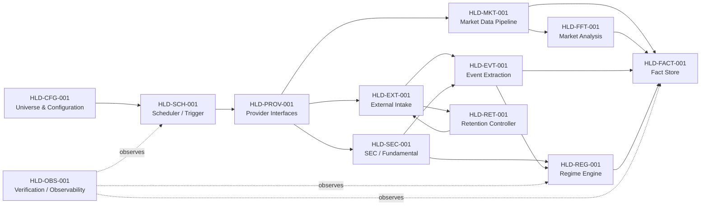
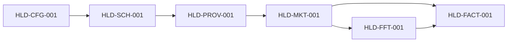
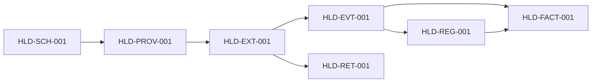
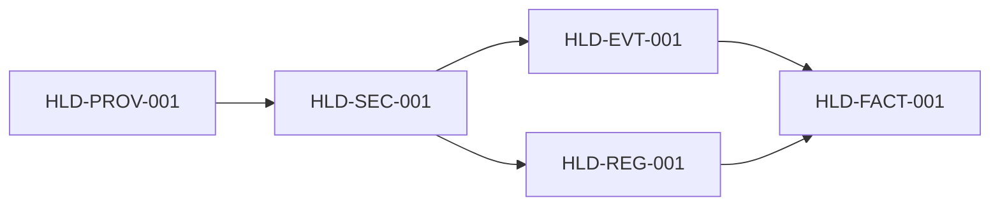

# Stock Monitoring Fact v0.1 — High-Level Design

Status: provisional, non-normative design derived from Code of Truth v0.1

## 1. Purpose

This document proposes the high-level component boundaries that realize the requirements in `REQUIREMENTS_TRACEABILITY_v0.1.md`.

It does not change the four Code of Truth v0.1 documents. Where a design choice is not fixed by the Code of Truth, it is marked as provisional or unresolved rather than silently promoted to a requirement.

## 2. Design goals

The high-level design preserves these constraints:

- Core domain behavior is independent of vendor-specific schemas.
- Fact / Derived Metric / Interpretation / Prediction remain distinct.
- Market, corporate, filing, official-signal and Regime information can converge on a common Fact representation.
- Regime history is append-oriented and reconstructable.
- Raw news body retention is minimized and bounded.
- Time handling is explicit: UTC internally, New York for market classification, Tokyo for display.
- Fixed v0.1 Universe and per-instrument cadence remain configuration concerns rather than provider concerns.
- Provisional prediction research remains separated from observed Facts and from the fixed monitoring Universe.

## 3. High-level component IDs

| ID | Component / boundary | Primary responsibility |
|---|---|---|
| HLD-CFG-001 | Universe & Configuration Registry | Load fixed Universe, cadence, themes, roles, Regime-tracking flags and system configuration |
| HLD-SCH-001 | Acquisition Scheduler / Trigger Boundary | Initiate cadence-based and event-driven acquisition without embedding provider-specific API logic |
| HLD-PROV-001 | Provider Interface Layer | Expose MarketData / News / Filing / Fundamental / OfficialSignal contracts to Core |
| HLD-MKT-001 | Market Data Pipeline | Normalize bars/calendar/session data and prepare market observations for analysis |
| HLD-FFT-001 | Market Analysis Pipeline | Execute defined preprocessing and FFT windows; emit derived metrics rather than Facts when appropriate |
| HLD-EXT-001 | External Information Intake | Accept news / official / filing-derived external information and retain temporary raw payload only as allowed |
| HLD-EVT-001 | Event Extraction & Corporate Fact Builder | Convert external information into normalized corporate/policy Facts and evidence candidates |
| HLD-SEC-001 | SEC / Fundamental Pipeline | Detect filings, extract XBRL / segment revenue and preserve filing provenance |
| HLD-REG-001 | Regime Engine | Maintain Provisional / Revenue-based Regime state, strength, confidence, decay, negative evidence and reactivation |
| HLD-FACT-001 | Fact Store Boundary | Persist common Facts and immutable/reconstructable Regime history |
| HLD-RET-001 | Retention Controller | Enforce raw-news deletion / exception-retention rules |
| HLD-OBS-001 | Verification / Observability Boundary | Provide evidence needed to demonstrate Definition-of-Done behavior without defining a specific monitoring stack |
| HLD-PRED-001 | Prediction Research Pipeline | Build versioned as-of snapshots, target windows, labels and probabilistic Prediction records without changing observed Facts or the fixed monitoring Universe |

These IDs define architectural responsibility, not necessarily one process, service, package, table or deployment unit each.

## 4. System context

The arrows express responsibility flow, not a mandated runtime transport.

## 5. Component responsibilities

### 5.1 HLD-CFG-001 — Universe & Configuration Registry

Responsibilities:

- represent the fixed v0.1 instrument Universe,
- preserve Tier A / B / C cadence assignment,
- represent asset type, theme / role / character and Regime-tracking flags,
- expose configuration to scheduling and domain processing.

Requirement coverage:

`REQ-UNI-001..010`, `REQ-SYS-003`

Not fixed here:

- configuration file format,
- database vs static-file representation,
- configuration hot reload.

### 5.2 HLD-SCH-001 — Acquisition Scheduler / Trigger Boundary

Responsibilities:

- trigger 1m / 15m / 1d market-data acquisition according to instrument configuration,
- represent work as provider-neutral acquisition jobs,
- plan historical catch-up from explicit coverage checkpoints and overlap policy,
- accept event-driven triggers for News / SEC / Official Signals,
- keep triggering, job transport and retry policy independent from vendor adapter internals.

Requirement coverage:

`REQ-SYS-004`, `REQ-UNI-006..008`, `REQ-MD-003`, `REQ-VER-002`

Not fixed here:

- cron vs queue vs long-running worker,
- polling intervals for event-driven providers,
- retry/backoff policy,
- distributed scheduling.

### 5.3 HLD-PROV-001 — Provider Interface Layer

Responsibilities:

- define stable Core-facing provider contracts,
- isolate Alpaca / Tiingo / SEC / X / future vendor schemas,
- normalize provider output into internal boundary models before domain processing.

Required contracts:

- `MarketDataProvider`
- `NewsProvider`
- `FilingProvider`
- `FundamentalProvider`
- `OfficialSignalProvider`

Requirement coverage:

`REQ-MD-001..007`, `REQ-PROV-001..007`, `REQ-SRC-004..005`, `REQ-SEC-001..006`

### 5.4 HLD-MKT-001 — Market Data Pipeline

Responsibilities:

- accept OHLCV and market calendar information through provider contracts,
- normalize timestamps to UTC,
- classify Regular / Premarket / After-hours using New York market time,
- preserve holiday/weekend gaps rather than synthesizing intraday data,
- distinguish shortened sessions from normal-session baselines,
- idempotently accept repeated/overlapping bars and surface corrections or conflicts,
- advance coverage only through durably accepted contiguous expected bars,
- emit normalized market observations / Facts to downstream processing.

Requirement coverage:

`REQ-MD-002..006`, `REQ-CAL-001..005`, `REQ-SYS-005`

### 5.5 HLD-FFT-001 — Market Analysis Pipeline

Responsibilities:

- create 1 / 7 / 20 / 60 trading-day analysis windows,
- perform the specified FFT preprocessing sequence,
- use log return as primary input,
- support auxiliary close / volatility / volume features,
- represent frequency bands by period/frequency rather than price-change percentage,
- keep amplitude-derived features distinct from frequency-band definitions.

Requirement coverage:

`REQ-FFT-001..006`, `REQ-VER-012`

Not fixed here:

- exact Low / Mid / High boundaries,
- exact numerical library,
- storage schema for spectra / derived metrics,
- alert thresholds.

### 5.6 HLD-EXT-001 — External Information Intake

Responsibilities:

- accept News and Official Signal provider records,
- preserve source metadata and retrieval timestamps,
- hand temporary raw body/content to event extraction,
- cooperate with the Retention Controller for deletion/exception handling.

Requirement coverage:

`REQ-INT-001`, `REQ-SRC-001..005`, `REQ-PROV-003`, `REQ-PROV-006`, `REQ-RET-001..004`

### 5.7 HLD-EVT-001 — Event Extraction & Corporate Fact Builder

Responsibilities:

- convert external information into normalized events / Corporate Facts,
- distinguish policy statement from policy implementation,
- emit evidence suitable for Regime evaluation,
- preserve source provenance needed for later verification,
- create event types defined by the Fact model when supported by evidence.

Requirement coverage:

`REQ-INT-001..003`, `REQ-FACT-001..003`, portions of `REQ-REG-*` that consume Evidence

Not fixed here:

- extraction model,
- deterministic vs LLM extraction,
- confidence-calibration method,
- deduplication strategy,
- contradiction-resolution algorithm.

### 5.8 HLD-SEC-001 — SEC / Fundamental Pipeline

Responsibilities:

- incrementally detect SEC EDGAR filings by CIK,
- preserve accession, form type, document and XBRL provenance,
- attempt segment-revenue extraction in the defined fallback order,
- maintain segment identity/history needed by Revenue-based Regime calculations.

Extraction order:

`Company Facts → XBRL Dimension → Filing Fallback`

Requirement coverage:

`REQ-SEC-001..006`, `REQ-VER-004..006`

### 5.9 HLD-REG-001 — Regime Engine

Responsibilities:

- allow multiple Regimes per company,
- maintain `PROVISIONAL` and `REVENUE_BASED` strength types,
- apply evidence-based Provisional strength levels,
- calculate MA4, Revenue Strength and Revenue Share,
- preserve Confidence separately,
- apply one-year `×0.5` decay only to Provisional Regimes,
- process contract state, negative evidence and reactivation,
- produce `COMPANY_REGIME_CHANGE` Facts,
- preserve full historical state transitions.

Requirement coverage:

`REQ-REG-001..026`, `REQ-VER-006..010`, `REQ-VER-014`

### 5.10 HLD-FACT-001 — Fact Store Boundary

Responsibilities:

- provide a common persistence boundary for Market / Corporate / Policy Facts,
- preserve Fact / Derived Metric / Interpretation / Prediction distinction,
- preserve provenance and timestamps required by source domains,
- support reconstruction of Regime history.

Requirement coverage:

`REQ-FACT-001..003`, `REQ-REG-020`, `REQ-REG-026`, `REQ-VER-013..014`

Not fixed here:

- SQL / document / event-store technology,
- physical schema,
- indexing strategy,
- retention for non-news data,
- query API.

### 5.11 HLD-RET-001 — Retention Controller

Responsibilities:

- delete successfully processed raw news body content under normal conditions,
- preserve only specified metadata and extracted Facts,
- allow temporary retention for documented exceptions,
- enforce the 30-day maximum for exceptional raw-body retention.

Requirement coverage:

`REQ-RET-001..004`, `REQ-VER-011`

### 5.12 HLD-OBS-001 — Verification / Observability Boundary

Responsibilities:

- expose enough execution evidence to demonstrate the v0.1 Definition of Done,
- make acquisition cadence, provider substitution, filing detection, extraction, Regime transitions, retention and history reconstruction testable,
- avoid prescribing a specific logging/metrics stack at this layer.

Requirement coverage:

`REQ-VER-001..014`

### 5.13 HLD-PRED-001 — Prediction Research Pipeline

Status: provisional extension; not part of the current v0.1 Definition of Done.

Responsibilities:

- consume versioned, provider-neutral input snapshots without look-ahead leakage,
- keep predictor instruments outside the fixed monitoring `UniverseSnapshot`,
- define U.S. Premarket/Regular target windows and robust price anchors,
- materialize realized labels separately from Predictions,
- emit probabilistic direction, expected return, predicted volatility and distribution ranges,
- record model, feature, registry, label-policy, calendar and provider-data revisions,
- expose quality/as-of information so stale or partial inputs are never hidden.

Normative compatibility:

- preserves `REQ-SYS-002` because prediction remains a secondary extension,
- preserves `REQ-SYS-003` because Japanese inputs use a separate registry,
- preserves `REQ-PROV-001` through replaceable provider adapters,
- preserves `REQ-FACT-001` by storing outputs as Predictions and realized labels as Derived Metrics.

Detailed boundary:

`PROVISIONAL_DESIGN_JP_US_PREDICTION_v0.1.md`

## 6. Main data flows

### 6.1 Market-data path

### 6.2 Corporate / policy information path

### 6.3 SEC / revenue path

### 6.4 Provisional cross-market prediction path

This path is a research extension. It does not make Japanese instruments members of the fixed v0.1 monitoring Universe.

## 7. Requirement-to-HLD map

| Requirement domain | Primary HLD realization |
|---|---|
| REQ-SYS-* | HLD-CFG-001, HLD-SCH-001, HLD-MKT-001, HLD-FACT-001 |
| REQ-UNI-* | HLD-CFG-001, HLD-SCH-001 |
| REQ-MD-* | HLD-PROV-001, HLD-MKT-001 |
| REQ-CAL-* | HLD-MKT-001 |
| REQ-FFT-* | HLD-FFT-001 |
| REQ-INT-* | HLD-EXT-001, HLD-EVT-001 |
| REQ-SRC-* | HLD-PROV-001, HLD-EXT-001 |
| REQ-SEC-* | HLD-PROV-001, HLD-SEC-001 |
| REQ-REG-* | HLD-REG-001, HLD-SEC-001, HLD-EVT-001, HLD-FACT-001 |
| REQ-RET-* | HLD-EXT-001, HLD-RET-001 |
| REQ-PROV-* | HLD-PROV-001 |
| REQ-FACT-* | HLD-EVT-001, HLD-FACT-001 |
| REQ-VER-* | HLD-OBS-001 plus the component being verified |

`HLD-PRED-001` has no independent v0.1 product requirement. It is constrained by `REQ-SYS-002`, `REQ-SYS-003`, `REQ-PROV-001` and `REQ-FACT-001`; promotion into the Definition of Done requires a later normative decision.

## 8. Explicit unresolved design points

The current Code of Truth does not settle the following, so this HLD does not settle them either:

- deployment topology: local, cloud, hybrid or split by workload,
- process/service boundaries,
- programming language and framework,
- storage engine and physical schema,
- message queue / event bus usage,
- exact scheduler / polling mechanism,
- provider retry, rate-limit and backfill policy,
- event deduplication and contradiction handling,
- extraction model / LLM selection,
- exact FFT Low / Mid / High boundaries,
- API/UI/query interfaces,
- authentication / authorization model,
- observability product selection,
- backup / disaster recovery policy,
- non-news retention policy.
- exact Japanese prediction-input registry and U.S. target-label registry,
- cross-market prediction acceptance thresholds and model policy,
- same-day Japan provider/fallback and local-to-cloud handoff.

These require either a design decision that does not change product semantics or a future Code of Truth decision when observable behavior is affected.

## 9. Detailed-design handoff

The next design layer should define `DLD-*` artifacts against one HLD boundary at a time.

Recommended first detailed-design slices:

1. `HLD-CFG-001` + `HLD-PROV-001` — configuration and provider contracts (`DETAILED_DESIGN_CFG_PROVIDER_v0.1.md`),
2. `HLD-SCH-001` + `HLD-MKT-001` — acquisition scheduling, coverage and market-bar acceptance (`DETAILED_DESIGN_SCHEDULER_MARKET_v0.1.md`),
3. `HLD-MKT-001` + `HLD-FFT-001` — analysis-ready market series and numerical analysis contracts,
4. `HLD-SEC-001` + `HLD-REG-001` — filing/fundamental and Regime calculations,
5. `HLD-EVT-001` + `HLD-FACT-001` — Fact schema and event/provenance flow,
6. `HLD-RET-001` + `HLD-OBS-001` — retention and acceptance verification.
7. `HLD-MKT-001` + `HLD-PRED-001` — provisional Japan-to-U.S. snapshots, target anchors, labels, predictions and leakage controls (`PROVISIONAL_DESIGN_JP_US_PREDICTION_v0.1.md`).

Detailed design must link back to both its `HLD-*` owner and the relevant `REQ-*` IDs.
