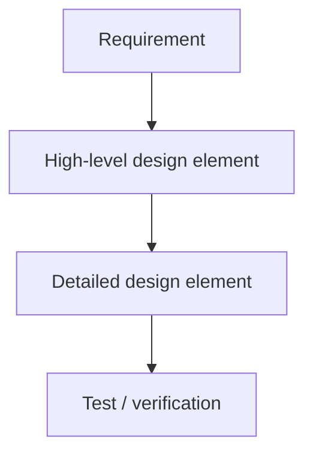
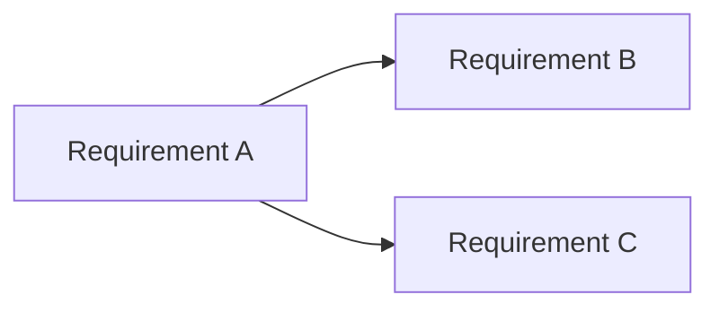
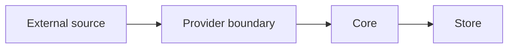
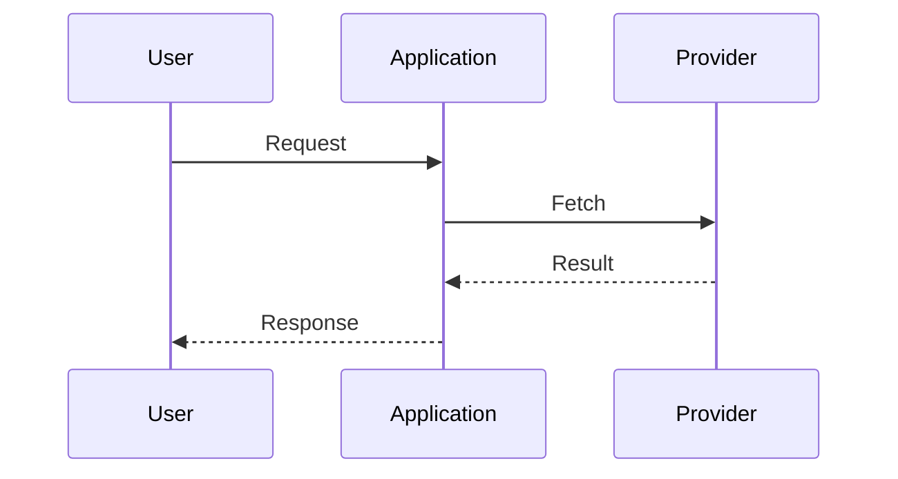
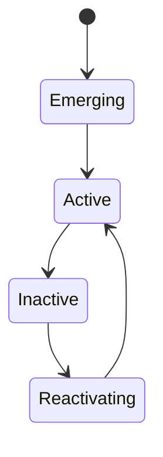
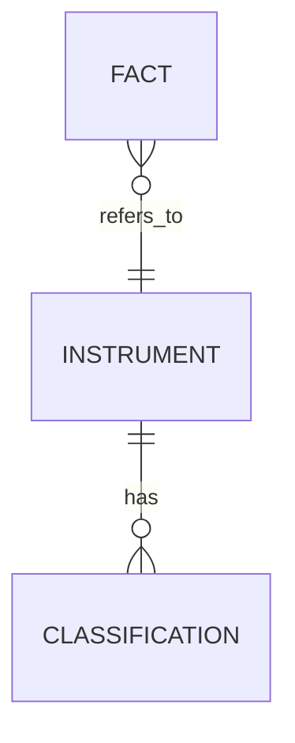
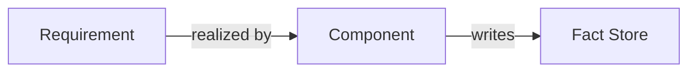
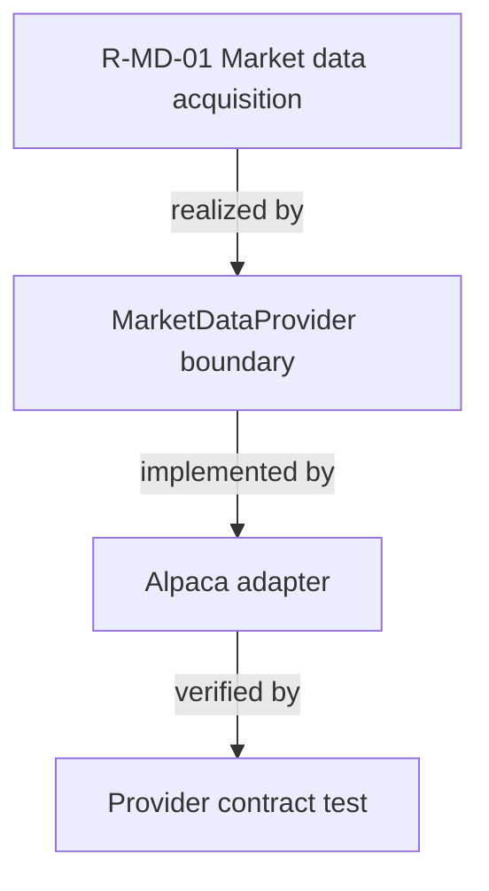
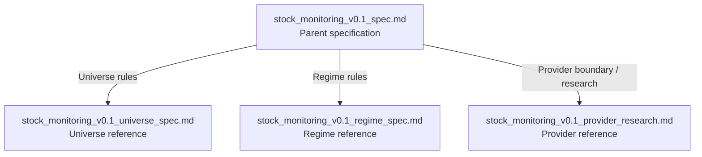

# Mermaid Conventions — Cross-Project Design Traceability Guide

Status: non-normative documentation aid

## 1. Purpose

This guide defines how Mermaid diagrams should be used to connect requirement, high-level design, and detailed design layers without making diagrams a second source of truth.

The authoritative content remains the corresponding specification text. Mermaid diagrams summarize structure, ownership, dependencies, state transitions, and traceability.

## 2. Core rule

Use Mermaid to answer one of these questions:

1. What is connected to what?
2. Which layer owns a responsibility?
3. What state changes are possible?
4. What data or control flow crosses a boundary?
5. Which detailed element realizes a higher-level requirement?

Do not use Mermaid as the only place where a requirement, constraint, API contract, calculation rule, threshold, retention period, or business rule is defined.

## 3. Layer model

Use three design layers consistently:

- Requirements: what must be true.
- High-level design: which components or boundaries satisfy the requirement.
- Detailed design: how a component or contract is realized.

Recommended cross-layer relation:

A diagram may omit a lower layer when that layer does not yet exist. Do not invent missing design details only to complete the graph.

## 4. Diagram types by purpose

### 4.1 Requirement dependency map

Use `flowchart` when requirements depend on or constrain each other.

### 4.2 Architecture / responsibility map

Use `flowchart` for component ownership and system boundaries.

### 4.3 Sequence / interaction

Use `sequenceDiagram` for order-sensitive interactions.

### 4.4 Lifecycle / state

Use `stateDiagram-v2` for domain states and legal transitions.

### 4.5 Data model

Use `erDiagram` only when entities and cardinality are more important than behavior.

## 5. Visual semantics

Prefer semantic labels over implementation-specific class names unless the diagram belongs to detailed design.

Recommended node naming:

- Requirement: `R-*` or the project's requirement ID.
- High-level component: domain/component name.
- Detailed element: schema, interface, worker, repository, queue, endpoint, or algorithm name.
- Verification: test, assertion, metric, or acceptance criterion.

Arrows mean dependency, flow, realization, or transition only when the label or local context makes the relation unambiguous.

For ambiguous relations, label the edge.

## 6. Source-of-truth rule

Mermaid is descriptive, not independently normative.

When a diagram and specification text disagree:

1. Treat the text in the designated Code of Truth document as authoritative.
2. Mark the diagram as stale.
3. Update the diagram in the same change that resolves the mismatch where practical.

Do not silently reinterpret specification text to make it match a diagram.

## 7. Change discipline

Update a Mermaid diagram when a change alters:

- component boundaries,
- ownership,
- externally visible flow,
- state transitions,
- important data dependencies,
- cross-layer traceability.

A diagram update is normally unnecessary for wording-only edits or local implementation changes that do not affect the represented structure.

## 8. Cross-layer traceability

For projects with requirements, high-level design, and detailed design documents, use stable IDs and preserve them across diagrams.

Example:

This allows a reviewer or AI agent to move from requirement to implementation without treating prose proximity as evidence of a relationship.

## 9. Stock Monitoring Fact example

The current Code of Truth can be read as this document relationship:

The four documents together form Code of Truth v0.1. This Mermaid diagram is only a navigation and relationship view; it does not create a fifth normative specification.

## 10. Recommended placement

Use diagrams near the prose they summarize.

Recommended order:

1. prose statement of scope or rule,
2. Mermaid visualization,
3. exceptions / constraints,
4. references to lower or higher layers.

For repository-level navigation, one small document map in the README is sufficient.

## 11. Anti-patterns

Avoid:

- encoding business rules only inside node labels,
- huge diagrams that mix requirements, infrastructure, runtime sequence, and state lifecycle,
- unlabeled arrows whose meaning changes within one graph,
- implementation details in requirement-level diagrams,
- decorative diagrams with no decision or navigation value,
- duplicated diagrams that must be manually synchronized across many documents,
- inventing future components to make a diagram look complete.

## 12. Review checklist

Before accepting a Mermaid change, check:

- Does the graph have one clear purpose?
- Is the authoritative prose still present?
- Are layer boundaries preserved?
- Are missing details left missing rather than guessed?
- Are important edges labeled when ambiguous?
- Does the graph use stable IDs where traceability matters?
- Would deleting the graph leave the specification semantically complete?

If the answer to the last question is no, normative information has probably leaked into the diagram and should be moved into prose.

## 13. Reuse in other projects

This convention is intentionally project-independent. A new project may adopt it by:

1. defining its authoritative document hierarchy,
2. defining stable requirement/design IDs,
3. selecting diagram types by purpose,
4. keeping diagrams descriptive rather than independently normative,
5. updating diagrams together with structural changes,
6. using cross-layer edges to preserve traceability.

Project-specific conventions may extend this guide but should not weaken the source-of-truth rule.