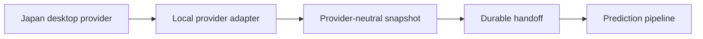

# Stock Monitoring Fact v0.1 — Japan-to-U.S. Prediction Design

Status: provisional, non-normative design extension

Date: 2026-08-31

Primary owners:

- `HLD-CFG-001` — separate prediction-input and prediction-target registries
- `HLD-PROV-001` — replaceable Japan market-data provider boundary
- `HLD-MKT-001` — calendar/session-aware normalized bars and analysis-ready snapshots
- `HLD-PRED-001` — prediction windows, labels, outputs and leakage controls
- `HLD-FACT-001` — separation and persistence of Derived Metric / Prediction

Related normative constraints:

- `REQ-SYS-002` — prediction is not the primary purpose of v0.1
- `REQ-SYS-003` — the fixed monitoring Universe remains U.S.-market oriented
- `REQ-SYS-005` — internal timestamps remain UTC
- `REQ-CAL-001..005` — sessions, holidays and shortened sessions remain explicit
- `REQ-PROV-001` — Core remains independent of provider-specific schemas
- `REQ-FACT-001` — Fact / Derived Metric / Interpretation / Prediction remain distinct

This document does not add Japanese instruments to the normative U.S. monitoring Universe and does not add prediction accuracy to the v0.1 Definition of Done. It defines a bounded research/implementation extension that can be promoted only through a later Code of Truth decision.

## 1. Reconciliation result

| Existing design | Prediction extension | Reconciled rule |
|---|---|---|
| Fixed U.S. monitoring Universe | Japanese equities act as leading inputs | Keep a separate `PredictionInputRegistry`; do not add Japanese symbols to `UniverseSnapshot` |
| Alpaca-backed U.S. acquisition | J-Quants or a domestic broker source is needed for Japan | Reuse provider-neutral bar/calendar semantics behind a separate route/adapter |
| Worker currently plans U.S. equities as `REGULAR` only | Targets include U.S. Premarket and Regular windows | Add extended-hours U.S. coverage before live prediction; do not relabel Premarket as Regular |
| Cloud acquisition + Main-PC heavy analysis | Training and probabilistic inference are heavier than collection | Keep collection/snapshot materialization at the edge; keep first model and backtest on the Main PC |
| D1 hot state / R2 long-lived archive | Predictions need immutable input and label snapshots | D1 may hold latest run/digest metadata; R2 or another bulk store holds versioned snapshots, labels and model artifacts |
| Fact / Derived Metric / Interpretation / Prediction separation | New outputs are probabilities and distributions | Persist them only as `PredictionRecord`, never as observed Facts |

## 2. Scope

The extension predicts U.S. theme/sector movement from same-day Japanese market observations.

Required target coverage:

- major U.S. themes and sectors,
- a distinct `Semiconductor Materials` target,
- material inputs split into:
  - `Semiconductor Materials`,
  - `Resource / Cyclical Materials`.

The exact Japanese instrument list and exact U.S. theme-label instrument mapping are unresolved. They must be versioned registries rather than implicit model constants.

Automatic trading is out of scope.

## 3. Registry boundaries

### 3.1 PredictionInputRegistry

Japanese predictor instruments are not members of the normative monitoring Universe.

```text
PredictionInputRegistry
- revision
- market: JAPAN_EQUITIES
- generated_at
- instruments: list<PredictionInputInstrument>

PredictionInputInstrument
- instrument_id: stable namespaced identifier
- display_symbol
- provider_symbol_mappings
- exchange
- themes: list<PredictionTheme>
- base_cadence
- enabled
- valid_from
- valid_until?
```

Rules:

- `instrument_id` must be namespaced and stable; a raw numeric code or provider ticker is not the Core identity.
- The Japanese list may change without changing the fixed U.S. monitoring Universe.
- Every snapshot and model run records the registry revision used.
- No Japanese ticker is silently inferred by this design. The initial list requires a separate approved mapping.

### 3.2 PredictionTargetRegistry

```text
PredictionTargetRegistry
- revision
- generated_at
- targets: list<PredictionTarget>

PredictionTarget
- target_id
- theme_or_sector
- primary_label_instrument?
- constituent_instrument_ids
- market_proxy_id?
- label_policy_version
- enabled_horizons
```

The U.S. `Semiconductor Materials` target includes `ENTG`, `Q`, `MKSI` and `MTRN` in the normative Tier B monitoring Universe. `Q` must remain ineligible for historical training until its available history satisfies the later minimum-history rule; it may still contribute to live observation and future labels.

## 4. Japan provider strategy

### 4.1 Provider-neutral contract

Japan acquisition must expose the same logical capabilities used by the existing market-data boundary:

```text
JapanMarketDataProvider
- historical_bars(instruments, interval, range)
- latest_observations(instruments, as_of)
- market_calendar(range)
- capabilities()
```

Vendor payloads are normalized before snapshot construction. Provider, feed/data variant, event time, retrieval time and completeness remain explicit.

### 4.2 Initial provider roles

| Provider | Role | Current factual boundary | Design decision |
|---|---|---|---|
| J-Quants minute bars | Historical source and same-day batch source | Delivered daily rather than in real time; official update table currently says around 16:30 JST and does not guarantee the exact time | Primary reproducible history; usable for same-day prediction only when the batch arrives before the computed deadline |
| MARKET SPEED II RSS | Same-day local fallback candidate | Domestic market information can be retrieved in Excel; domestic equity information is presented as real time; the tool is free, requires Windows/Excel and a logged-in desktop app | Preferred first operational fallback for the user's current Windows environment, behind a local bridge |
| kabu Station API | Programmatic local fallback candidate | Local REST/WebSocket; push registration supports up to 50 symbols; API is free only while the required Professional-or-higher plan conditions are met | Alternative when a direct programmatic bridge is preferred and eligibility is maintained |
| Google Finance / `GOOGLEFINANCE` | Not an acquisition provider | Spreadsheet quotes may be delayed up to 20 minutes and are not sourced from every market | Do not use for deadline-critical bars, completeness, labels or backtests |

The provider selection is not encoded into Core contracts. Prices, plans, eligibility and data licensing must be revalidated before live use.

### 4.3 Local bridge boundary

MARKET SPEED II RSS and kabu Station API are desktop-local sources. They cannot be called directly by the Cloudflare Worker.



The handoff must contain market data and health metadata only. Broker account balances, orders, credentials and write controls must not enter the snapshot.

## 5. Calendar and session normalization

Japan and the United States require independent authoritative calendars.

Rules:

- Internal instants are UTC.
- Market dates and session classification use each market's IANA timezone.
- The Japanese morning and afternoon segments remain separate expected grids; the lunch break is not interpolated.
- A Japanese holiday or partial session produces no synthetic bars.
- U.S. Premarket and Regular are separate target/coverage scopes.
- Cross-market pairing uses the two calendar snapshots, not weekday arithmetic.
- A Japanese trading date may map to no eligible U.S. target session, and vice versa; such rows are unavailable rather than forward-filled.

The current TypeScript calendar contract already carries `market` and a list of sessions, but the Alpaca adapter emits Regular sessions only. A Japan adapter may emit multiple Regular segments for one market date; implementation should add a stable segment identifier before relying on segment-specific baselines.

## 6. As-of and leakage contract

Every input value must satisfy:

```text
event_time <= feature_cutoff
retrieved_at <= prediction_generated_at
available_at <= prediction_generated_at
```

`available_at` is the earliest time at which the system could actually use the provider record. It is required for delayed or daily batch sources.

```text
PredictionInputSnapshot
- snapshot_id
- input_registry_revision
- provider_route
- logical_data_variant
- japan_market_date
- feature_cutoff
- generated_at
- available_at_max
- calendar_revision
- coverage_state: COMPLETE | PARTIAL | UNKNOWN | BLOCKED
- missing_inputs
- feature_schema_version
- features
```

Backtests must reconstruct snapshots from `available_at`, not merely from the bar's market timestamp. A 16:30 batch must not be treated as if it was known during the Japanese trading session.

## 7. Japanese feature snapshot

The first deterministic feature contract reuses existing market-analysis decisions:

- open-to-close and previous-close-to-close log return,
- high-low range,
- realized short-window volatility,
- volume,
- comparable-bucket relative volume,
- notional activity proxy,
- close location,
- opening gap,
- theme-relative return,
- coverage and provider-quality flags.

Theme aggregation should preserve at least:

- constituent median return,
- advance ratio,
- dispersion,
- median relative volume,
- missing-constituent ratio.

Weighting, outlier handling and the exact Japanese theme membership remain unresolved and versioned.

## 8. Prediction horizons and price anchors

`PREOPEN_ANCHOR` is not an official Premarket close. It is a robust price anchor immediately before the U.S. Regular open.

| Horizon | Start anchor | End anchor | Purpose |
|---|---|---|---|
| `PM_OPEN` | Previous U.S. Regular close | U.S. 04:00–04:15 ET VWAP | Premarket opening response |
| `PM_SESSION` | `PM_OPEN` anchor | 09:25–09:30 ET median/VWAP (`PREOPEN_ANCHOR`) | Full Premarket movement |
| `REG_OPEN` | `PREOPEN_ANCHOR` | 09:30–09:45 ET VWAP (`REG_OPEN_ANCHOR`) | Regular opening response |
| `REG_SESSION` | `REG_OPEN_ANCHOR` | U.S. Regular close anchor | Full Regular-session movement |

Rules:

- Exact anchor estimator and fallback order are versioned.
- A window with insufficient trades does not substitute a fabricated price; it becomes partial/unavailable.
- U.S. extended-hours feed provenance must be stored because IEX/SIP/provider coverage can differ.
- Prediction generation and label finalization are separate events.

## 9. Same-day readiness deadline

For a prediction that must exist before U.S. Premarket opens:

```text
hard_deadline = authoritative_US_premarket_open - 5 minutes
```

This normally corresponds to 16:55 JST while New York is on daylight time and 17:55 JST while it is on standard time. The implementation calculates this from calendars; it must not hard-code a seasonal UTC schedule.

J-Quants is accepted for the run only if its batch and completeness metadata arrive before the hard deadline. Otherwise the configured local provider may supply the snapshot. If neither source is complete enough, the prediction is emitted with degraded quality or is withheld according to later policy; stale data is never silently presented as current.

## 10. Provisional label policy

The exact U.S. theme labels remain a separate analysis decision. Until that analysis is complete, use this provisional hierarchy:

1. A liquid theme ETF's absolute horizon return is the primary label when a defensible ETF exists.
2. Otherwise, the target Universe constituents' median horizon return is the primary label.
3. Store constituent median return, advance ratio and market-residual return as secondary labels in both cases.

```text
up_label = 1 when primary_horizon_return > 0
up_label = 0 when primary_horizon_return <= 0
```

Zero-return handling, auction prints, corporate actions, target eligibility and exact ETF mappings remain versioned policy decisions. The provisional absolute-return label must not be confused with the separately stored market-residual label.

## 11. Prediction output contract

```text
PredictionRecord
- prediction_id
- target_id
- horizon: PM_OPEN | PM_SESSION | REG_OPEN | REG_SESSION
- generated_at
- as_of
- input_snapshot_id
- input_registry_revision
- target_registry_revision
- model_id
- model_version
- feature_schema_version
- label_policy_version
- up_probability
- expected_return_pct
- predicted_volatility_pct
- p10_return_pct
- p90_return_pct
- quality: COMPLETE | PARTIAL | STALE | UNAVAILABLE
- quality_reasons
- realized_label_ref?
```

Semantics:

- `up_probability` is the model probability that the provisional primary return is positive.
- `expected_return_pct` is the expected horizon return in percentage points.
- `predicted_volatility_pct` is the predicted standard deviation of the horizon return distribution in percentage points.
- `p10_return_pct` and `p90_return_pct` are distribution quantiles, not confidence claims about model correctness.
- `as_of` identifies the latest usable event-time cutoff; `generated_at` identifies when inference ran.
- A prediction is never rewritten into a Fact after realization. The realized label is a separate linked Derived Metric.

## 12. Deployment and persistence

Initial responsibility split:

| Boundary | Responsibility |
|---|---|
| Cloudflare Worker | Existing U.S. acquisition, coverage/checkpoint state and sanitized digest; later extended-hours collection after explicit implementation |
| Japan local collector | Same-day domestic provider access, normalization and safe snapshot handoff |
| D1 or equivalent hot state | Latest snapshot/run status, deadlines, quality and digest references |
| R2 or equivalent bulk boundary | Immutable feature snapshots, label snapshots, backtest extracts and model artifacts |
| Main PC | Walk-forward backtest, calibration, model fitting, probabilistic inference and evaluation |

The existing U.S. acquisition Worker remains valid. Prediction support must not change its bar identity, checkpoint or retry invariants.

## 13. Evaluation and promotion gates

Required checks before any live interpretation:

1. cross-calendar pairing across U.S. DST transitions, Japanese/U.S. holidays and shortened sessions,
2. snapshot reconstruction using `available_at`, proving no look-ahead leakage,
3. exact separation of Premarket and Regular anchors,
4. provider fallback without duplicate or conflicting logical bars,
5. walk-forward rather than random train/test splitting,
6. probability calibration and Brier/log-loss reporting for direction,
7. MAE/RMSE and interval coverage for expected return/volatility outputs,
8. benchmark comparison against an intercept/base-rate model and a U.S.-only baseline,
9. per-theme and per-horizon sample counts,
10. quality-aware reporting when Japanese input or U.S. label coverage is partial.

No production threshold is invented here. Promotion thresholds require measured data and an explicit decision.

## 14. Implementation sequence

Current repository implementation status (2026-08-31):

- `src/prediction.ts` implements the separate registry contracts, four horizon/anchor chain, anchor observation windows, readiness deadline and timestamp leakage guard.
- Calendar, bar normalization, checkpoints and the bounded acquisition planner support `PREMARKET` as a scope distinct from `REGULAR`.
- Premarket calendar generation is opt-in and is derived only for dates returned by the authoritative Alpaca trading calendar; the default Worker profile remains Regular-only.
- No Japanese symbols, U.S. theme/ETF mappings or model parameters have been inferred. Consequently the Premarket planner is not yet wired into live Worker orchestration.

1. Approve the Japanese predictor instrument/theme mapping and assign a registry revision.
2. Approve provisional U.S. target mappings or explicitly mark ETF-less targets.
3. Generalize calendar/session fixtures for Japan's split session and U.S. extended hours. U.S. Premarket core support is implemented; Japan split-session support remains open.
4. Add the Japan provider-neutral adapter and immutable snapshot builder.
5. Add U.S. Premarket acquisition as a distinct coverage scope. Core planning/normalization/checkpoint support is implemented; approved-target Worker wiring remains open.
6. Materialize the four target anchors and realized-label records.
7. Add `PredictionRecord` persistence and sanitized digest projection.
8. Build an availability-aware historical dataset on the Main PC.
9. Measure simple baselines before selecting a more complex model.
10. Run in prediction shadow mode before using outputs in Attention or reports.

## 15. Explicit unresolved items

- exact Japanese predictor symbols and theme memberships,
- exact U.S. theme ETF/constituent label mapping,
- weighting and outlier policy for Japanese theme aggregation,
- minimum history required before `Q` and other new listings enter training,
- J-Quants subscription/add-on and licensing details at implementation time,
- selection between MARKET SPEED II RSS and kabu Station API for the local fallback,
- snapshot signing/authentication and local-to-cloud transport,
- exact anchor estimator/fallback order,
- zero-return and corporate-action label rules,
- model family and feature-selection policy,
- promotion thresholds for calibration, loss and interval coverage,
- retention period for snapshots, predictions and realized labels.

## 16. Official references checked

- J-Quants update timing: <https://jpx-jquants.com/ja/spec/data-update>
- JPX description of minute/tick data as daily, non-real-time delivery: <https://www.jpx.co.jp/english/markets/other-data-services/j-quants-api/>
- MARKET SPEED II RSS: <https://marketspeed.jp/ms2_rss/>
- MARKET SPEED II availability and pricing: <https://marketspeed.jp/ms2/>
- kabu Station API service/eligibility: <https://kabu.com/item/kabustation_api/default.html>
- kabu Station API push feed: <https://kabucom.github.io/kabusapi/ptal/push.html>
- Google `GOOGLEFINANCE` limitations: <https://support.google.com/docs/answer/3093281>
