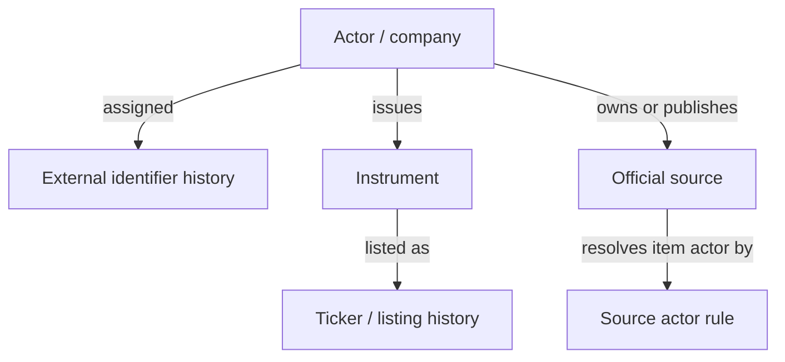

# OrderScope — entity/source registry値と履歴対応案（WEB-004）

Status: Web research complete; local schema and contract tests pending  
Web task: `WEB-004`  
Parent task: `I0-001`  
Registry proposal version: `entity-source-registry-v0.1`  
Checked at: `2026-09-03T15:48:29Z`

## 1. 結論

`WEB-001`のAMD/NVIDIA identityと、`WEB-002`の公式source範囲を、履歴を上書きしないregistry seedへ変換した。

- company、instrument、外部identifier、ticker/listing alias、actor、official sourceを別recordとして扱う。
- ticker、exchange、CIK、URLを内部IDにせず、Evidenceと有効期間を持つ割当として保存する。
- source owner、配布主体、個別itemの発言・提出主体を分離する。特にEDGAR文書のcontent actorはfilerであり、SEC自身の見解とは扱わない。
- 外部事実の開始日が公式Evidenceから分からない場合、確認日を`valid_from`へ代入しない。`valid_from = unknown`、`observed_at = checked_at`として保持する。
- v0.1への採否は外部事実の有効期間とは別に、`policy_valid_from = 2026-09-03`、`policy_valid_to = open`で履歴化する。

本書はregistry値と論理契約の入力であり、migration、DB制約、adapter、as-of query、contract testの実装完了を主張しない。

## 2. record境界

以下の関係を正とする。図は関係の案内であり、field定義は後続の表を正とする。

| Record | 必須field | 履歴上の役割 |
|---|---|---|
| `Actor` | `actor_id`, `actor_kind`, `display_name`, `legal_name?`, `evidence_refs` | company、政府機関、公式発行主体を共通identityで表現 |
| `ExternalIdentifierAssignment` | `scheme`, `value`, `actor_id`, `valid_from?`, `valid_to?`, `observed_at`, `evidence_refs` | CIK等をactorへ期間付きで割当 |
| `Instrument` | `instrument_id`, `issuer_actor_id`, `instrument_kind`, `security_class_raw`, `valid_from?`, `valid_to?`, `evidence_refs` | ticker変更から独立した証券identity |
| `ListingAliasAssignment` | `instrument_id`, `ticker`, `venue_name`, `valid_from?`, `valid_to?`, `observed_at`, `evidence_refs` | tickerと取引所を期間付きで割当 |
| `OfficialSource` | `source_id`, `source_lane`, `canonical_entry_url`, `owner_actor_id`, `publisher_actor_id`, `source_type`, `policy_status`, `policy_valid_from`, `policy_valid_to`, `observed_at`, `evidence_refs` | 公式入口とOrderScope採否を管理 |
| `SourceActorRule` | `source_id`, `content_actor_mode`, `fixed_actor_id?`, `item_actor_locator?`, `valid_from`, `valid_to`, `evidence_refs` | source ownerと個別item actorの混同を防止 |

`valid_from` / `valid_to`は半開区間`[valid_from, valid_to)`として扱う。開始日不明を許容し、`observed_at`、`filed_at`、`period_end`、registry方針の開始日を代用品にしない。

## 3. Corporate Canary seed

### 3.1 ActorとCIK

| actor_id（内部提案） | actor_kind | legal/display name | identifier assignment | 外部valid_from | valid_to | observed_at | Evidence |
|---|---|---|---|---|---|---|---|
| `sec-cik-0000002488` | `COMPANY` | Advanced Micro Devices, Inc. | `SEC_CIK = 0000002488` | `unknown` | `open` | `2026-09-03T15:48:29Z` | `E-AMD-10KA-DETAIL`, `E-AMD-10KA-COVER` |
| `sec-cik-0001045810` | `COMPANY` | NVIDIA Corporation | `SEC_CIK = 0001045810` | `unknown` | `open` | `2026-09-03T15:48:29Z` | `E-NVDA-10K-DETAIL`, `E-NVDA-10K-COVER` |

CIKは10桁zero-paddingを保持した文字列である。上表の`actor_id`は内部提案であり、SECが発行したIDではない。Evidenceは少なくとも各report period / filing date時点で対応が成立していたことを示すが、割当開始日までは示さない。

### 3.2 Instrumentとlisting alias

| instrument_id（内部提案） | issuer_actor_id | instrument_kind | security_class_raw | ticker | venue_name | 外部valid_from | valid_to | Evidence |
|---|---|---|---|---|---|---|---|---|
| `us-sec-0000002488-common` | `sec-cik-0000002488` | `COMMON_EQUITY` | Common Stock, $0.01 par value per share | `AMD` | The NASDAQ Global Select Market | `unknown` | `open` | `E-AMD-10KA-COVER` |
| `us-sec-0001045810-common` | `sec-cik-0001045810` | `COMMON_EQUITY` | Common Stock, $0.001 par value per share | `NVDA` | The Nasdaq Global Select Market | `unknown` | `open` | `E-NVDA-10K-COVER` |

`security_class_raw`と`venue_name`はEvidenceの表記を保持する。検索・比較用の正規化値を追加する場合も原文を上書きしない。`instrument_id`の正式な命名規則と全Universeでのuniquenessはローカルreview対象である。

## 4. Publisher / official actor seed

| actor_id（内部提案） | actor_kind | display name | 外部valid_from | valid_to | Evidence |
|---|---|---|---|---|---|
| `actor-gov-us-sec` | `GOVERNMENT_AGENCY` | U.S. Securities and Exchange Commission | `unknown` | `open` | `E-SEC-EDGAR`, `E-SEC-NEWSROOM` |
| `sec-cik-0000002488` | `COMPANY` | Advanced Micro Devices, Inc. | `unknown` | `open` | `E-AMD-10KA-COVER`, `E-AMD-IR` |
| `sec-cik-0001045810` | `COMPANY` | NVIDIA Corporation | `unknown` | `open` | `E-NVDA-10K-COVER`, `E-NVDA-IR` |
| `actor-gov-us-white-house` | `GOVERNMENT_OFFICIAL_SOURCE` | The White House | `unknown` | `open` | `E-WHITE-HOUSE-NEWS` |
| `actor-gov-us-treasury` | `GOVERNMENT_AGENCY` | U.S. Department of the Treasury | `unknown` | `open` | `E-TREASURY-NEWS` |
| `actor-gov-us-fed-board` | `GOVERNMENT_AGENCY` | Board of Governors of the Federal Reserve System | `unknown` | `open` | `E-FED-NEWS` |

企業がpublisherになることはactor種別ではなく`OfficialSource.publisher_actor_id`の関係で表す。CIKはactor IDそのものではなく`ExternalIdentifierAssignment`へ移し、既存の`WEB-001`内部IDを変更する場合はmigration aliasを別recordで保持する。

White Houseについて、`The White House`とExecutive Office of the Presidentの法的・組織的な親子関係は本調査で確定していない。v0.1 seedでは公式Web ownerの表示identityだけを登録し、推測した組織階層を追加しない。

## 5. Official source seed

全行の`policy_valid_from`は`2026-09-03`、`policy_valid_to`は`open`、`policy_status`は`INCLUDED_V0_1`である。これはOrderScope内の採用期間であって、Webページの開設日または外部有効期間ではない。外部URLの`valid_from`は全て`unknown`、`observed_at`は`2026-09-03T15:48:29Z`とする。

| source_id（内部提案） | source_lane | canonical_entry_url | owner / publisher actor | source_type | content_actor_mode | Evidence |
|---|---|---|---|---|---|---|
| `official-sec-edgar` | `SEC_EDGAR` | https://www.sec.gov/search-filings | `actor-gov-us-sec` / `actor-gov-us-sec` | `FILING_AND_PUBLIC_DATA_ENTRY` | `FILER_FROM_ITEM` | `E-SEC-EDGAR` |
| `official-sec-agency-press` | `SEC_AGENCY` | https://www.sec.gov/newsroom/press-releases | `actor-gov-us-sec` / `actor-gov-us-sec` | `AGENCY_PRESS_RELEASE_INDEX` | `ITEM_DECLARED_OR_FIXED_OWNER` | `E-SEC-NEWSROOM` |
| `official-ir-amd` | `CORPORATE_IR_AMD` | https://ir.amd.com/ | `sec-cik-0000002488` / `sec-cik-0000002488` | `CORPORATE_IR_ENTRY` | `FIXED_OWNER_UNLESS_ITEM_DECLARES_JOINT_ACTOR` | `E-AMD-IR` |
| `official-ir-nvidia` | `CORPORATE_IR_NVDA` | https://investor.nvidia.com/home/default.aspx | `sec-cik-0001045810` / `sec-cik-0001045810` | `CORPORATE_IR_ENTRY` | `FIXED_OWNER_UNLESS_ITEM_DECLARES_JOINT_ACTOR` | `E-NVDA-IR` |
| `official-white-house-news` | `WHITE_HOUSE` | https://www.whitehouse.gov/news/ | `actor-gov-us-white-house` / `actor-gov-us-white-house` | `GOVERNMENT_NEWS_ENTRY` | `ITEM_DECLARED` | `E-WHITE-HOUSE-NEWS` |
| `official-us-treasury-press` | `US_TREASURY` | https://home.treasury.gov/news/press-releases | `actor-gov-us-treasury` / `actor-gov-us-treasury` | `AGENCY_PRESS_RELEASE_INDEX` | `ITEM_DECLARED_OR_FIXED_OWNER` | `E-TREASURY-NEWS` |
| `official-fed-board-news` | `FED_BOARD` | https://www.federalreserve.gov/newsevents.htm | `actor-gov-us-fed-board` / `actor-gov-us-fed-board` | `CENTRAL_BANK_NEWS_ENTRY` | `ITEM_DECLARED` | `E-FED-NEWS` |

### SourceActorRuleの解釈

- `FILER_FROM_ITEM`: 配布主体はSECだが、提出内容のactorはCIK等から解決したfilerとする。
- `FIXED_OWNER_UNLESS_ITEM_DECLARES_JOINT_ACTOR`: 通常は企業ownerをactorとするが、共同発表では明示された共同actorを別関係として保持する。
- `ITEM_DECLARED`: page/itemに明記されたPresident、official、Board、FOMC等を解決する。未解決ならownerへ黙って置換せず`actor_resolution = pending`とする。
- `ITEM_DECLARED_OR_FIXED_OWNER`: itemに明示actorがあれば保持し、なければagency ownerを使ったことをresolution methodに残す。

公式pageから外部siteへlinkされるだけでは、外部itemへowner/actorを継承しない。CDNやIR hosting vendorは、配信hostであることだけを理由にpublisherへ設定しない。

## 6. Evidence registry

| Evidence ID | Source title | Publisher / actor | Canonical URL | Checked at | Effective/version date | Evidence class | Extracted fact | Unknowns |
|---|---|---|---|---|---|---|---|---|
| `E-AMD-10KA-DETAIL` | AMD Form 10-K/A filing detail, accession `0000002488-26-000021` | SEC / AMD filer | https://www.sec.gov/Archives/edgar/data/2488/000000248826000021/0000002488-26-000021-index.htm | `2026-09-03T15:48:29Z` | filed `2026-02-04`; period `2025-12-27` | `official data` | CIK `0000002488`とAMD filer表示 | CIK割当開始日 |
| `E-AMD-10KA-COVER` | AMD Form 10-K/A cover | Advanced Micro Devices, Inc. | https://www.sec.gov/Archives/edgar/data/2488/000000248826000021/amd-20251227.htm | `2026-09-03T15:48:29Z` | fiscal year ended `2025-12-27` | `official data` | legal name、common stock、ticker `AMD`、registered exchange | listing各属性の開始日 |
| `E-NVDA-10K-DETAIL` | NVIDIA Form 10-K filing detail, accession `0001045810-26-000021` | SEC / NVIDIA filer | https://www.sec.gov/Archives/edgar/data/1045810/000104581026000021/0001045810-26-000021-index.htm | `2026-09-03T15:48:29Z` | filed `2026-02-25`; period `2026-01-25` | `official data` | CIK `0001045810`とNVIDIA filer表示 | CIK割当開始日 |
| `E-NVDA-10K-COVER` | NVIDIA Form 10-K cover | NVIDIA Corporation | https://www.sec.gov/Archives/edgar/data/1045810/000104581026000021/nvda-20260125.htm | `2026-09-03T15:48:29Z` | fiscal year ended `2026-01-25` | `official data` | legal name、common stock、ticker `NVDA`、registered exchange | listing各属性の開始日 |
| `E-SEC-EDGAR` | Search Filings | U.S. Securities and Exchange Commission | https://www.sec.gov/search-filings | `2026-09-03T15:48:29Z` | `記載なし` | `official data` | EDGAR検索、CIK検索、API/RSSへの公式入口 | URL開設日、変更履歴 |
| `E-SEC-NEWSROOM` | SEC Press Releases | U.S. Securities and Exchange Commission | https://www.sec.gov/newsroom/press-releases | `2026-09-03T15:48:29Z` | `記載なし` | `official data` | SEC official announcementsの入口 | URL開設日、item actorの完全な規則 |
| `E-AMD-IR` | AMD Investor Relations | Advanced Micro Devices, Inc. | https://ir.amd.com/ | `2026-09-03T15:48:29Z` | `記載なし` | `official data` | Press Releases、Financial Results、SEC Filingsへの公式導線 | URLの開始日、redirect/archive挙動 |
| `E-NVDA-IR` | NVIDIA Investor Relations | NVIDIA Corporation | https://investor.nvidia.com/home/default.aspx | `2026-09-03T15:48:29Z` | `記載なし` | `official data` | Financial Reports、SEC Filings、Quarterly Results等への公式導線 | URLの開始日、redirect/archive挙動 |
| `E-WHITE-HOUSE-NEWS` | News | The White House | https://www.whitehouse.gov/news/ | `2026-09-03T15:48:29Z` | `記載なし` | `official data` | White House公式news入口 | 組織階層、URL変更履歴、item actor規則 |
| `E-TREASURY-NEWS` | Press Releases | U.S. Department of the Treasury | https://home.treasury.gov/news/press-releases | `2026-09-03T15:48:29Z` | `記載なし` | `official data` | Treasury公式press release入口 | URL変更履歴、bureau別actor規則 |
| `E-FED-NEWS` | News & Events | Board of Governors of the Federal Reserve System | https://www.federalreserve.gov/newsevents.htm | `2026-09-03T15:48:29Z` | `記載なし` | `official data` | press release、speech/testimony、calendar等への公式入口 | URL変更履歴、Board/FOMC/個人actorの全対応 |

## 7. 履歴更新規則

1. 現在rowの値が変わった場合は上書きせず、判明した境界で旧rowの`valid_to`を閉じ、新rowを作る。
2. 変更の実発生日が不明なら、`valid_from`を推測せず`observed_at`を記録し、precision/statusを`UNKNOWN`または`OBSERVED_ONLY`とする。
3. ticker変更で`instrument_id`を変更しない。issuer、security class、corporate actionを根拠に同一性をreviewする。
4. CIK、ticker、URLの再利用を想定し、`value`単独を永続主キーにしない。
5. source URL変更時も論理的source継続が確認できれば`source_id`を維持し、endpoint assignmentだけを履歴化する。継続が不明なら別sourceとしてreviewする。
6. owner、publisher、content actor、distribution hostを別fieldで保持する。
7. 各履歴rowは少なくとも1件のEvidence refを必要とする。削除・訂正も新しいEvidenceと観測時刻を残す。
8. as-of queryは外部validityとOrderScope policy validityの両方を指定できるようにする。

## 8. Local handoff — I0-001

ローカル実装は次をreview・実装すれば開始できる。

- `Actor`をcompany/agency/officialで共通化し、companyのpublisher性をactor種別ではなくsource関係で表す。
- nullableな外部`valid_from`と、非nullableな`observed_at` / `policy_valid_from`を区別する。
- identifier、listing alias、source endpoint、source actor ruleをappend-only historyとしてmigrationへ落とす。
- canonical URLの文字列一致だけでsource同一性を決めない。
- Evidence refなしの履歴row、同一scopeで矛盾するopen row、不正な期間を拒否する。

最低限のcontract test候補:

1. ticker rename後もinstrument IDが変わらない。
2. 同一instrument/venueで期間が重なるticker aliasを拒否する。
3. 同一issuerの複数share classを誤統合しない。
4. EDGAR itemのactorをSECではなくfilerへ解決する。
5. 公式pageの外部linkへ公式ownerを自動継承しない。
6. `valid_from = unknown`を保持でき、`observed_at`で代用しない。
7. source policy除外後も過去as-ofでは当時の採用状態を再現できる。

## 9. 未解決事項

- AMD/NVIDIAの過去ticker、旧listing、security class変更、successor/predecessor履歴は未調査。
- CIK、ticker、公式URLの外部valid_fromは確認したEvidenceだけでは不明。
- `instrument_id`と`actor_id`の全Universe共通命名規則、DB uniqueness制約は未確定。
- White HouseとExecutive Office of the Presidentのregistry上の組織関係は未確定。
- Federal Reserve Board、FOMC、個々のofficialのitem別actor解決表は未作成。
- stable item URL、RSS/API、pagination、redirect、update/delete挙動は`WEB-008`、`WEB-015`、`WEB-016`の範囲であり、本書では確定しない。
- Web確認のみであり、migration、adapter、parser、as-of query、idempotencyのローカル実測は行っていない。

## 10. 参照

- `REPORT_CORPORATE_CANARY_IDENTITY_WEB_001_2026-09-03.md`
- `REPORT_OFFICIAL_SOURCE_SCOPE_WEB_002_2026-09-03.md`
- `WORK_BREAKDOWN_LOCAL_CORPORATE_INTELLIGENCE_2026-09-03.md`
- `DETAILED_DESIGN_CFG_PROVIDER_v0.1.md`
- `MERMAID_CONVENTIONS.md`
