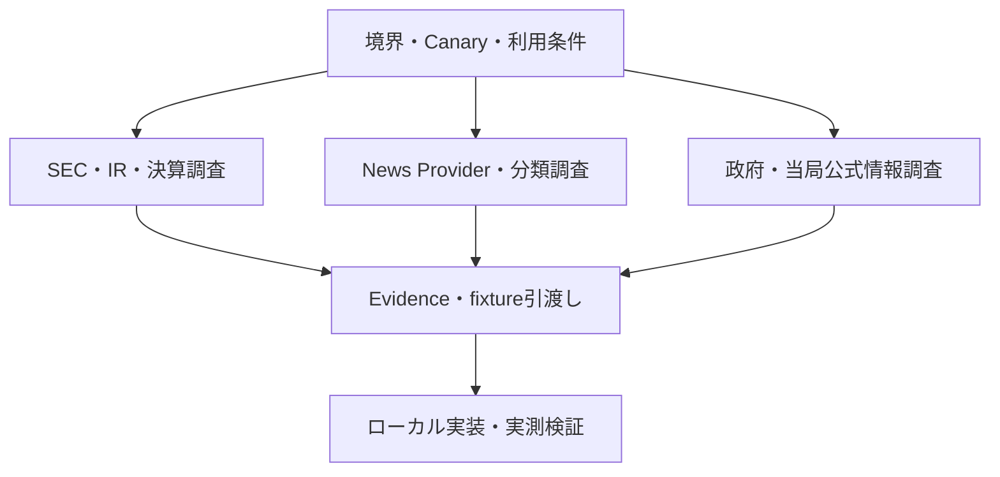

# OrderScope — Web企業情報調査ワークストリーム可視化レポート

Status: active coordination report (non-normative)
Date: 2026-09-03
Scope source: `WORK_BREAKDOWN_LOCAL_CORPORATE_INTELLIGENCE_2026-09-03.md`
Progress source: `WEB_CORPORATE_INTELLIGENCE_PROGRESS_TRACKER_2026-09-03.md`

## 1. 目的

ChatGPT Webの別セッションから継続できる調査・文書化作業を可視化する。Web調査と、ローカル実装、credential利用、実データ取得、DB処理、実行試験を明確に分離する。

タスク範囲と完了条件の正本は作業分解文書である。本書は責任範囲と依存関係を示す案内資料であり、進捗状態の正本は併設するWeb進捗トラッカーとする。

## 2. Web側の作業境界

### Web側で実施できること

- 公式公開情報とProvider公式文書の確認
- 料金、制限、endpoint、保存、本文利用、再配布条件の比較
- 恒久URL、公式actor、根拠、確認日時の収集
- registry、確認票、ADR入力、taxonomy、fixture候補、handoffの作成
- credentialや制限対象本文を含まないGitHub文書の更新

### ローカル証跡なしに完了扱いできないこと

- adapter、migration、CLI、API、scheduler、retention controllerの実装
- credential付き取得、有料契約、利用規約への同意
- D1 export、remote Worker変更、Live取得、localhost検証
- idempotency、retry、cursor、抽出精度、E2Eの試験
- recall、latency、成功率、coverage、healthの実測

したがって、Web調査が完了しても、対応する親タスクが完了したとは限らない。

## 3. 全体像

Mermaidは案内図であり、依存関係と進捗状態は以下の表および進捗トラッカーを正とする。

## 4. Web作業カタログ

### 4.1 境界・Canary・registry

| Web ID | 親ID | Web作業 | 成果物 | Web完了境界 |
|---|---|---|---|---|
| WEB-001 | W0-002 | AMD/NVDAのinstrument、ticker、CIK、公式IR URLを確認 | version付きCorporate Canary registry案 | 公式根拠、確認日、未解決項目が揃う |
| WEB-002 | W0-003 | v0.1公式source範囲を明文化 | SEC、企業IR、White House、Treasury、Fedの対象・除外表 | 一般SNSを含む対象外範囲まで明示される |
| WEB-003 | W0-004 | Provider・利用条件確認票を作成 | rate、User-Agent、保存、本文利用、再配布、費用、credentialの共通確認票 | 各欄が公式根拠、`記載なし`、`契約確認要`のいずれかになる |
| WEB-004 | I0-001 | entity/source registry値を準備 | instrument、ticker、CIK、publisher、official actor/sourceの履歴付き対応案 | 値と有効期間が根拠付きで示される。schema実装はローカルへ渡す |

### 4.2 SEC・Filing・決算・Fundamental

| Web ID | 親ID | Web作業 | 成果物 | Web完了境界 |
|---|---|---|---|---|
| WEB-005 | S0-001 | SEC接続条件を再確認 | User-Agent、Fair Access、endpoint、保存条件の調査報告 | 現行公式文書、確認日、曖昧点が記録される |
| WEB-006 | S0-004 | 対象formの目的と例外を確認 | 8-K、10-Q、10-K、S-1、S-3、424B*、DEF 14A、13D/G、Form 4の対応表 | amendment等を含む公式根拠が揃う |
| WEB-007 | E0-001 | Earnings契約の事例を収集 | 予定時刻、実発表時刻、期間、通貨、GAAP/non-GAAP、sourceの区別例 | 必要な区別を例示できる。契約実装はローカルへ渡す |
| WEB-008 | E0-003 | AMD/NVDAのIR fallbackを調査 | release/archiveのstable URL表とsource優先順位案 | 両社について経路または明示的な欠落が記録される |
| WEB-009 | E0-005 | segment revenueの取得可能性を調査 | 複数四半期のCompany Facts、XBRL Dimension、Filing fallback対応表 | 取得可否と失敗理由が記録され、欠損値を推測していない |
| WEB-010 | E0-007 | 複数四半期の照合用Evidenceを準備 | 公式値比較表と未解決差異一覧 | ローカル自動照合へ渡せる。実測前に成功率を提示しない |

### 4.3 News・Fact抽出

| Web ID | 親ID | Web作業 | 成果物 | Web完了境界 |
|---|---|---|---|---|
| WEB-011 | N0-001 | News Provider比較を更新 | 価格、履歴、rate、本文権利、internal-use条件とADR入力 | 不明・契約確認要を残した現在情報の比較が完成する |
| WEB-012 | N0-003 | 重複・syndication事例を収集 | 同一記事、転載、訂正、重要更新のcase set | URL、時刻、分類理由が揃う |
| WEB-013 | N1-001 | event taxonomyを作成 | contract、CAPEX、financing、M&A、regulation、earnings、partnership、major customerの定義と例 | evidenceから各分類を区別できる |
| WEB-014 | N1-006 | SEC/IR基準イベント集合を準備 | AMD/NVDAの1〜3か月分の正解候補一覧 | 公式根拠付きでローカルrecall/latency測定へ渡せる |

### 4.4 政府・当局・公式情報

| Web ID | 親ID | Web作業 | 成果物 | Web完了境界 |
|---|---|---|---|---|
| WEB-015 | O0-001 | official source registryを作成 | White House、Treasury、Federal Reserve、SECの恒久URLとactor identity | 公式owner、source type、入口URL、確認日が揃う |
| WEB-016 | O0-002 | 公式feedを調査 | RSS、API、更新一覧、pagination、時刻、更新・削除挙動の一覧 | sourceごとにbounded incremental取得候補または制約が明示される |
| WEB-017 | O0-003 | statementとimplementationの事例を収集 | 発言・提案と署名・施行・正式決定の分離例 | 公式に得られるevent/publish/effective時刻が記録される |
| WEB-018 | O0-004 | 直接・theme関連付けのEvidenceを定義 | AMD/NVDAへの直接関係と半導体themeへの間接関係の例 | 根拠のない関連付けを除外できる |
| WEB-019 | O0-005 | Official Signal fixture候補を準備 | update、delete、重複、時刻、恒久sourceのcase set | 保持可能なmetadataから再現できる。試験実行はローカルへ渡す |

### 4.5 統合・運用handoff

| Web ID | 親ID | Web作業 | 成果物 | Web完了境界 |
|---|---|---|---|---|
| WEB-020 | X0-006 | Canary runbookの公開情報部分を作成 | rate、障害、停止・再開、再処理、削除、escalationの草案 | 公開制約を根拠付きで記載し、未試験操作を明示する |

## 5. 優先Wave

| Wave | Web ID | 目的 | 開始条件 |
|---|---|---|---|
| A — 境界基準 | WEB-001、002、003、005、015 | Canary、source範囲、利用条件を固定 | 即時開始可能 |
| B — 取得設計入力 | WEB-004、006、008、011、016 | registryとadapter設計へEvidenceを渡す | 対応するWave Aが安定 |
| C — 意味・分類 | WEB-007、009、012、013、017、018 | 決算、segment、News、政策分類の事例を準備 | identity/source基準が存在 |
| D — 検証準備 | WEB-010、014、019、020 | 照合、recall、fixture、runbookへ引き渡す | 必要なローカルcontractまたはadapter形状が判明 |

Waveは調査順を示し、親タスクの完了を示さない。作業分解文書が許すローカル作業は並行して進められる。

## 6. Evidence記録標準

| 項目 | 記録規則 |
|---|---|
| Source title | 公式ページまたは文書の名称 |
| Publisher / actor | 法人・公的機関としての発行主体。hostnameだけから推測しない |
| Canonical URL | 検索結果ではなく公式ページ、文書、feed、endpoint仕様への直接URL |
| Checked at | Web確認日時をUTCで記録 |
| Effective/version date | 公開されていれば記録し、不明なら`記載なし` |
| Evidence class | `official rule`、`official data`、`provider commercial term`、`secondary lead` |
| Extracted fact | 原則として要約し、FactとInterpretationを分ける |
| Unknowns | 推測で埋めず明示する |
| Local consequence | 結果を使うcontract、fixture、adapter、test、runbookを示す |

料金、利用条件、rate limitは時点情報であり、契約または実装前に再確認する。検索結果や二次情報は公式sourceの探索には使えるが、Tier 1 Evidenceを置き換えない。

## 7. 別セッションでの更新手順

1. 本書、Web進捗トラッカー、作業分解文書を読む。
2. 編集前に対象ブランチの最新版を取得する。
3. 依存条件を満たす`WEB-*` IDを選ぶ。
4. 調査開始前に進捗を`進行中`へ変更し、session識別子を記録する。
5. 公式一次情報を優先し、不明点を推測で埋めない。
6. 結果を対象の限定されたreport、registry、ADR入力として`docs/`へ保存する。
7. トラッカーへ成果物、Evidence確認日、handoff先、次の操作を記録する。

credential値、account identifier、制限対象の記事本文、provider response body、一時raw本文をGitHubへ保存しない。

## 8. 別セッション開始用プロンプト

> OrderScopeの `docs/REPORT_WEB_CORPORATE_INTELLIGENCE_WORKSTREAM_2026-09-03.md` と `docs/WEB_CORPORATE_INTELLIGENCE_PROGRESS_TRACKER_2026-09-03.md` を参照し、依存条件を満たす未着手の最優先WEBタスクを確認してください。着手前にトラッカーを進行中へ更新し、公式一次情報を基準に調査し、成果物と根拠日付を保存した後、トラッカーの状態・証跡・次のアクションを更新してください。不明値は補完せず、ローカル実装や実測が必要な完了条件は完了扱いにしないでください。

## 9. 関連文書

- `WORK_BREAKDOWN_LOCAL_CORPORATE_INTELLIGENCE_2026-09-03.md`
- `WEB_CORPORATE_INTELLIGENCE_PROGRESS_TRACKER_2026-09-03.md`
- `IMPLEMENTATION_PROGRESS_TRACKER_2026-09-01.md`
- `ADR_LOCAL_ANALYSIS_STACK_v0.1.md`
- `stock_monitoring_v0.1_provider_research.md`
- `MERMAID_CONVENTIONS.md`
