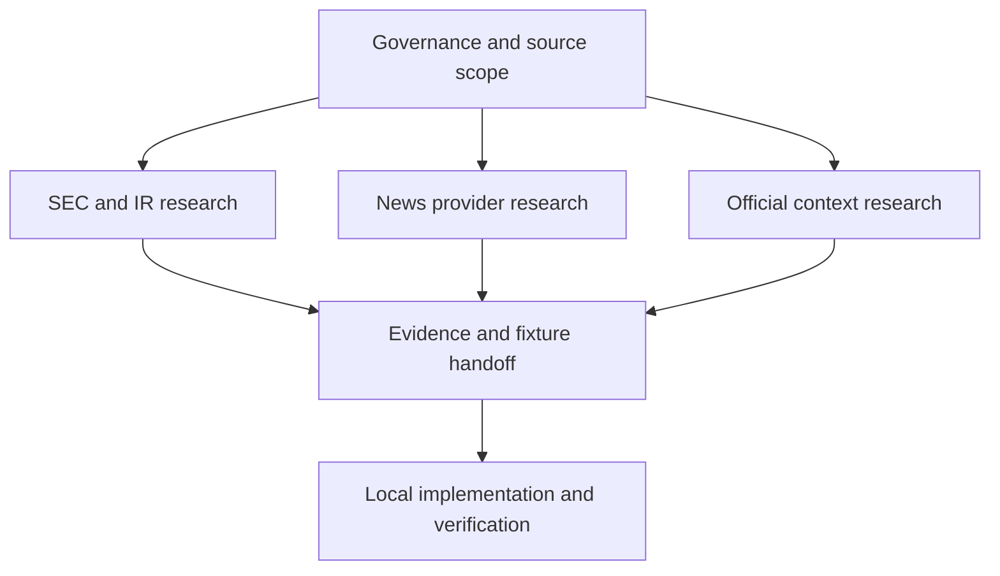

# OrderScope — Web Corporate Intelligence Workstream Report

Status: active coordination report (non-normative)
Date: 2026-09-03
Scope source: `WORK_BREAKDOWN_LOCAL_CORPORATE_INTELLIGENCE_2026-09-03.md`
Progress source: `WEB_CORPORATE_INTELLIGENCE_PROGRESS_TRACKER_2026-09-03.md`

## 1. Purpose

This report makes the work that can be advanced from ChatGPT Web visible across sessions. It separates Web research and documentation from local implementation, credential use, live acquisition, database work, and runtime verification.

The work-breakdown document remains authoritative for task scope and completion conditions. This report is a navigation and responsibility view. Task status is authoritative only in the companion Web progress tracker.

## 2. Boundary

### Web may do

- inspect official public sources and current provider documentation;
- compare terms, limits, prices, endpoints, retention and redistribution conditions;
- collect stable source URLs and evidence metadata;
- draft registries, checklists, ADR inputs, taxonomies, fixture candidates and handoff notes;
- update repository documentation without recording credentials or restricted response bodies.

### Web must not claim complete without local evidence

- provider adapters, schema migrations, CLI, API, scheduler or retention-controller implementation;
- credentialed requests, paid subscriptions or contract acceptance;
- D1 export, remote Worker mutation, live-provider execution or localhost verification;
- automated extraction accuracy, idempotency, retry, cursor or end-to-end tests;
- measured recall, latency, success rate or operational health.

An item can therefore have its Web research completed while its parent work-breakdown task remains incomplete.

## 3. Workstream map

The diagram is descriptive. Dependencies and status are defined by the tables in this report and the companion tracker.

## 4. Web task catalogue

### 4.1 Governance and registries

| Web ID | Parent ID | Work | Web deliverable | Web completion boundary |
|---|---|---|---|---|
| WEB-001 | W0-002 | Verify AMD/NVDA instrument identity, ticker, CIK and official IR URLs | Versioned Corporate Canary registry proposal with official evidence and retrieval dates | Both companies have stable identifiers, official URLs and unresolved fields explicitly recorded |
| WEB-002 | W0-003 | Enumerate the v0.1 official-source scope | Source-scope table for SEC, company IR, White House, Treasury and Federal Reserve | Included and excluded source classes are explicit; general social media remains excluded |
| WEB-003 | W0-004 | Build the provider and usage-condition checklist | Reusable checklist covering rate limit, User-Agent, storage, body use, redistribution, cost and credentials | Every field has an official source, `not stated`, or `requires contract review`; no missing value is guessed |
| WEB-004 | I0-001 | Prepare entity/source-registry values | Proposed historical mappings for instrument, ticker, CIK, publisher and official actor/source | Values and effective dates are evidence-backed; schema implementation remains local |

### 4.2 SEC, filings, earnings and fundamentals

| Web ID | Parent ID | Work | Web deliverable | Web completion boundary |
|---|---|---|---|---|
| WEB-005 | S0-001 | Reconfirm current SEC connection conditions | SEC connection-condition report covering User-Agent, fair access, endpoints and storage | Current official documentation is cited with checked-at date and ambiguity list |
| WEB-006 | S0-004 | Verify target-form purpose and edge cases | Form matrix for 8-K, 10-Q, 10-K, S-1, S-3, 424B*, DEF 14A, 13D/G and Form 4 | Purpose, amendment/update cases and primary official references are recorded |
| WEB-007 | E0-001 | Collect earnings-contract examples | Example matrix separating scheduled time, actual release time, fiscal period, currency, GAAP/non-GAAP and source | Examples demonstrate the required distinctions; contract implementation remains local |
| WEB-008 | E0-003 | Survey AMD/NVDA IR fallback sources | Stable IR release/archive URL table, availability notes and SEC-over-IR precedence proposal | Both canaries have an evidence-backed fallback path or an explicit gap |
| WEB-009 | E0-005 | Map segment-revenue source availability | Quarter-by-quarter map of Company Facts, XBRL dimensions and filing fallback for AMD/NVDA | Availability and failure reasons are recorded without inventing missing segment values |
| WEB-010 | E0-007 | Prepare a multi-quarter reconciliation evidence set | Official-value comparison sheet and unresolved-difference log | Evidence set is ready for local automated comparison; no success-rate claim is made before execution |

### 4.3 News and Fact extraction research

| Web ID | Parent ID | Work | Web deliverable | Web completion boundary |
|---|---|---|---|---|
| WEB-011 | N0-001 | Update News provider comparison | Current comparison of price, history, rate, body rights and internal-use terms with ADR recommendation inputs | Official terms are cited and unknown/licence-review fields remain explicit |
| WEB-012 | N0-003 | Collect duplicate and syndication cases | Case set for same article, syndication, correction and material update | Cases include canonical URLs, timestamps and the proposed classification rationale |
| WEB-013 | N1-001 | Draft the versioned event taxonomy | Definitions and positive/negative examples for contract, CAPEX, financing, M&A, regulation, earnings, partnership and major customer | Categories are distinguishable from evidence; final schema/version approval remains visible |
| WEB-014 | N1-006 | Prepare the SEC/IR reference-event set | One-to-three-month AMD/NVDA gold-event candidate list | Reference events are evidence-backed and ready for local recall/latency measurement |

### 4.4 Official and policy context

| Web ID | Parent ID | Work | Web deliverable | Web completion boundary |
|---|---|---|---|---|
| WEB-015 | O0-001 | Build the official-source registry | Permanent URLs and actor identities for White House, Treasury, Federal Reserve and SEC | Each source has an official owner, source type, stable entry point and checked-at date |
| WEB-016 | O0-002 | Survey official feeds | RSS/API/public-update-list inventory with pagination, timestamps and update/delete behavior | A bounded incremental acquisition candidate or explicit limitation is recorded per source |
| WEB-017 | O0-003 | Collect statement-versus-implementation examples | Evidence set separating speech/proposal from signature/effective implementation/formal decision | Each example has event, publication and effective times where officially available |
| WEB-018 | O0-004 | Define direct and thematic relationship evidence | AMD/NVDA direct-link and semiconductor-theme indirect-link examples with rationale | Direct and indirect relationships are distinguishable and unsupported association is excluded |
| WEB-019 | O0-005 | Prepare Official Signal fixture candidates | Update, deletion, duplicate, timestamp and permanent-source cases | Candidate fixtures are reproducible from retained metadata; test execution remains local |

### 4.5 Integration and operational handoff

| Web ID | Parent ID | Work | Web deliverable | Web completion boundary |
|---|---|---|---|---|
| WEB-020 | X0-006 | Draft the evidence-based part of the Canary runbook | Draft sections for rate rules, source outages, stop/resume, reprocessing, deletion and escalation | Public constraints and planned operations are documented; locally untested commands remain clearly marked |

## 5. Priority and dependency waves

| Wave | Web tasks | Purpose | Start condition |
|---|---|---|---|
| A — boundary baseline | WEB-001, WEB-002, WEB-003, WEB-005, WEB-015 | Fix canary identity, source scope and official usage boundaries | May start immediately |
| B — acquisition design input | WEB-004, WEB-006, WEB-008, WEB-011, WEB-016 | Supply registry and adapter-design evidence | Relevant Wave A source is stable |
| C — semantic evidence | WEB-007, WEB-009, WEB-012, WEB-013, WEB-017, WEB-018 | Supply earnings, segment, news and policy classification examples | Identity/source baselines exist |
| D — verification preparation | WEB-010, WEB-014, WEB-019, WEB-020 | Prepare reconciliation, recall, fixtures and runbook handoff | Required local contracts or adapter shapes are known |

Wave membership controls research order, not parent-task completion. Local work may proceed in parallel where the work breakdown permits it.

## 6. Standard evidence record

Every Web deliverable should record at least:

| Field | Rule |
|---|---|
| Source title | Human-readable official document/page title |
| Publisher / actor | Legal or official publishing entity; do not infer actor identity from a hostname alone |
| Canonical URL | Direct official page, document, feed or endpoint documentation URL |
| Checked at | UTC date/time of the Web check |
| Effective/version date | Record when published; otherwise use `not stated` |
| Evidence class | `official rule`, `official data`, `provider commercial term`, `secondary lead` |
| Extracted fact | Paraphrase; keep Fact separate from interpretation |
| Unknowns | Explicit list; never silently fill gaps |
| Local consequence | Contract, fixture, adapter, test or runbook item that consumes the result |

Terms, prices and limits are point-in-time findings and must be rechecked before contract acceptance or implementation. Secondary search results may locate a source but do not replace Tier 1 evidence.

## 7. Cross-session working protocol

At the start of a Web research session:

1. Read this report, the companion tracker and the work-breakdown source.
2. Fetch the latest branch revision before editing.
3. Select one or more `WEB-*` IDs whose dependencies are satisfied.
4. Change status to `進行中` and add the session identifier before research begins.
5. Use current official sources; record unknowns rather than guessing.
6. Save the result as a focused report, registry or ADR input under `docs/`.
7. Update the tracker with result link, evidence date, handoff target and next action.

Do not place credential values, account identifiers, restricted article bodies, provider response bodies or temporary raw content in GitHub documentation.

## 8. Session starter

Use the following instruction in another session:

> OrderScopeの `docs/REPORT_WEB_CORPORATE_INTELLIGENCE_WORKSTREAM_2026-09-03.md` と `docs/WEB_CORPORATE_INTELLIGENCE_PROGRESS_TRACKER_2026-09-03.md` を参照し、依存条件を満たす未着手の最優先WEBタスクを確認してください。着手前にトラッカーを進行中へ更新し、公式一次情報を基準に調査し、成果物と根拠日付を保存した後、トラッカーの状態・証跡・次のアクションを更新してください。不明値は補完せず、ローカル実装や実測が必要な完了条件は完了扱いにしないでください。

## 9. Related documents

- `WORK_BREAKDOWN_LOCAL_CORPORATE_INTELLIGENCE_2026-09-03.md`
- `WEB_CORPORATE_INTELLIGENCE_PROGRESS_TRACKER_2026-09-03.md`
- `IMPLEMENTATION_PROGRESS_TRACKER_2026-09-01.md`
- `ADR_LOCAL_ANALYSIS_STACK_v0.1.md`
- `stock_monitoring_v0.1_provider_research.md`
- `MERMAID_CONVENTIONS.md`
