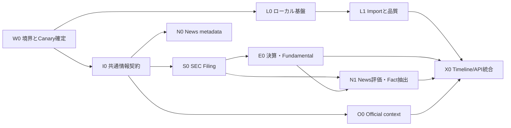

# OrderScope — ローカル・企業情報・決算・ニュース作業分解

Status: non-normative execution backlog
Date: 2026-09-03
Entry gate: Market Worker G1 achieved; Live Canary restored to Shadow

## 1. フェーズ判断

米国株価Workerは、実装、D1永続化、実bar取得、idempotency、公平化の限定Live確認まで完了しており、次領域へ移るための一区切りとする。Workerは`WORKER_MODE=shadow`、`PREDICTION_MODE=shadow`で維持する。

ただし、これは本番運用完了を意味しない。次は独立したWorker運用バックログとして保留する。

- `SMOKE-006`: 制御されたprovider失敗と次Cron再試行
- `SMOKE-007`: 一時停止とhistorical catch-up
- `CANARY-001`: NVDAを含む5銘柄すべての実環境前進
- `CANARY-002`〜`006`: tick予算、coverage/health、構造化error、運用回帰

ローカルMVPの開始条件G1は満たしているため、これらを完了するまでローカル・企業情報作業を待たせない。remote Worker変更が必要な作業だけ、別の承認済み変更窓で行う。

## 2. 今回の対象と原則

対象は次の4本である。

1. ローカルの保存・取込・品質検査・read-only API
2. SEC/IRを基準にしたFiling、決算、segment revenue
3. ticker関連ニュースと一時本文からのFact抽出
4. 政府・当局・企業公式情報などの周辺情報

初期Corporate Canaryは`AMD`と`NVDA`とする。`QQQ`と`SPY`はETF、`BTCUSD`はcryptoであり、企業決算、CIK、segment revenue、企業Regimeの対象へ混ぜない。

全作業で次を守る。

- Provider固有schemaはadapter内に閉じ込める。
- `Fact / Derived Metric / Interpretation / Prediction`を混同しない。
- `event_time`、`published/filed_at`、`retrieved_at`、`available_at`、`accepted_at`を区別する。
- SEC/企業IRなどTier 1をニュース評価の基準側にする。
- ニュース本文はmetadataと分離し、Fact抽出成功後は原則削除する。
- exception本文も最大30日とし、無期限保存しない。
- ローカルAPIは`127.0.0.1`だけでlistenし、変更操作は当面CLIに限定する。
- Provider credentialをWorker、local DB、dump、API response、Gitへ横流ししない。
- 1タスクは原則として、単独でreview、test、rollbackできる変更単位にする。

## 3. 依存順

## 4. 作業パッケージ

### W0 — 境界・Canary・運用判断

| ID | タスク | 完了条件 | 依存 |
|---|---|---|---|
| W0-001 | Worker作業を保留バックログへ固定 | 上記`SMOKE/CANARY`を未完了のまま明記し、Local開始を妨げない | なし |
| W0-002 | Corporate Canaryを固定 | AMD/NVDAのinstrument ID、ticker、CIK、公式IR URLをversion付きregistryで表現 | なし |
| W0-003 | 周辺情報のv0.1範囲を固定 | SEC、企業IR、White House、Treasury、Fed、SEC公式を対象とし、一般SNSは初期対象外 | W0-002 |
| W0-004 | Provider・利用条件確認票を作る | rate limit、User-Agent、保存、本文利用、再配布、費用、credentialを公式情報で再確認する欄を用意 | W0-003 |

`stock_monitoring_v0.1_provider_research.md`の価格・制限は調査時点の記録であり、契約や実装前に現在の公式条件を再確認する。

### L0 — ローカル基盤

| ID | タスク | 完了条件 | 依存 |
|---|---|---|---|
| L0-001 | ローカルstack ADRを作る | Python runtime、package/lock管理、SQLite/DuckDB、Arrow/Parquet、API、test、Windows/WSL境界を決定 | W0-001 |
| L0-002 | ディレクトリとデータ境界をscaffold | `analysis/app`、`analysis/tests`、`analysis/config`を作成し、`var/`をGit対象外にする | L0-001 |
| L0-003 | 設定・Secret境界を実装 | 非Secret設定schema、環境変数名、local-only credential手順を定義し、値をログへ出さないtestを追加 | L0-002 |
| L0-004 | localhost healthを実装 | `127.0.0.1`のみで`GET /health`が応答し、外部interfaceへのbindをtestで拒否 | L0-002 |
| L0-005 | ローカルmigration基盤を実装 | metadata/catalog用SQLite schemaをversion付きmigrationから再生成可能 | L0-002 |
| L0-006 | CLI入口を実装 | `serve`、`import`、`quality`等のcommand groupを用意し、HTTPから任意jobを起動しない | L0-003〜005 |

### L1 — 市場データ取込・品質

| ID | タスク | 完了条件 | 依存 |
|---|---|---|---|
| L1-001 | D1 export manifest契約を定義 | source environment/revision、開始終了時刻、table、row count、size、SHA-256をschema化 | L0-005 |
| L1-002 | fixture dump importerを実装 | 小さなSQL fixtureをimmutable rawとして登録し、同一hashの再取込が冪等 | L1-001 |
| L1-003 | 実D1 export変更窓を実施 | Cron停止・export・再開・catch-upを別承認で実施し、dump値をGitへ追加しない | `SMOKE-007`変更窓 |
| L1-004 | canonical bar datasetを生成 | barとreceiptのprovenanceを保った決定順Parquetを生成 | L1-002、実データ時はL1-003 |
| L1-005 | 市場データ品質検査を実装 | schema、row count、identity、OHLCV、gap、conflict、session gridを検査 | L1-004 |
| L1-006 | import/dataset APIを実装 | `/imports`、`/coverage/latest`、`/datasets`、`/quality/latest`をread-only提供 | L0-004、L1-005 |

L1-002まではfixtureで進め、remote D1 exportをローカル基盤のブロッカーにしない。

### I0 — 共通External Information・Fact契約

| ID | タスク | 完了条件 | 依存 |
|---|---|---|---|
| I0-001 | source/entity registryを定義 | instrument、ticker、CIK、publisher、official actor/sourceを履歴付きで対応付ける | W0-002/003 |
| I0-002 | 共通provenance契約を実装 | source ref/hash、event/publish/file/retrieve/available/accept時刻、provider revisionを型とtestで固定 | I0-001 |
| I0-003 | cursor/checkpoint契約を実装 | provider/source単位のbounded window、cursor、再開、partial/errorを永続化可能 | I0-002 |
| I0-004 | idempotency・重複境界を実装 | accession/article/signalの安定IDとcontent hashによる重複・更新・衝突を区別 | I0-002 |
| I0-005 | Fact Store論理schemaを確定 | Fact、Evidence、Relationship、Derived Metric、Interpretationを別recordとして履歴保存 | I0-002 |
| I0-006 | temporary content lifecycleを定義 | content ref、retention class、expiry、delete proof、exception reasonをschema化 | I0-005 |
| I0-007 | 共通contract test kitを作る | provider adapterがtimestamp、pagination、partial、retry、秘密非露出を満たす共通test | I0-003/004/006 |

### S0 — SEC Filing取得

| ID | タスク | 完了条件 | 依存 |
|---|---|---|---|
| S0-001 | SEC接続条件を再確認 | 現在の公式User-Agent、rate/fair-access、endpoint、保存条件を記録 | W0-004 |
| S0-002 | CIK/submissions adapterを実装 | AMD/NVDAのfiling一覧をbounded incremental取得し、vendor JSONをCoreへ漏らさない | I0-007、S0-001 |
| S0-003 | FilingRecordを保存 | accession、form、filed_at、period_end、primary document ref、retrieved_atを冪等保存 | S0-002 |
| S0-004 | 対象form filterを実装 | 8-K、10-Q、10-K、S-1、S-3、424B*、DEF 14A、13D/G、Form 4を識別 | S0-003 |
| S0-005 | filing document取得を実装 | documentをhash付きtemporary contentとして保存し、取得失敗を再試行可能 | S0-003、I0-006 |
| S0-006 | Company Facts/XBRL adapterを実装 | XBRL factをprovider-neutral型へ正規化し、unit/period/dimension/sourceを保持 | S0-003 |
| S0-007 | Filing検出受入試験 | fixture再生とAMD/NVDA限定取得で新規、重複、amendment、partialを確認 | S0-004〜006 |

### E0 — 決算・Fundamental

| ID | タスク | 完了条件 | 依存 |
|---|---|---|---|
| E0-001 | Earnings event/result契約を定義 | 予定日時、実発表時刻、fiscal period、通貨、GAAP/non-GAAP、sourceを混同しない | I0-005 |
| E0-002 | SEC決算検出を実装 | 10-Q/10-Kおよび該当8-K/添付資料から決算候補を作成 | S0-007、E0-001 |
| E0-003 | 企業IR fallbackを設計・実装 | IR releaseのstable URL/hashを保持し、SECと重複統合してsource優先順位を残す | E0-002 |
| E0-004 | 基本決算Factを抽出 | revenue、net income、EPS等をperiod/unit/source付きFactとして保存し、欠損値を推測しない | E0-002/003 |
| E0-005 | segment revenue fallback chainを実装 | `Company Facts → XBRL Dimension → Filing Fallback`のmethodと失敗理由を保存 | S0-006、E0-004 |
| E0-006 | SegmentIdentityHistoryを実装 | rename、merge、split、recastをnameだけで同一視せず履歴化 | E0-005 |
| E0-007 | 決算Canary品質レポート | AMD/NVDAの複数四半期でsource照合、抽出成功率、未解決差異を出力 | E0-004〜006 |

Analyst consensusやearnings surpriseは別データライセンスが必要になり得るため、E0では実績Factと企業発表を先に扱い、推測値や無料サイトのスクレイピングで補わない。

### N0/N1 — News取得・Fact化

| ID | タスク | 完了条件 | 依存 |
|---|---|---|---|
| N0-001 | News provider比較を更新 | 現在の公式価格、履歴、rate、本文権利、internal-use条件を比較し採否をADR化 | W0-004 |
| N0-002 | News metadata adapterを実装 | AMD/NVDAをbounded window/cursorで取得し、article ID、headline、publisher、URL、時刻を正規化 | I0-007、N0-001 |
| N0-003 | canonical URL・重複処理を実装 | provider重複、syndication、更新記事を同一・別物・更新として説明可能に分類 | N0-002 |
| N0-004 | temporary body accessを実装 | 本文をdurable metadataへ埋め込まず、期限付きcontent refから抽出処理だけが読める | I0-006、N0-002 |
| N1-001 | event taxonomyを固定 | contract、CAPEX、financing、M&A、regulation、earnings、partnership、major customer等をversion化 | I0-005、E0-001 |
| N1-002 | deterministic extraction baselineを実装 | headline/metadataと明示パターンからFact候補を生成し、原文にない値を補わない | N0-003、N1-001 |
| N1-003 | 本文抽出境界を実装 | extractor名/version、confidence、evidence span、source refを保存し、LLM採用は別ADRにする | N0-004、N1-002 |
| N1-004 | contradiction/pending reviewを実装 | SEC/IRとの矛盾、曖昧、後続確認待ちをexception reasonで保持 | S0-007、E0-007、N1-003 |
| N1-005 | retention controllerを実装 | 成功本文を削除し、例外本文も30日以内に削除、metadata/Fact/delete proofは保持 | I0-006、N1-004 |
| N1-006 | News recall評価を実装 | SEC/IRイベントを基準に1〜3か月の発見率、遅延、ticker誤付与を測定 | E0-007、N1-005 |

### O0 — 公式・政策などの周辺情報

| ID | タスク | 完了条件 | 依存 |
|---|---|---|---|
| O0-001 | 公式source registryを作る | White House、Treasury、Federal Reserve、SEC等の恒久URLとactor identityを管理 | W0-003、I0-001 |
| O0-002 | 公式feed adapterを実装 | RSS/API/公開更新一覧からbounded incremental取得し、一般検索結果を一次source扱いしない | I0-007、O0-001 |
| O0-003 | statement/implementation分離 | 発言・提案と署名・施行・正式決定を別Fact typeとして保存 | I0-005、O0-002 |
| O0-004 | instrument/theme関連付け | AMD/NVDAへの直接関係と半導体themeへの間接関係をEvidence付きで区別 | O0-003 |
| O0-005 | Official Signal品質試験 | update/delete、重複、時刻、permanent source、関連付け誤りをfixtureで確認 | O0-002〜004 |

X APIは料金・archive・編集削除情報が未確定なため初期必須経路にせず、公式Web/RSS等で成立しない範囲だけ後続ADRで検討する。

### X0 — 統合・観測・ローカル閲覧

| ID | タスク | 完了条件 | 依存 |
|---|---|---|---|
| X0-001 | unified timeline queryを実装 | market、filing、earnings、news、official Factをas-of条件付きで時系列取得 | L1-005、I0-005、E0-007、N1-005、O0-005 |
| X0-002 | Corporate coverage summaryを実装 | source別last success、cursor、lag、partial/error、retention pendingを表示 | I0-003、各adapter |
| X0-003 | read-only APIを拡張 | `/facts`、`/filings`、`/earnings`、`/news`、`/sources/health`をlocalhost限定提供 | L0-004、X0-001/002 |
| X0-004 | local schedulerを実装 | 手動CLIから開始し、single-instance lock、bounded run、resume、dry-runを備える | 各adapter、L0-006 |
| X0-005 | end-to-end fixture試験 | filing/IR/news/official入力からFact、retention、timelineまで決定的に再生成 | X0-001〜004 |
| X0-006 | Canary運用runbookを作る | credential、rate、停止、再開、再処理、削除、backup、障害判定を記録 | X0-005 |

## 5. マイルストーンと着手順

| Milestone | 含むタスク | 判定 |
|---|---|---|
| M0 境界固定 | W0-001〜004 | Worker保留項目、AMD/NVDA、source範囲、利用条件確認方法が明確 |
| M1 Local skeleton | L0-001〜006 | localhost health、migration、CLIがtest可能 |
| M2 Data/Fact core | L1-001/002、I0-001〜007 | fixtureでmarket importと外部情報契約が冪等に動作 |
| M3 SEC/Earnings Canary | S0-001〜007、E0-001〜007 | AMD/NVDAのfiling・決算Factと品質結果を再生成可能 |
| M4 News/Official Canary | N0/N1、O0 | Tier 1基準でNews recallとraw-body削除を検証可能 |
| M5 Local intelligence MVP | L1-003〜006、X0-001〜006 | 実データを統合しlocalhostからread-only参照可能 |

最初の実装sliceは次に限定する。

1. `L0-001`: stack ADR
2. `L0-002`: scaffoldと`var/`除外
3. `L0-004`: localhost health
4. `I0-001/002`: AMD/NVDA entity registryとprovenance型
5. `S0-001`: SEC公式接続条件の再確認

このsliceでは有料News契約、remote D1 export、Worker変更、LLM抽出、Regime強度計算を行わない。

## 6. 完了の定義

- 同一raw/fixtureから同一Factとdatasetを再生成できる。
- AMD/NVDAのSEC filingと決算Factをaccession/sourceまで追跡できる。
- Newsの発見率をSEC/IR基準で測定できる。
- 正常処理したnews raw bodyが残らず、例外も30日を超えない。
- provider停止、partial、cursor再開、重複、更新、矛盾を観測できる。
- localhost APIにcredential、raw body、provider response bodyを出さない。
- WorkerはShadowのままで、ローカルからWorkerを直接制御しない。

## 7. 参照

- `stock_monitoring_v0.1_spec.md`
- `stock_monitoring_v0.1_regime_spec.md`
- `stock_monitoring_v0.1_provider_research.md`
- `REQUIREMENTS_TRACEABILITY_v0.1.md`
- `HIGH_LEVEL_DESIGN_v0.1.md`
- `DETAILED_DESIGN_CFG_PROVIDER_v0.1.md`
- `WORK_PLAN_INITIAL_VALIDATION_AND_LONG_TERM_OPERATIONS_2026-09-01.md`
- `IMPLEMENTATION_PROGRESS_TRACKER_2026-09-01.md`
