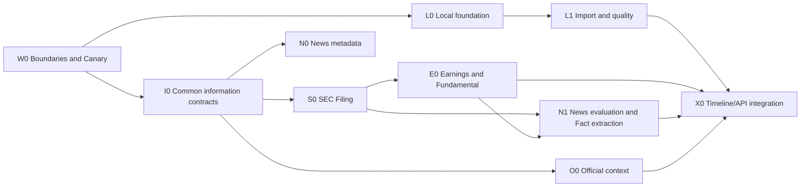

# OrderScope — Local Corporate Intelligence Work Breakdown Structure

Status: non-normative execution backlog
Date: 2026-09-03
Entry gate: Market Worker G1 achieved; Live Canary restored to Shadow

## 1. Phase decision

The U.S. market Worker has reached a sufficient milestone: implementation, D1 persistence, real-bar acquisition, idempotency, and limited fairness checks are complete. Keep `WORKER_MODE=shadow` and `PREDICTION_MODE=shadow` while Local Corporate Intelligence work proceeds.

This does not mean Worker operations are complete. Keep these items in a separate Worker backlog:

- `SMOKE-006`: controlled provider failure and next-Cron retry
- `SMOKE-007`: pause plus historical catch-up
- `CANARY-001`: real-environment progress for all five symbols including NVDA
- `CANARY-002..006`: tick budget, coverage/health, structured errors, operational regression

G1 is sufficient to start the local MVP. Only tasks requiring remote Worker changes must wait for a separately approved change window.

## 2. Scope and principles

Scope:
1. Local storage, ingestion, quality checks, and read-only API
2. SEC/IR-based Filing, earnings, and segment revenue
3. Ticker-related news and Fact extraction from temporary body content
4. Government, regulator, and official-company context

Initial Corporate Canary: `AMD` and `NVDA`.
Do not mix `QQQ`, `SPY`, or `BTCUSD` into company earnings, CIK, segment revenue, or company Regime logic.

Principles:
- Keep provider-specific schemas inside adapters.
- Keep `Fact / Derived Metric / Interpretation / Prediction` distinct.
- Distinguish `event_time`, `published/filed_at`, `retrieved_at`, `available_at`, and `accepted_at`.
- Use SEC/company IR and other Tier-1 sources as the reference side for news evaluation.
- Separate news body content from durable metadata; delete successful raw bodies by default after extraction.
- Exception bodies must also expire within 30 days.
- Bind local API to `127.0.0.1` only; mutation remains CLI-only for now.
- Never leak provider credentials into Worker, local DB, dumps, API responses, or Git.
- Each task should normally be independently reviewable, testable, and rollbackable.

## 3. Dependency order

## 4. Work packages

### W0 — Boundary / Canary / operational decisions

| ID | Task | Completion condition | Dependency |
|---|---|---|---|
| W0-001 | Freeze Worker work into deferred backlog | Keep the listed `SMOKE/CANARY` items explicitly incomplete and non-blocking for Local start | None |
| W0-002 | Freeze Corporate Canary | Represent AMD/NVDA instrument ID, ticker, CIK, and official IR URL in a versioned registry | None |
| W0-003 | Freeze v0.1 official-context scope | Include SEC, company IR, White House, Treasury, Fed, and official SEC sources; exclude general social media initially | W0-002 |
| W0-004 | Create provider/terms verification sheet | Provide fields to recheck rate limit, User-Agent, storage, body use, redistribution, cost, and credentials from official sources | W0-003 |

Treat prices/limits in `stock_monitoring_v0.1_provider_research.md` as point-in-time research. Recheck current official terms before contract or implementation decisions.

### L0 — Local foundation

| ID | Task | Completion condition | Dependency |
|---|---|---|---|
| L0-001 | Create local-stack ADR | Decide Python runtime, package/lock management, SQLite/DuckDB, Arrow/Parquet, API, tests, and Windows/WSL boundary | W0-001 |
| L0-002 | Scaffold directories and data boundary | Create `analysis/app`, `analysis/tests`, `analysis/config`; exclude `var/` from Git | L0-001 |
| L0-003 | Implement config/secret boundary | Define non-secret config schema, environment-variable names, local-only credential procedure, and tests preventing secret logging | L0-002 |
| L0-004 | Implement localhost health | `GET /health` responds only on `127.0.0.1`; tests reject external-interface bind | L0-002 |
| L0-005 | Implement local migration foundation | Rebuild metadata/catalog SQLite schema from versioned migrations | L0-002 |
| L0-006 | Implement CLI entry point | Provide `serve`, `import`, `quality` command groups; do not allow arbitrary job start from HTTP | L0-003..005 |

### L1 — Market-data import / quality

| ID | Task | Completion condition | Dependency |
|---|---|---|---|
| L1-001 | Define D1 export manifest contract | Schema includes source environment/revision, start/end time, table, row count, size, SHA-256 | L0-005 |
| L1-002 | Implement fixture dump importer | Register a small SQL fixture as immutable raw data; reimport of the same hash is idempotent | L1-001 |
| L1-003 | Execute real D1 export change window | Pause Cron, export, resume, and catch up under separate approval; do not add dump values to Git | `SMOKE-007` change window |
| L1-004 | Generate canonical bar dataset | Produce deterministic-order Parquet while preserving bar/receipt provenance | L1-002; L1-003 for real data |
| L1-005 | Implement market-data quality checks | Validate schema, row count, identity, OHLCV, gaps, conflicts, and session grid | L1-004 |
| L1-006 | Implement import/dataset API | Read-only `/imports`, `/coverage/latest`, `/datasets`, `/quality/latest` | L0-004, L1-005 |

Proceed through L1-002 using fixtures; do not make remote D1 export a local-foundation blocker.

### I0 — Common External Information / Fact contracts

| ID | Task | Completion condition | Dependency |
|---|---|---|---|
| I0-001 | Define source/entity registry | Map instrument, ticker, CIK, publisher, and official actor/source with history | W0-002/003 |
| I0-002 | Implement common provenance contract | Fix source ref/hash, event/publish/file/retrieve/available/accept timestamps, and provider revision in types and tests | I0-001 |
| I0-003 | Implement cursor/checkpoint contract | Persist provider/source bounded window, cursor, resume state, partial/error state | I0-002 |
| I0-004 | Implement idempotency/duplicate boundary | Distinguish duplicate, update, and conflict using stable accession/article/signal IDs and content hash | I0-002 |
| I0-005 | Finalize Fact Store logical schema | Store Fact, Evidence, Relationship, Derived Metric, and Interpretation as distinct historical records | I0-002 |
| I0-006 | Define temporary-content lifecycle | Schema for content ref, retention class, expiry, delete proof, exception reason | I0-005 |
| I0-007 | Build common contract-test kit | Verify adapters satisfy timestamp, pagination, partial, retry, and secret-nonexposure contracts | I0-003/004/006 |

### S0 — SEC Filing acquisition

| ID | Task | Completion condition | Dependency |
|---|---|---|---|
| S0-001 | Reconfirm SEC access conditions | Record current official User-Agent, fair-access/rate rules, endpoints, and storage conditions | W0-004 |
| S0-002 | Implement CIK/submissions adapter | Incrementally fetch AMD/NVDA filing lists in bounded windows without leaking vendor JSON into Core | I0-007, S0-001 |
| S0-003 | Persist FilingRecord | Idempotently store accession, form, filed_at, period_end, primary-document ref, retrieved_at | S0-002 |
| S0-004 | Implement target-form filter | Identify 8-K, 10-Q, 10-K, S-1, S-3, 424B*, DEF 14A, 13D/G, Form 4 | S0-003 |
| S0-005 | Implement filing-document acquisition | Store document as hashed temporary content; acquisition failure remains retryable | S0-003, I0-006 |
| S0-006 | Implement Company Facts/XBRL adapter | Normalize XBRL facts into provider-neutral types while preserving unit/period/dimension/source | S0-003 |
| S0-007 | Filing-detection acceptance test | Replay fixtures and limited AMD/NVDA fetches; verify new, duplicate, amendment, partial cases | S0-004..006 |

### E0 — Earnings / Fundamental

| ID | Task | Completion condition | Dependency |
|---|---|---|---|
| E0-001 | Define earnings event/result contract | Keep scheduled time, actual release time, fiscal period, currency, GAAP/non-GAAP, and source distinct | I0-005 |
| E0-002 | Implement SEC earnings detection | Build earnings candidates from 10-Q/10-K and relevant 8-K/attachments | S0-007, E0-001 |
| E0-003 | Design/implement company-IR fallback | Preserve stable IR URL/hash; deduplicate with SEC while retaining source priority | E0-002 |
| E0-004 | Extract basic earnings Facts | Store revenue, net income, EPS, etc. with period/unit/source; never infer missing values | E0-002/003 |
| E0-005 | Implement segment-revenue fallback chain | Persist method and failure reason for `Company Facts → XBRL Dimension → Filing Fallback` | S0-006, E0-004 |
| E0-006 | Implement SegmentIdentityHistory | Track rename/merge/split/recast without equating segments by name alone | E0-005 |
| E0-007 | Produce earnings Canary quality report | Reconcile multiple AMD/NVDA quarters across sources; report extraction success and unresolved differences | E0-004..006 |

Analyst consensus and earnings surprise may require separate licensed data. E0 handles observed results and company disclosures first; do not fill gaps from scraping or inferred estimates.

### N0/N1 — News acquisition / Fact extraction

| ID | Task | Completion condition | Dependency |
|---|---|---|---|
| N0-001 | Refresh news-provider comparison | Compare current official price, history, rate, body rights, and internal-use terms; record adoption ADR | W0-004 |
| N0-002 | Implement news metadata adapter | Fetch AMD/NVDA by bounded window/cursor; normalize article ID, headline, publisher, URL, timestamps | I0-007, N0-001 |
| N0-003 | Implement canonical URL / duplicate handling | Classify provider duplicate, syndication, and updated article as same/different/update with explainable rules | N0-002 |
| N0-004 | Implement temporary body access | Keep body outside durable metadata; only extraction reads expiring content refs | I0-006, N0-002 |
| N1-001 | Freeze event taxonomy | Version contract, CAPEX, financing, M&A, regulation, earnings, partnership, major customer, etc. | I0-005, E0-001 |
| N1-002 | Implement deterministic extraction baseline | Generate Fact candidates from headline/metadata and explicit patterns; never invent values absent from source | N0-003, N1-001 |
| N1-003 | Implement body-extraction boundary | Store extractor name/version, confidence, evidence span, source ref; LLM adoption requires separate ADR | N0-004, N1-002 |
| N1-004 | Implement contradiction/pending review | Preserve SEC/IR conflicts, ambiguity, and later-confirmation cases with exception reason | S0-007, E0-007, N1-003 |
| N1-005 | Implement retention controller | Delete successful bodies; delete exception bodies within 30 days; retain metadata/Fact/delete proof | I0-006, N1-004 |
| N1-006 | Evaluate news recall | Measure 1-3 month discovery rate, lag, and ticker misattribution against SEC/IR events | E0-007, N1-005 |

### O0 — Official / policy context

| ID | Task | Completion condition | Dependency |
|---|---|---|---|
| O0-001 | Build official-source registry | Manage stable URLs and actor identity for White House, Treasury, Federal Reserve, SEC, etc. | W0-003, I0-001 |
| O0-002 | Implement official-feed adapter | Incrementally acquire from RSS/API/public update lists; do not treat generic search results as primary sources | I0-007, O0-001 |
| O0-003 | Separate statement from implementation | Store statement/proposal separately from signed/effective/formal-decision Fact types | I0-005, O0-002 |
| O0-004 | Link instrument/theme relevance | Distinguish direct AMD/NVDA relation from indirect semiconductor-theme relation using Evidence | O0-003 |
| O0-005 | Official Signal quality test | Verify update/delete, duplicate, timestamps, permanent source, and relevance errors with fixtures | O0-002..004 |

Do not make X API an initial required path while pricing/archive/edit-delete conditions remain unresolved. Consider it later only where official Web/RSS is insufficient.

### X0 — Integration / observability / local read access

| ID | Task | Completion condition | Dependency |
|---|---|---|---|
| X0-001 | Implement unified timeline query | Query market, filing, earnings, news, and official Facts in as-of order | L1-005, I0-005, E0-007, N1-005, O0-005 |
| X0-002 | Implement Corporate coverage summary | Show last success, cursor, lag, partial/error, and retention pending by source | I0-003, each adapter |
| X0-003 | Extend read-only API | Localhost-only `/facts`, `/filings`, `/earnings`, `/news`, `/sources/health` | L0-004, X0-001/002 |
| X0-004 | Implement local scheduler | Start from manual CLI; provide single-instance lock, bounded run, resume, dry-run | each adapter, L0-006 |
| X0-005 | End-to-end fixture test | Deterministically regenerate Fact, retention, and timeline from filing/IR/news/official inputs | X0-001..004 |
| X0-006 | Create Canary operations runbook | Document credentials, rate limits, stop/resume, reprocessing, deletion, backup, incident decisions | X0-005 |

## 5. Milestones and initial order

| Milestone | Tasks | Acceptance |
|---|---|---|
| M0 Boundary freeze | W0-001..004 | Worker deferrals, AMD/NVDA, source scope, and terms-check process are explicit |
| M1 Local skeleton | L0-001..006 | localhost health, migration, CLI are testable |
| M2 Data/Fact core | L1-001/002, I0-001..007 | fixture-based market import and external-information contracts are idempotent |
| M3 SEC/Earnings Canary | S0-001..007, E0-001..007 | AMD/NVDA filing/earnings Facts and quality results are reproducible |
| M4 News/Official Canary | N0/N1, O0 | News recall and raw-body deletion are verifiable against Tier-1 references |
| M5 Local intelligence MVP | L1-003..006, X0-001..006 | Real data is integrated and available through localhost read-only access |

Initial implementation slice:
1. `L0-001`: stack ADR
2. `L0-002`: scaffold + `var/` exclusion
3. `L0-004`: localhost health
4. `I0-001/002`: AMD/NVDA entity registry and provenance types
5. `S0-001`: recheck official SEC access conditions

Do not include paid-news contracts, remote D1 export, Worker changes, LLM extraction, or Regime-strength calculation in this slice.

## 6. Definition of Done

- Same raw/fixture input reproduces the same Fact and dataset.
- AMD/NVDA SEC filings and earnings Facts are traceable to accession/source.
- News discovery can be measured against SEC/IR reference events.
- Successful news raw bodies do not remain; exception bodies never exceed 30 days.
- Provider outage, partial results, cursor resume, duplicates, updates, and contradictions are observable.
- Localhost API never exposes credentials, raw news bodies, or provider response bodies.
- Worker remains in Shadow; Local does not directly control Worker.

## 7. References

- `stock_monitoring_v0.1_spec.md`
- `stock_monitoring_v0.1_regime_spec.md`
- `stock_monitoring_v0.1_provider_research.md`
- `REQUIREMENTS_TRACEABILITY_v0.1.md`
- `HIGH_LEVEL_DESIGN_v0.1.md`
- `DETAILED_DESIGN_CFG_PROVIDER_v0.1.md`
- `WORK_PLAN_INITIAL_VALIDATION_AND_LONG_TERM_OPERATIONS_2026-09-01.md`
- `IMPLEMENTATION_PROGRESS_TRACKER_2026-09-01.md`
