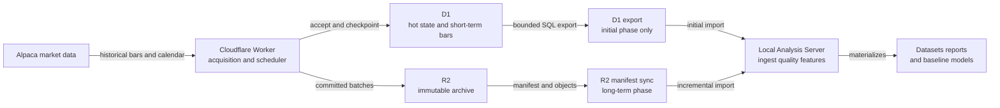

# OrderScope — 初期動作確認・ローカル分析・長期運用 作業工程

Status: non-normative implementation and operations plan
Date: 2026-09-01
Baseline: `004a4fd` and `PROGRESS_REPORT_2026-09-01.md`

## 1. 目的

本資料は、現在の Shadow Worker を実データで検証し、ローカル分析を開始した後、R2を用いる長期運用へ段階的に移行する作業工程を定義する。

工程は次の二段階に分ける。

1. **初期動作確認**: 限定Live Canary、D1による取得確認、D1エクスポート、ローカル分析サーバーの最小構成までを対象とする。R2は完了条件に含めない。
2. **長期運用**: R2への不変アーカイブ、manifest、差分同期、D1のhot-state化、監視、復旧、20取引日以上の品質評価を対象とする。

本資料はCode of Truthを変更しない。仕様・契約文書と矛盾する場合は、仕様・契約文書を優先する。

## 2. 現在地と前提

### 2.1 実装済み

- Cloudflare WorkerのCron、`/health`、`/digest/latest`、`/digest/history`
- Alpacaの認証済み取得に接続できるprovider境界
- authoritative calendar、休日、短縮取引、DST、Regular/Premarket分離
- D1のcheckpoint、attempt、lease、normalized bar、conflict、digest履歴
- overlap、再試行、欠損保持、重複排除、競合隔離
- 5銘柄の`canary-v0.1`と、外側Workerから独立したprediction shadow planning
- 日本市場入力用のimmutable snapshot境界

### 2.2 未実装または未検証

- Remote D1への全migration適用確認
- 実環境のSecretとLiveデプロイの確認
- 銘柄間で公平なジョブ優先順位と、tick全体の処理予算
- 取得成功・coverage鮮度を反映するhealth/coverage summary
- R2 writer、archive ledger、manifest、local sync
- ローカル分析サーバー
- IEXに対応する遅延SIP履歴の取得経路
- 米国Premarketの実取得、日本市場provider adapter、target anchor/label

### 2.3 固定する責任分界

| 境界 | 責任 | 対象外 |
|---|---|---|
| Worker | 取得、正規化、idempotent acceptance、checkpoint、軽量digest | 学習、FFT、重い集計、モデル選択 |
| D1 | hot operational state、短期bar、receipt、coverage、archive ledger | 長期の全履歴を唯一保持すること |
| R2 | 不変bar batch、manifest、分析handoff、後続artifact | Schedulerの可用性を支えること |
| Local Analysis Server | 取込、検証、dataset、feature、品質比較、baseline | Provider Secretを受け取ること、Workerを直接制御すること |

## 3. 目標トポロジー

以下は責任とデータフローの要約であり、保存形式や保持期間の唯一の定義ではない。



初期は`D1 -> D1 export -> Local`を使用する。長期運用では`Worker -> R2 -> manifest sync -> Local`を正規経路とし、D1 exportを定常同期に使用しない。

## 4. フェーズ構成と昇格条件

| フェーズ | 目的 | 開始条件 | 終了ゲート |
|---|---|---|---|
| I-0 Preflight | Remote環境を安全にLive化できる状態へ揃える | Shadow deploy済み | G0: config、migration、Secret、dry-run確認完了 |
| I-1 Bounded Live Smoke | 実calendar、Alpaca、Cron、D1を限定実行する | G0 | G1: equityとcryptoの実barを取得し、再試行可能 |
| I-2 Canary Operational Check | 全Canaryのcoverageと公平性を確認する | G1 | G2: coverage、鮮度、重複、欠損、復旧基準を満たす |
| I-3 Local Analysis MVP | D1 exportからローカル分析を再現する | G1、最低限のbarあり | G3: 同一入力から同一datasetと品質結果を再生成できる |
| L-1 R2 Archive Canary | R2への不変archiveを限定運用する | G2、archive設計承認 | G4: write、manifest、retry、reconcile、restore成功 |
| L-2 Sustained Operations | R2を正規handoffにし、運用監視を定着させる | G3、G4 | G5: 20取引日品質評価と継続運用判定完了 |
| L-3 Prediction Research | 日本→米国研究datasetとbaselineを構築する | G5および別途入力整備 | G6: leakage-safe walk-forward評価を再現できる |

## 5. 第I部 — 初期動作確認

### 5.1 I-0 Preflight

| ID | タスク | 成果物・完了条件 | 依存 |
|---|---|---|---|
| INIT-001 | `shadow`を既定のまま保ち、明示的なLive Canary環境を定義する | Dashboard依存ではなく、再デプロイ可能な環境設定。`PREDICTION_MODE=shadow`を維持 | なし |
| INIT-002 | Binding型生成をクリーンな環境で再現可能にする | `wrangler types --check`成功。管理用Cloudflare tokenをWorkerの型・bindingへ混入させない | INIT-001 |
| INIT-003 | Remote D1 migrationを確認・適用する | `0001`から最新migrationまで適用済み。pendingが0件 | なし |
| INIT-004 | Alpaca Secretを対象環境へ登録し、名前だけを確認する | `ALPACA_API_KEY`、`ALPACA_API_SECRET`が対象環境に存在。値はログ・文書へ出さない | INIT-001 |
| INIT-005 | build、typecheck、test、dry-runを実行する | TypeScript成功、91件以上の既存テスト成功、binding一覧に想定外Secretなし | INIT-001〜004 |
| INIT-006 | rollback手順を記録する | Live CanaryからShadowへ戻す操作、確認者、復旧確認項目をrunbookへ記載 | INIT-001 |

確認コマンド例は次のとおり。`<env>`および`<writable-xdg-dir>`は実環境に置き換える。

```bash
XDG_CONFIG_HOME=<writable-xdg-dir> npx wrangler types --check --env <env>
npm run typecheck
npm test
XDG_CONFIG_HOME=<writable-xdg-dir> npx wrangler deploy --dry-run --env <env>
XDG_CONFIG_HOME=<writable-xdg-dir> npx wrangler d1 migrations list orderscope-state --remote --env <env>
XDG_CONFIG_HOME=<writable-xdg-dir> npx wrangler secret list --env <env>
```

#### G0 — Live Canary開始条件

- Live Canary環境がsource-controlled configから再現できる。
- Remote D1にpending migrationがない。
- 必要なSecret名が存在し、値が出力・記録されていない。
- Binding型検査、TypeScript、テスト、dry-runがすべて成功する。
- 問題発生時にShadowへ戻す手順と確認項目が記録されている。

### 5.2 I-1 Bounded Live Smoke

最初のLive化では、`UNIVERSE_PROFILE=canary-v0.1`、`ACQUISITION_MAX_JOBS_PER_TICK=1`を維持する。この設定は障害半径を限定するためのSmoke設定であり、5銘柄すべての1分cadence達成を意味しない。

| ID | タスク | 成果物・完了条件 | 依存 |
|---|---|---|---|
| SMOKE-001 | Live Canaryをデプロイする | `/health`に`mode=live`が現れ、Secret値は出ない | G0 |
| SMOKE-002 | Workers LogsとDigestを監視する | Cronが継続し、`generatedAt`が更新。provider/calendar例外が識別可能 | SMOKE-001 |
| SMOKE-003 | Crypto実取得を確認する | `BTCUSD`のbar、receipt、checkpointがD1で前進 | SMOKE-001 |
| SMOKE-004 | 米国Regular中にequity実取得を確認する | Canaryの少なくとも1 equityでbarとcheckpointが前進 | SMOKE-001 |
| SMOKE-005 | idempotencyを確認する | overlap取得でcanonical barが増殖せず、`MATCHED`または同等の証跡が残る | SMOKE-003/004 |
| SMOKE-006 | Provider失敗と次Cron再試行を確認する | checkpointが不正に前進せず、失敗がattemptとログへ残り、後続tickで再計画 | SMOKE-001 |
| SMOKE-007 | 一時停止とcatch-upを確認する | 短い停止後に履歴取得で欠落範囲を回復 | SMOKE-003/004 |

#### G1 — 初期取得合格条件

- `/health`の`ok`だけでは判定しない。
- `/digest/latest`の時刻が3 cron window以内に更新される。
- 少なくとも1つのcryptoと1つのequityで`normalized_bar`が増える。
- 対応する`coverage_checkpoint.complete_through`が単調に前進する。
- 同一identityの重複barがない。
- `CONFLICT`、`REJECTED`、`PARTIAL`がある場合は、件数と理由をレビューできる。
- Secret、provider response body、account情報が公開Digestへ出ない。

3 cron windowは初期Smoke用の運用目安であり、製品仕様上のSLOではない。

### 5.3 I-2 Canary Operational Check

現在のCanaryは5銘柄すべてが1分足である一方、1 tickあたり1 jobであり、jobはhash順に切り詰められる。初期Smoke後、正常運用と呼ぶ前に次を実装・検証する。

| ID | タスク | 成果物・完了条件 | 依存 |
|---|---|---|---|
| CANARY-001 | ジョブ優先順位を公平化する | missing、未取得、最古coverage、通常前進の優先順位が決定的。hash順だけに依存しない | G1 |
| CANARY-002 | tick全体の処理予算を導入する | job数だけでなく、最大bar数またはD1操作予算で制限。catch-upでも上限を超えない | CANARY-001 |
| CANARY-003 | Coverage Summaryを実装する | 銘柄別state、complete-through、lag、missing、last successをsanitized表示 | G1 |
| CANARY-004 | Health判定を取得実績へ接続する | binding存在だけでなく、last cron、coverage freshness、連続失敗を反映 | CANARY-003 |
| CANARY-005 | 構造化error logを追加する | Secretとresponse bodyを除き、event、jobId、coverageKey、error classを`console.error`へ出力 | G1 |
| CANARY-006 | 競合・欠損・休日・早期終了・DST回帰を確認する | 既存テストに加え、実運用証跡またはfixtureによる受入記録 | CANARY-001〜005 |

#### G2 — Canary正常運用合格条件

- 5銘柄すべてのcheckpointがstarvationせず前進する。
- cadence別の許容lagを測定し、Canary用の一時SLOを明文化する。
- 未解決gapを跨いでcheckpointが進まない。
- duplicate Cron、lease競合、missed tickを安全に回復する。
- D1のquery/write、Worker CPU、subrequest、provider callを観測し、予算内である。
- 1回以上の米国Regular sessionを通して、重大な未解決エラーがない。

### 5.4 I-3 Local Analysis Server MVP

#### 5.4.1 役割

ローカル分析サーバーは、クラウド収集処理から独立したMain PC上のread-mostlyサービスとする。初期入力はD1 export、長期入力はR2 manifest syncとし、内部のdataset builderは同じ入力契約を使用する。

初期技術候補は次のとおり。ただし、`LOCAL-001`で確定し、バージョンをlockfileへ固定する。

- Pythonによる分析・APIプロセス
- FastAPI相当のlocalhost API
- SQLiteによるD1 dump復元、DuckDBによる分析catalog/query
- Arrow/Parquetによるローカルcurated dataset
- Polarsまたは同等のcolumnar dataframe処理

#### 5.4.2 提案ディレクトリ境界

```text
analysis/
  app/
    api/
    ingest/
    quality/
    datasets/
    features/
    models/
  tests/
  config/
var/                         # Git管理外
  raw/d1/
  raw/r2/
  sqlite/
  parquet/
  catalog/
  artifacts/
```

`var/`には市場データ、dump、credential、model artifactを置くため、実装開始時にGit ignoreとバックアップ方針を追加する。

#### 5.4.3 MVPタスク

| ID | タスク | 成果物・完了条件 | 依存 |
|---|---|---|---|
| LOCAL-001 | ローカルstackと実行方式を決定する | Python/DB/API/lockfile、Windows/WSLの実行境界、起動停止手順を記録 | G1 |
| LOCAL-002 | ローカルサーバーをscaffoldする | `127.0.0.1`のみlistenし、`GET /health`が応答。外部公開しない | LOCAL-001 |
| LOCAL-003 | D1 export運用を実装する | timestamp付きSQL dump、hash、export開始・終了時刻、source revisionをmanifestへ記録 | G1 |
| LOCAL-004 | D1 dump importerを実装する | dumpをimmutable rawとして保存し、SQLiteへ再現可能にimport | LOCAL-003 |
| LOCAL-005 | canonical dataset builderを実装する | barとreceiptを結合し、provider、variant、source/retrieval/accepted時刻を保持したParquetを生成 | LOCAL-004 |
| LOCAL-006 | 品質検査を実装する | schema、row count、identity重複、OHLCV制約、gap、conflict、session gridを検査 | LOCAL-005 |
| LOCAL-007 | 分析run registryを実装する | run ID、input hash、dataset revision、code revision、parameter、結果を保存 | LOCAL-005 |
| LOCAL-008 | localhost APIを実装する | coverage、dataset、quality、run metadataをread-onlyで取得可能 | LOCAL-006/007 |
| LOCAL-009 | 初期featureを計算する | return、range、realized volatility、RVOL warming state、notional proxyをversion付きで生成 | LOCAL-006 |
| LOCAL-010 | 単純baselineを作る | base-rateまたはnaive volatility baseline。複雑モデルは未選択 | LOCAL-009 |

推奨する最小APIは次のとおり。

```text
GET /health
GET /imports
GET /coverage/latest
GET /datasets
GET /quality/latest
GET /runs
GET /runs/{run_id}
```

import、sync、dataset buildなどの変更操作は、初期はCLIに限定する。HTTP経由の任意ジョブ実行やWorker制御は追加しない。

#### 5.4.4 初期D1 export手順

D1 exportは実行中に他のdatabase requestをblockするため、定常収集と並行する同期手段には使用しない。初期Canaryでは次の順序で実施する。

1. export windowの開始時刻と直前checkpointを記録する。
2. Cron triggerを一時停止する。Shadowだけでもscheduled digestがD1へ書くため、D1 requestの停止にはならない。
3. 必要なテーブルを同一exportとして取得する。
4. SQL dumpのSHA-256とファイルサイズを記録する。
5. Cron triggerを再開し、WorkerがLive Canaryであることを確認する。
6. historical catch-upでexport window中の欠落が回復することを確認する。
7. ローカルimport後のrow countとD1側の基準値を照合する。

```bash
XDG_CONFIG_HOME=<writable-xdg-dir> npx wrangler d1 export orderscope-state --remote \
  --table=normalized_bar \
  --table=bar_acceptance_receipt \
  --table=bar_conflict \
  --table=coverage_checkpoint \
  --output=<timestamped-output>.sql \
  --env <env>
```

`normalized_bar`だけではprovider/retrieval provenanceが不足するため、`bar_acceptance_receipt`を必須入力とする。`bar_conflict`と`coverage_checkpoint`は品質・coverage証跡として保持する。

#### G3 — Local MVP合格条件

- 同一dumpを2回importしても、canonical datasetのidentityとrow countが変わらない。
- raw dump、dataset、quality result、analysis runをhashとrevisionで追跡できる。
- provider/feed/sessionを混同しない。
- 時刻はUTCのevent/source/retrieval/accepted/as-ofを区別する。
- ローカルサーバーはlocalhost以外へlistenせず、Alpaca Secretを保持しない。
- 最低1取引日のCanaryデータから品質レポートと単純featureを生成できる。

## 6. 第II部 — R2を用いる長期運用

### 6.1 R2設計原則

1. R2 bucketはprivateとし、`r2.dev`やpublic custom domainを有効化しない。
2. WorkerはR2 bindingを使って書き込み、Cloudflare REST APIを呼ばない。
3. ローカル同期は、bucketを限定したread-only credentialを使用する。
4. object keyは内容から決まる不変keyとし、同じ論理期間を黙って上書きしない。
5. batch objectを先に書き、すべて検証後にmanifestをcommitする。
6. objectにはSHA-256、schema version、provider、feed variant、session、interval、market date、row countを対応付ける。
7. acquisitionはR2成功に依存しない。archive失敗はD1 ledgerへ残し、別tickで再試行する。
8. D1からbarを削除するのは、R2 commit、reconciliation、安全期間、restore testの後に限定する。
9. lifecycleの自動削除は、保持方針承認前にはraw barへ設定しない。

R2はwrite/delete後の強い整合性を提供するが、アプリケーション上のbatch completenessはmanifestとarchive ledgerで別途保証する。

### 6.2 Archive object候補

Workerで直接Parquetを生成することは初期要件にしない。最初の候補は、受理済みcanonical barを決定的な順序で並べたversion付きNDJSON batchであり、ローカル側でParquetへ変換する。

```text
bars/v1/
  market=us/
  provider=alpaca/
  feed=iex/
  interval=1min/
  session=regular/
  market_date=YYYY-MM-DD/
  window_start=HHMM/
  part-<content_sha256>.ndjson

manifests/v1/
  market=us/
  market_date=YYYY-MM-DD/
  manifest-<content_sha256>.json
```

正確なkey、batch window、圧縮方式、1 objectあたりのrow/byte目標は、実測後に`R2-001`で決定する。R2内のpath用feed名と、Coreの`logical_data_variant`はmanifestで明示的に対応付ける。

### 6.3 R2実装タスク

| ID | タスク | 成果物・完了条件 | 依存 |
|---|---|---|---|
| R2-001 | Archive contractを決定する | object schema、canonical order、key、batch、checksum、manifest、compression、schema evolutionを文書化 | G2 |
| R2-002 | 保存権利とprovider条件を確認する | IEX/SIPの保存、ローカル利用、保持、再配布禁止条件を記録 | R2-001 |
| R2-003 | private Canary bucketを作成する | bucket名、location hint、環境分離、public access無効を確認 | R2-001 |
| R2-004 | 最小権限を設定する | Workerはbinding経由write、Localはbucket限定read-only、Admin tokenは運用時だけ | R2-003 |
| R2-005 | `BAR_ARCHIVE` bindingと独立modeを追加する | `ARCHIVE_MODE=off|shadow|live`等を定義し、acquisition modeと分離。型を再生成 | R2-003 |
| R2-006 | D1 archive ledgerを追加する | batch ID、source range、object key、hash、state、attempt、committedAtを保持 | R2-001 |
| R2-007 | bounded batch writerを実装する | 未archive barを決定順で取得し、checksum付きobjectを書き、ledgerをidempotent更新 | R2-005/006 |
| R2-008 | manifest commitを実装する | 全参照objectをhead/checksum確認後、immutable manifestを最後に書く | R2-007 |
| R2-009 | reconcile/retryを実装する | D1 pending、R2 orphan、missing object、重複実行を検出・回復 | R2-008 |
| R2-010 | remote Canary統合試験を行う | binding、権限、write/read、conditional put、list paginationを実R2で確認 | R2-009 |
| R2-011 | lifecycleを設定する | `tmp/`、失敗multipart、quarantine等から開始。raw barの保持・IA移行・削除は承認済みpolicyのみ | R2-010 |

Bucket作成とbindingの概念例は次のとおり。名称とlocationは`R2-003`で確定する。

```bash
npx wrangler r2 bucket create <private-canary-bucket>
```

```jsonc
{
  "r2_buckets": [
    {
      "binding": "BAR_ARCHIVE",
      "bucket_name": "<private-canary-bucket>"
    }
  ]
}
```

### 6.4 R2からローカルへの同期タスク

| ID | タスク | 成果物・完了条件 | 依存 |
|---|---|---|---|
| SYNC-001 | R2 sync portを定義する | list manifest、get object、head/checksum、cursor、resumeのprovider-neutral interface | R2-001 |
| SYNC-002 | manifest pollerを実装する | prefix/date partitionとlocal catalogで未取込manifestを識別し、cursorは1回のlist pagination内だけで使用 | SYNC-001、R2-008 |
| SYNC-003 | atomic downloaderを実装する | temporary fileへdownload、hash確認後rename。中断時に再開または安全に再取得 | SYNC-002 |
| SYNC-004 | import adapterを統合する | D1 dumpとR2 batchを同じcanonical dataset inputへ正規化 | SYNC-003、LOCAL-005 |
| SYNC-005 | local catalogを更新する | imported object、etag、hash、manifest、row count、dataset revisionを記録 | SYNC-004 |
| SYNC-006 | R2 credential運用を実装する | read-only tokenの保存、rotation、失効、漏洩時手順をrunbook化 | R2-004 |
| SYNC-007 | 定期同期を設定する | Main PC停止時もクラウド取得は継続し、再開時に差分同期できる | SYNC-005 |

大量または継続同期にはWranglerのobject単体取得をループさせず、S3-compatible clientまたは`rclone`等のbulk/mirror手段を比較して選定する。Wranglerはbucket管理、確認、少量の手動操作に使用する。

### 6.5 D1 hot-state化と削除安全性

| ID | タスク | 成果物・完了条件 | 依存 |
|---|---|---|---|
| RET-001 | D1保持範囲を決定する | catch-up、reconcile、障害復旧に必要なhot windowを実測から決定 | G4 |
| RET-002 | archive済み判定を固定する | manifest committed、checksum一致、local/restore確認の必要条件を定義 | R2-009 |
| RET-003 | dry-run pruning reportを実装する | 削除候補だけを出力し、件数、期間、manifestを提示 | RET-001/002 |
| RET-004 | bounded pruningを実装する | 1回の削除件数上限、transaction、audit、停止スイッチを備える | RET-003 |
| RET-005 | restore drillを実施する | 空のlocal catalogへR2から再構築し、row count/hash/qualityが一致 | SYNC-005、RET-002 |

`RET-005`が成功するまで、D1のmaterialなbar削除を有効化しない。

#### G4 — R2 Archive合格条件

- 同じbatchを複数回処理しても同一object/hashへ収束する。
- R2 write成功・D1 ledger更新失敗、およびその逆を再試行で回復できる。
- manifestが参照する全objectが存在し、hashとrow countが一致する。
- incomplete manifestをローカル側が取込まない。
- list paginationを件数ではなく`truncated`とcursorで処理する。
- Worker acquisitionはR2障害中も継続する。
- read-only local credentialではwrite/deleteできない。
- remote Canaryからローカルへの再同期とrestoreが成功する。

### 6.6 長期運用・監視タスク

| ID | タスク | 成果物・完了条件 | 依存 |
|---|---|---|---|
| OPS-001 | 運用SLOを測定して決定する | cadence別coverage lag、archive lag、local sync lag、連続失敗、欠損率 | G4 |
| OPS-002 | 監視eventを追加する | acquisition、archive、manifest、sync、qualityの構造化eventとseverity | OPS-001 |
| OPS-003 | 日次reconciliationを実装する | D1 accepted、R2 manifest、local importedのrow/hash差分を報告 | R2-009、SYNC-005 |
| OPS-004 | 容量・費用レポートを実装する | D1 rows/size、R2 objects/bytes/operations、Worker使用量、local diskを記録 | G4 |
| OPS-005 | backup/restore runbookを作る | credential喪失、Main PC再構築、R2 object欠落、schema rollbackを扱う | RET-005 |
| OPS-006 | lifecycleレビューを定例化する | 保持、Standard/IA、削除、provider条件、復元頻度を実測で再評価 | OPS-004 |
| OPS-007 | Universeを段階拡張する | CanaryからTier別へ拡張し、各段階でSLO/費用/欠損を再評価 | OPS-001〜004 |

初期の運用周期候補は次のとおり。実測後に変更する。

| 周期 | 処理 |
|---|---|
| 毎Cron | acquisition、checkpoint、bounded archive retry、digest |
| 米国取引終了後 | 当日manifest finalize、local差分sync、daily quality |
| 日次 | D1/R2/local reconciliation、失敗・gap・conflict確認 |
| 週次 | 容量・費用・coverage SLO・baseline driftレビュー |
| 定期 | credential rotation、restore drill、lifecycle/provider条件レビュー |

### 6.7 IEX/SIP品質評価

現在の`ALPACA_FEED=iex`だけでは比較datasetは生成されない。遅延SIPを取得できる契約・権限を再確認し、別logical variantとして取得する。

| ID | タスク | 成果物・完了条件 | 依存 |
|---|---|---|---|
| QUAL-001 | SIP取得方式を決定する | after-close backfill、別Worker環境、local取得のいずれかを選択 | R2-002 |
| QUAL-002 | SIPを別variantで保存する | IEXを上書きせず、同一bar windowを比較可能 | QUAL-001 |
| QUAL-003 | comparable bucketを構築する | symbol、interval、session、market-time bucket、shortened-sessionを整合 | QUAL-002、SYNC-004 |
| QUAL-004 | 20取引日レポートを生成する | volume ratio、RVOL rank correlation、Attention top-K overlap、誤昇格/降格 | QUAL-003 |
| QUAL-005 | feed運用判断を記録する | decision stabilityと費用から継続・変更を判断。閾値は測定後に決定 | QUAL-004 |

#### G5 — 長期運用合格条件

- 少なくとも20 comparable trading daysのIEX品質datasetが揃う。
- SIP利用可能時は別variantとの比較が完了する。利用不可なら制約を明示する。
- D1、R2、Localのreconciliationが継続して一致する。
- coverage/archive/sync lagが合意したSLO内に収まる。
- backup/restore drillが成功する。
- Full Universeへの拡張可否を、推測ではなく容量・費用・品質実測で判断できる。

## 7. 第III部 — 予分析・予測研究への接続

米国市場の活動・ボラティリティ予分析はG3後に開始できる。一方、日本→米国予測は次の依存を満たすまで別トラックとして扱う。

| ID | タスク | 成果物・完了条件 | 依存 |
|---|---|---|---|
| PRED-001 | 日本市場provider adapter/calendar bridgeを実装する | split sessionとavailabilityを保持したimmutable snapshot | G3 |
| PRED-002 | 米国Premarket実取得を実装する | `PREMARKET`をRegularと別coverageとして保存 | G4 |
| PRED-003 | anchor/realized labelをmaterializeする | 4 horizonをcalendar/version付きで保存 | PRED-001/002 |
| PRED-004 | availability-aware datasetを構築する | `available_at <= as_of`を再構築可能 | PRED-003 |
| PRED-005 | 単純baselineをwalk-forward評価する | base-rate、US-only baseline、Brier/log-loss、MAE/RMSE、interval coverage | PRED-004、G5 |
| PRED-006 | Prediction shadow runを実施する | model/data/revision付きPredictionRecord。Attentionへ未接続 | PRED-005 |

予測出力はObserved FactやDerived Metricと混ぜず、`PredictionRecord`として分離する。ランダムtrain/test splitは使用しない。

#### G6 — Prediction research合格条件

- input、target、calendar、provider、feature、label、model revisionをrunから追跡できる。
- `available_at <= as_of`を全入力で再検証できる。
- PremarketとRegularのanchorを混同しない。
- walk-forward評価を同一snapshotから再生成できる。
- US-onlyおよびbase-rate baselineを上回るか否かを、テーマ・horizon別sample数とともに報告する。
- 合格してもAttentionや自動判断へ直結せず、prediction shadowのままレビューする。

## 8. セキュリティとデータ管理

- Alpaca SecretはWorkerにのみ置き、ローカル分析サーバーへ渡さない。
- Local R2 credentialはbucket限定・read-onlyとし、管理tokenと分離する。
- R2 bucket、D1 dump、Parquet、model artifactは公開しない。
- ローカルAPIは既定で`127.0.0.1`へbindする。LAN公開は認証・TLS・脅威モデルを追加した別工程とする。
- API token、`.env`、dump、raw data、analysis artifactをGitへ入れない。
- market dataの保存・利用・再配布条件はfeedごとに記録する。
- 公開Digestにはraw archive key、credential、provider body、内部diagnosticを含めない。

## 9. 障害時の停止・復旧基準

| 状況 | 初動 | 復旧条件 |
|---|---|---|
| Provider認証失敗 | Live acquisitionを停止しShadowへ戻す | Secret修正後、calendar/barの限定取得成功 |
| D1 migration/binding不整合 | デプロイを進めない | migration、binding、型、dry-run一致 |
| coverage starvation | Universe拡張を停止 | fairness修正と全Canary前進確認 |
| R2 write失敗 | acquisitionを継続しarchiveをpending化 | retry/reconcileでmanifest commit |
| manifest/object不一致 | local importを停止 | object/hash/row count一致、新manifest発行 |
| local disk不足 | syncとdataset buildを停止 | 容量確保、catalog整合確認 |
| provider data conflict | canonical barを上書きしない | conflictを隔離し、採用判断を記録 |
| credential漏洩疑い | 該当tokenを失効 | rotation、監査、影響範囲確認 |

## 10. 実装優先順位

直近の推奨順序は次のとおり。

1. `INIT-001`〜`INIT-006` — Live Canary前提の確定
2. `SMOKE-001`〜`SMOKE-007` — 最初の実データ取得
3. `LOCAL-001`〜`LOCAL-010` — D1 exportを使うローカル分析MVP
4. `CANARY-001`〜`CANARY-006` — 正常運用判定に必要な公平性・coverage・observability
5. `R2-001`〜`R2-011` — 長期archive Canary
6. `SYNC-001`〜`SYNC-007` — R2からLocalへの正規同期
7. `RET-001`〜`RET-005`、`OPS-001`〜`OPS-007` — D1 hot-state化と継続運用
8. `QUAL-001`〜`QUAL-005` — IEX/SIP品質評価
9. `PRED-001`〜`PRED-006` — 日本→米国prediction research

`LOCAL-*`と`CANARY-*`はG1後に並行できる。`R2-*`の設計は並行着手できるが、D1削除とFull Universe拡張はG4より前に有効化しない。

## 11. 成果物一覧

### 初期動作確認

- 再現可能なLive Canary環境設定
- Remote D1 migration/Secret確認記録
- Live Smoke実行記録とrollback手順
- Coverage Summaryと公平なscheduler
- D1 export manifestとimmutable raw dump
- Local Analysis Server MVP
- 初期品質レポート、feature dataset、単純baseline

### 長期運用

- R2 archive contractとprivate bucket
- Archive ledger、batch writer、immutable manifest
- R2-to-local incremental sync
- D1/R2/Local reconciliation
- lifecycle、credential、backup/restore runbook
- 20取引日IEX/SIP品質レポート
- Universe拡張判断記録
- availability-aware prediction datasetとshadow baseline

## 12. 未決定事項

以下は作業開始前または実測後に明示的に決定し、本資料へ追記する。

- Local Analysis Serverの最終stackとWindows/WSL実行方式
- Live Canary環境名、デプロイ権限、rollback責任者
- cadence別coverage lag SLO
- R2 bucket名、location hint、batch window、圧縮方式
- raw/curated/artifact別の保持期間とstorage class
- D1 hot windowとpruning安全期間
- local sync周期とMain PC停止時の許容lag
- SIP履歴の取得権限・方式・費用
- Full Universe昇格基準
- prediction model昇格基準

## 13. 参照資料

Repository:

- `PROGRESS_REPORT_2026-09-01.md`
- `IMPLEMENTATION_DECISIONS_WORKER_v0.1.md`
- `RUNBOOK_CLOUDFLARE_WORKER_SCHEDULE_v0.1.md`
- `REPORT_VOLUME_FLOW_ALPACA_2026-08-28.md`
- `PROVISIONAL_DESIGN_JP_US_PREDICTION_v0.1.md`
- `MERMAID_CONVENTIONS.md`

Cloudflare:

- R2 bucket creation: <https://developers.cloudflare.com/r2/buckets/create-buckets/>
- R2 Workers API: <https://developers.cloudflare.com/r2/api/workers/workers-api-reference/>
- R2 lifecycle rules: <https://developers.cloudflare.com/r2/buckets/object-lifecycles/>
- D1 import/export: <https://developers.cloudflare.com/d1/best-practices/import-export-data/>
- Wrangler: <https://developers.cloudflare.com/workers/wrangler/>
