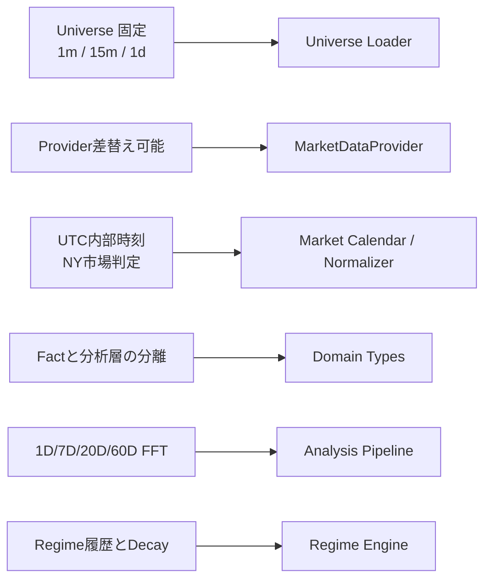
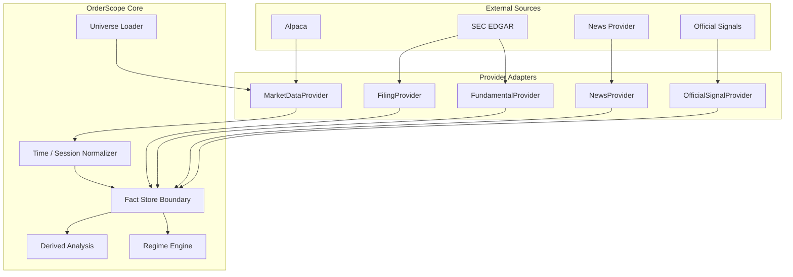
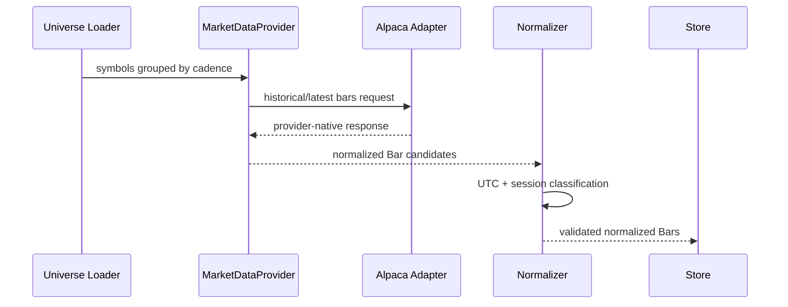

# OrderScope v0.1 Mermaid 利用レポート

Status: implementation-support report

本レポートは、OrderScope v0.1 において Mermaid をどのような目的で採用し、機能要件・概要設計・詳細設計・実装の各レイヤーをどのように接続したかを記録する。

Mermaid は Code of Truth を置き換える正本ではない。正本は `docs/stock_monitoring_v0.1_spec.md` とその3参照仕様であり、Mermaid は要件・責務・データフロー・実装先の対応関係を可視化する補助設計手段として扱う。

## 1. 採用目的

OrderScope は Market Data、News、SEC Filing、Official Signal、Fundamental、FFT、Regime など複数の責務を持つ。そのため文章仕様だけでは、次の関係が追跡しづらくなる。

- どの機能要件がどの設計責務へ対応するか
- どのProviderがどのCore境界へ接続するか
- どのデータがどの順番で正規化・保存・分析されるか
- どの詳細設計がどの実装ファイルへ落ちるか
- 実装変更がどのCode of Truth要件に由来するか

Mermaid はこれらの「接続」を可視化するために使用する。

## 2. レイヤーごとの利用方針

### 2.1 機能要件

目的は「何を満たす必要があるか」と「どの設計責務がそれを受け持つか」を接続することである。

主に `flowchart` を使用する。

例:



この層では、アルゴリズムやクラス内部構造までは表現しない。

### 2.2 概要設計

目的はシステムの責務境界とデータフローを表現することである。

主に `flowchart` と `subgraph` を使用する。

今回のv0.1では、以下を分離して可視化した。

- External Sources
- Provider Adapters
- OrderScope Core

例:



この図により、CoreがAlpacaなどのベンダ固有Schemaを直接参照しないProvider Boundaryを確認できる。

### 2.3 詳細設計

目的は、処理順序・interfaceの呼び出し関係・状態変化など、概要設計より具体的な動作を確認することである。

今回のFoundationでは `sequenceDiagram` を使用した。



このレイヤーでは、今後必要に応じて以下も利用する。

- `stateDiagram-v2`: Regimeのactive / inactive / reactivating等
- `classDiagram`: Domain Modelとinterface関係が複雑化した場合
- `erDiagram`: Fact StoreやRegime Historyの永続化Schemaが確定した場合

ただし、詳細設計図を先に作って未確定仕様を固定化しない。

### 2.4 実装レイヤー

Mermaidから実装ファイルへ直接追跡できるようにする。

現在の主な対応は以下。

| 要件・責務 | 実装先 |
|---|---|
| Universe / cadence | `config/universe.v0.1.yaml`, `src/orderscope/universe.py` |
| Provider Boundary | `src/orderscope/providers/market_data.py` |
| normalized Bar contract | `src/orderscope/domain/market.py` |
| Universe validation | `tests/test_universe.py` |
| UTC / Session | planned |
| FFT | later PR |
| Regime Engine | later PR |
| SEC / Fundamental | later PR |

Mermaidそのものからコードを生成することはv0.1では目的としない。目的は「このコードがどの設計責務を実装しているか」を人間とAI双方が追跡できる状態にすることである。

## 3. 今回実際に使用したMermaid

`docs/design/v0.1_traceability.md` に3種類を配置した。

1. 要件から実装への接続を示すFlowchart
2. External / Provider / Coreを分離した概要構成図
3. Market Data取得から保存までのSequence Diagram

これにより、次の流れを一貫して追跡可能にした。

```text
Code of Truth
    ↓
機能要件
    ↓
概要設計責務
    ↓
詳細設計 / interface / domain contract
    ↓
config / src / tests
```

## 4. Mermaidを正本にしない理由

Mermaidは構造や関係の理解には強いが、以下を完全に記述する用途には向かない。

- 詳細な例外条件
- 数値定義
- データ保持期間
- Provenance要件
- MUST / SHOULD等の規範
- 未確定事項と確定事項の境界
- FFT等の数式・前処理条件
- Regime Evidenceの意味論

そのため、OrderScopeでは文章仕様をCode of Truthとし、Mermaidは補助設計資料とする。

## 5. 優先順位と矛盾時の扱い

情報の優先順位は以下とする。

1. Code of Truth
2. 承認済み詳細仕様
3. Mermaid / traceability document
4. 実装コメント

MermaidとCode of Truthが矛盾した場合、Code of Truthを正とする。

Mermaidのみを変更して新しい機能要件を追加してはならない。

## 6. 変更運用

### 要件変更時

1. Code of Truthを変更する
2. 影響するMermaidを更新する
3. 対応する詳細設計を更新する
4. 実装とテストを変更する

### 実装のみ変更時

要件や責務境界が変わらないリファクタリングではCode of Truthを変更しない。

ただし、Mermaidが具体的な実装構造を指しており実態と乖離した場合は図を更新する。

## 7. 今後追加すべきMermaid

v0.1実装の進展に合わせ、次の図を追加する価値が高い。

### Market Session State / Classification

Regular、Premarket、After-hours、Holiday、Early Close、Missing/Gapの分類関係。

### Fact Pipeline

Raw Source → Extraction → Fact → Derived Metric → Interpretation / Prediction の境界。

### Regime State Diagram

Provisional → Revenue-based、active → inactive → reactivating等の状態遷移。

### Regime Evidence Sequence

News / SEC / Earnings / Segment RevenueがEvidenceとしてRegimeへ反映される順序。

### Persistence ER Diagram

Fact、Source、Instrument、Classification、Regime、Regime Evidence、Derived Metric、History間の永続化関係。

これらは対応する仕様が実装可能な粒度まで確定した時点で追加する。

## 8. 採用判断

OrderScopeではMermaidを継続利用する。

採用対象:

- レイヤー間トレーサビリティ
- コンポーネント境界
- データフロー
- Sequence
- State transition
- 永続化関係

非採用対象:

- Mermaidだけによる要件定義
- 数値仕様の正本化
- 未決事項を図で暗黙確定すること
- 実装コードの代替

## 9. 結論

Mermaidは、OrderScopeにおいて「仕様を記述する主媒体」ではなく、「異なる抽象度の設計を接続する媒体」として有効である。

特にAI駆動開発では、Code of Truthから実装へ直接ジャンプすると責務境界や由来が失われやすい。機能要件 → 概要設計 → 詳細設計 → 実装という中間構造をMermaidで明示することで、AI・人間双方が設計意図と実装の対応を確認しやすくなる。

v0.1ではこの運用を `docs/design/v0.1_traceability.md` と本レポートで開始し、今後のPRでも必要な図だけを追加する。