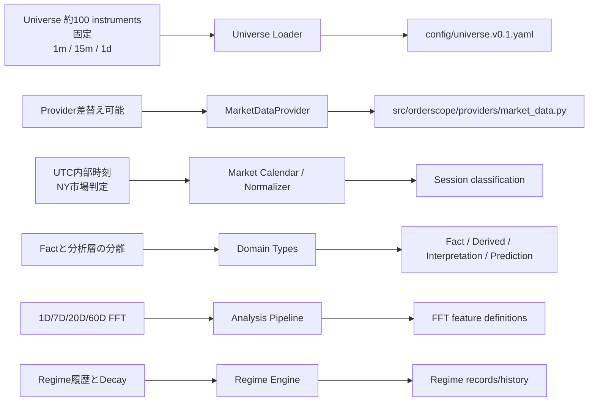
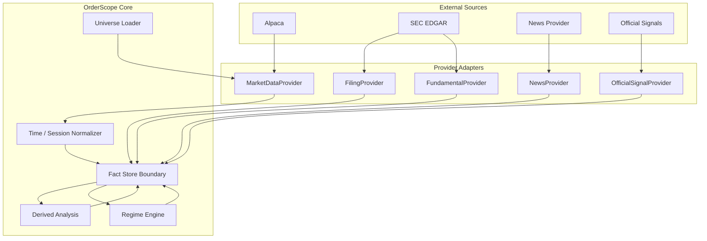
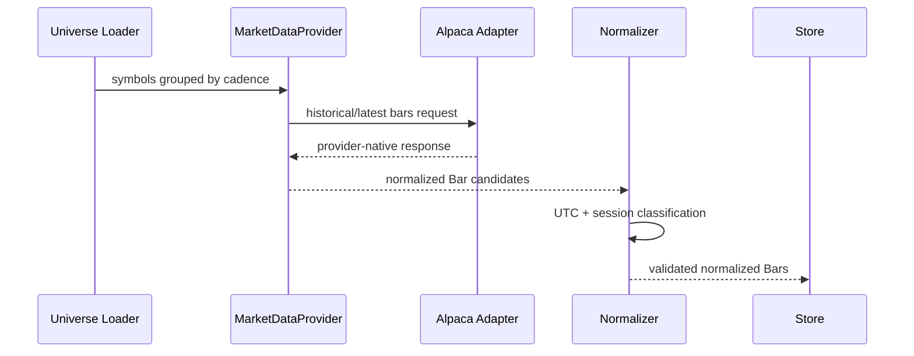

# v0.1 要件・設計・実装トレーサビリティ

Status: implementation-support document

この文書は Code of Truth を置き換えない。正本は `docs/stock_monitoring_v0.1_spec.md` とその3参照仕様であり、本書は要件から設計・実装へ落とした対応関係を可視化する補助文書である。

## 1. レイヤー方針

- 機能要件: Code of Truth が規定する「何を満たすか」
- 概要設計: 責務境界・データフロー・Provider境界
- 詳細設計: Domain model / interface / config / validation
- 実装: `src/`, `config/`, `tests/`

Mermaidは主に「接続」を表現し、文章仕様を代替しない。

## 2. 要件から実装への接続

## 3. 概要設計

## 4. Market Data 詳細接続

## 5. トレーサビリティ表

| Code of Truth | 概要設計責務 | 最初の実装先 | 状態 |
|---|---|---|---|
| Universe / cadence | Universe Loader | `config/universe.v0.1.yaml` | started |
| Provider Boundary | MarketDataProvider | `src/orderscope/providers/market_data.py` | started |
| UTC / Market Session | Normalizer | domain contract first | planned |
| Fact Model | Domain Types | domain contract first | planned |
| FFT | Analysis Pipeline | later PR | not started |
| Regime | Regime Engine | later PR | not started |
| SEC / Fundamental | Provider adapters | later PR | not started |

## 6. 変更ルール

1. 要件変更は先にCode of Truthへ反映する。
2. Mermaidだけで新しい要件を追加しない。
3. Mermaidと文章が矛盾する場合はCode of Truthを優先する。
4. 実装ファイルは対応する正本節または本トレーサビリティから追跡可能にする。
