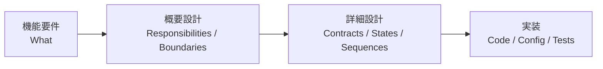
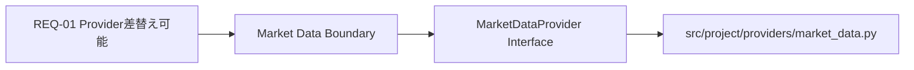
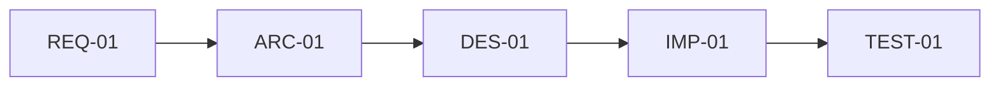
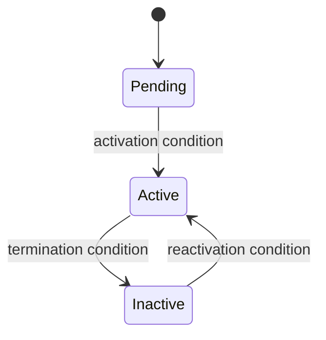
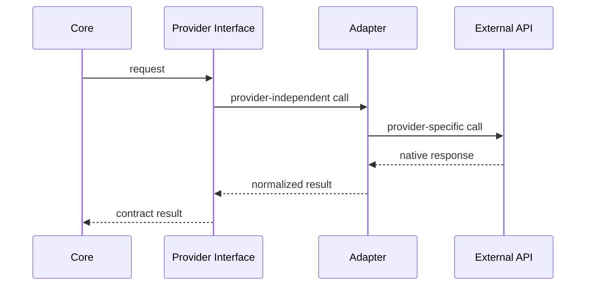

# Mermaid Design Legend

Status: reusable project standard

この文書は特定プロジェクト固有の仕様ではなく、機能要件・概要設計・詳細設計・実装を接続するためのMermaid運用凡例である。他プロジェクトへコピーして利用できる。

## 1. 目的

Mermaidは文章仕様を置き換えるためではなく、抽象度の異なる設計レイヤー間の接続を可視化し、要件の落とし漏れ・責務の重複・実装先不明を検出するために使う。

基本原則:

- 文章仕様が正本である。
- Mermaidは構造・接続・遷移・依存関係の可視化を担当する。
- Mermaidだけで新しい要件を追加しない。
- 図と文章が矛盾した場合は文章仕様を優先する。
- 実装変更により図が古くなった場合、図を正本化せず追従更新する。

## 2. 抽象度レイヤー



### 機能要件

表すもの:
- システムが満たすべき機能
- 入出力
- 制約
- 完了条件

推奨図:
- `flowchart`

図の役割:
- 要件から概要設計責務への対応を示す。

### 概要設計

表すもの:
- コンポーネント
- サービス境界
- 外部システム
- データフロー
- Provider / Adapter境界

推奨図:
- `flowchart`
- `subgraph`

図の役割:
- 誰が何を担当するかを示す。

### 詳細設計

表すもの:
- Interface / Contract
- 呼出順序
- 状態遷移
- Domain relation
- Persistence relation

推奨図:
- `sequenceDiagram`
- `stateDiagram-v2`
- `classDiagram`
- `erDiagram`

図の役割:
- 実装前に振る舞いと境界条件を検証する。

### 実装

表すもの:
- source path
- config path
- test path
- workflow / deployment path

Mermaidだけで表現せず、トレーサビリティ表と組み合わせる。

## 3. 図種の凡例

| Mermaid | 主用途 | 主なレイヤー | 避ける用途 |
|---|---|---|---|
| `flowchart` | 要件対応、データフロー、責務境界 | 機能要件 / 概要設計 | 細かい時系列 |
| `sequenceDiagram` | API呼出、非同期処理、処理順 | 詳細設計 | 静的な構造一覧 |
| `stateDiagram-v2` | 状態遷移、ライフサイクル | 詳細設計 | データ構造 |
| `classDiagram` | Domain型、Interface関係 | 詳細設計 | DB物理構造の代用 |
| `erDiagram` | 永続化EntityとCardinality | 詳細設計 | サービス責務 |

## 4. ノード命名規則

ノード名は抽象度を混在させない。

推奨:



避ける例:
- 「高速化する」など検証不能な曖昧語
- 要件ノードに具体的class名を直接混ぜる
- 実装ファイルを要件として扱う

IDの推奨prefix:
- `REQ-` 要件
- `ARC-` 概要設計
- `DES-` 詳細設計
- `IMP-` 実装
- `TEST-` テスト

## 5. 線の意味

標準では線の意味を増やしすぎない。

- `A --> B`: AがBへ直接つながる / 導出される
- `A -.-> B`: 補助的・予定・非必須の関係
- `A ==> B`: 強調が必要な主要経路に限定

プロジェクト独自の意味を線種に持たせる場合、必ず図の直前に凡例を書く。

## 6. レイヤー間トレーサビリティ

各主要要件は最低1つの概要設計責務へ接続し、その責務は詳細設計または実装先へ追跡可能にする。

推奨形:



補助として表も持つ。

| Requirement | Architecture | Detailed design | Implementation | Test | Status |
|---|---|---|---|---|---|
| REQ-01 | ARC-01 | DES-01 | IMP-01 | TEST-01 | planned |

## 7. 状態遷移図の使用条件

状態を持つDomainでは文章だけでなく`stateDiagram-v2`を推奨する。

対象例:
- order lifecycle
- job lifecycle
- subscription
- approval
- incident
- regime

例:



図には状態と遷移だけを置き、数値条件や例外規則は文章仕様側に残す。

## 8. Sequence Diagramの使用条件

複数責務間の処理順序が正しさに影響する場合に使う。

対象例:
- API request / response
- provider adapter
- transaction
- retry
- queue
- normalization pipeline



## 9. ER Diagramの使用条件

永続化するEntity・主キー・関係の理解が必要になった段階で使う。

論理設計では有効だが、index・partition・storage engineなどの物理設計をMermaidだけで決めない。

## 10. 更新ルール

設計変更時の推奨順序:

1. 正本文書を変更する。
2. 対応するRequirement IDを更新する。
3. Mermaidの接続を更新する。
4. 詳細設計 / Interfaceを更新する。
5. 実装を変更する。
6. Testを更新する。
7. Traceability上のStatusを更新する。

バグ修正で仕様変更を伴わない場合は、正本文書を不要に変更しない。

## 11. PRレビュー時のチェック

- 新しい要件が図だけに存在していないか。
- 要件から実装先まで追跡できるか。
- 実装された主要コンポーネントに対応する設計責務があるか。
- 状態遷移がコードと一致しているか。
- Sequence Diagramの順序が実装と一致しているか。
- 削除済みコンポーネントが図に残っていないか。
- 図が細かすぎてコードの複製になっていないか。

## 12. 推奨ディレクトリ構成

```text
docs/
  specification/       # 正本仕様
  design/
    traceability.md    # 要件→設計→実装
    architecture.md    # 概要設計図
    detailed/          # sequence/state/class/ER
  standards/
    mermaid_design_legend.md
```

既存プロジェクトでは無理にこの構成へ移動せず、意味上同等の場所へ配置してよい。

## 13. 導入最小セット

小規模プロジェクトでは次の3点だけで開始できる。

1. Requirement → Componentの`flowchart`
2. 重要な1フローの`sequenceDiagram`
3. Requirement / Implementation / Testのトレーサビリティ表

状態が複雑になった時だけState Diagram、永続化設計が必要になった時だけER Diagramを追加する。

## 14. 適用判断

Mermaidを追加する価値が高い条件:
- 3つ以上の責務が接続する
- 複数レイヤー間の対応が分かりにくい
- 処理順序が正しさに影響する
- 状態遷移がある
- 人間またはAIが設計を跨いで実装する

文章の方が適する条件:
- 数式
- 数値閾値
- 長い例外条件
- 法的 / 業務的定義
- acceptance criteriaの詳細

## 15. 正本性

この凡例そのものも各プロジェクトの要件を定義しない。
各プロジェクトは、この凡例を採用したうえで、そのプロジェクト固有のCode of Truth / Specificationを別途正本として持つ。
