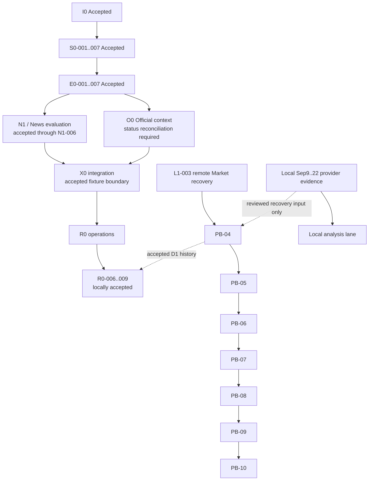

# OrderScope — Current Critical Path Reconciliation

Status: **CURRENT RUNTIME/PLANNING RECONCILIATION**
Date: 2026-09-23 JST
Branch: `l1-003-local-market-recovery`

## 1. Purpose

Reconcile the current critical path after the SEC/Earnings implementation lane
has reached E0-007 acceptance in a separate work session, while L1-003/PB and
R0 operational work continue on separate lanes.

This document does not replace the static dependency plan. It summarizes the
current controlling work and the safe parallel lanes.

## 2. Completed dependency spine

The former Corporate Intelligence implementation spine is no longer the
controlling path:

```text
I0
  -> S0-001..007
  -> E0-001..007
```

Treat S0/E0 as completed for current planning. That removes SEC/Earnings from
the blocking chain for downstream News/Official/Timeline work.

Known downstream accepted boundaries already recorded in the integrated
tracker include:

```text
N1-006 real-data News recall benchmark  ACCEPTED
X0-001..006 fixture/integration path    ACCEPTED
R0-001..009 local boundaries            ACCEPTED
```

Remote/live activation gates remain separate from local acceptance.

## 3. Current primary critical path

The controlling remote Market path is now L1-003 / PB:

```text
PB-04
bounded historical recovery / import
  ->
PB-05
prove contiguous remote coverage to the frozen handoff boundary
  ->
PB-06
unchanged normal scheduler handoff
  ->
PB-07
two clean normal scheduler opportunities
  ->
PB-08
freeze Phase-B entry packet
  ->
PB-09
separate authorization
  ->
PB-10
pause / exact-gap catch-up / safe-baseline restoration
```

Current remote truth:

```text
coverage key       NVDA|1Min|REGULAR|stock:iex:raw
checkpoint         version 18
complete through   2026-09-08T20:00:00.000Z
PB-04              IN PROGRESS
PB-05              BLOCKED on PB-04
PB-06+             GATED
```

Local provider evidence now exists through Sep 22, but it does not change the
remote checkpoint or PB state by itself.

## 4. Parallel lanes that are not on the primary CP

### A. Local analysis lane

```text
Local Sep9..Sep22 market bundle
  -> local loader / canonical analysis dataset
  -> FFT / volume / regime / correlation / price-discovery analysis
```

This lane may proceed without D1 mutation and without waiting for PB-04/PB-05.

Important: direct-provider local evidence is not automatically an L1-003 D1
export and must not be used to declare remote PB completion.

### B. R0 D1 hot-store lifecycle

```text
R0-006 retention contract
  -> R0-007 bounded D1 export/custody
  -> R0-008 ack/grace/purge eligibility
  -> R0-009 failure fixtures
```

The local/fixture acceptance boundary is complete. Remote R0-007/R0-008
operations remain change-window gated.

This lane is operational hardening, not a prerequisite for local analysis and
not a substitute for PB checkpoint recovery.

### C. Worker News activation

R0-005 has an accepted orchestration/evidence boundary, but live Worker News
activation remains a separately authorized change-window operation.

It is not on the current L1-003/PB critical path.

### D. R0-004 backup/restore

Backup/restore remains a separate recovery concern and must not be conflated
with R0-006..009 D1 drain/custody.

## 5. Status-reconciliation gap

The integrated Progress Tracker still contains older S0/E0-era text and does
not yet fully reflect the separate-session E0 completion.

Therefore:

- do not re-open S0/E0 implementation merely because the tracker text is stale;
- update the integrated tracker from the accepted S0/E0 evidence before the next
  formal milestone review;
- do not infer O0 completion unless task-specific acceptance evidence or the
  tracker explicitly confirms it.

If O0-001..005 are not yet accepted, they form a remaining **content-completion
lane**, but they do not block L1-003/PB remote Market recovery.

## 6. Current CP map



## 7. Priority order from here

1. **Primary CP:** continue L1-003/PB from PB-04 toward PB-05/PB-06.
2. **Parallel:** build/use the local market analysis path from the Sep9..22 bundle.
3. **Documentation reconciliation:** update the integrated Progress Tracker with
   accepted S0/E0 status and verify O0 status.
4. **Deferred live operations:** R0-005 activation and remote R0-007/R0-008
   remain separately gated.
5. **Do not block local analysis** on PB, D1 drain, or live News activation.

## 8. Decision rule

When choosing the next task:

- if the objective is **remote market continuity**, take the next PB task;
- if the objective is **analysis**, use the local bundle directly;
- if the objective is **long-term custody/storage cost**, take R0-006..009;
- if the objective is **full Corporate Intelligence content coverage**, reconcile
  O0 status and complete any missing O0 acceptance;
- if the objective is **production live operation**, open a separately reviewed
  change window for the relevant Worker/D1 action.
