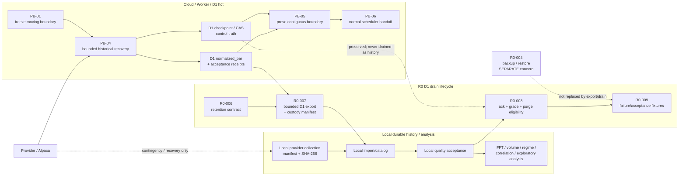

# OrderScope — L1-003 / PB and R0-006..009 Connection Map

Status: **PLANNING BASELINE — no remote mutation authorized**
Date: 2026-09-23 JST
Branch: `l1-003-local-market-recovery`

## Purpose

Connect the existing L1-003 / PB recovery plan to the existing R0-006..009 D1
hot-store drain lifecycle without changing either contract.

The two lanes solve different problems:

- **PB lane** restores remote Market coverage/checkpoint continuity so the
  unchanged normal scheduler can resume ownership.
- **R0-006..009 lane** moves already accepted D1 hot data into durable Local
  custody, proves quality/custody, then makes old D1 history purge-eligible.

Neither lane substitutes for the other.

## One-page connection map



## Responsibility boundary

| Area | Authority / durable role | May be redundant? | Key rule |
|---|---|---:|---|
| Provider historical data | External recovery source | Yes | Re-fetch is recovery, not internal custody |
| D1 `normalized_bar` hot history | Cloud hot acquisition state | Yes, temporarily | Keep until Local custody/quality is acknowledged |
| D1 checkpoint / CAS | **Remote control truth** | No competing writer | PB and R0 must preserve this state |
| D1 acceptance/idempotency evidence | Operational evidence | Yes, policy-dependent | Do not purge until retention contract permits |
| Local history/catalog | **Durable analysis/history custody** | Yes | Hash/manifest/quality required before D1 purge |
| Local direct-provider bundle | Contingency/recovery evidence | Yes | Does not advance PB checkpoint by itself |
| R0-004 backup | Disaster recovery copy | Yes | Export/drain is not a backup substitute |

## State-machine relationship

PB progression:

```text
PB-01 boundary freeze
  -> PB-04 remote accepted recovery
  -> PB-05 remote contiguous coverage
  -> PB-06 normal scheduler ownership
  -> PB-07+ stability / Phase-B readiness
```

R0 drain progression:

```text
PLANNED
  -> EXPORTED
  -> HASH_VERIFIED
  -> IMPORTED
  -> QUALITY_ACCEPTED
  -> ACKNOWLEDGED
  -> GRACE
  -> PURGE_ELIGIBLE
  -> PURGED
```

The join point is **accepted D1 market history**. PB creates/repairs that remote
history and checkpoint continuity. R0 exports that accepted hot history after
it exists. R0 must never fabricate PB completion by importing Local history
directly and jumping the checkpoint.

## Current Sep-2026 interpretation

Current known state:

```text
remote checkpoint          version 18 / Sep 8 close
PB-04                      IN PROGRESS
PB-05                      BLOCKED
local direct-provider data Sep 9..Sep 22 available
local Sep 11               reproducible sparse IEX session
Sep 22                     390 bars / accepted
remote mutation            none
```

The Local bundle is useful in two ways:

1. **Analysis immediately** — no D1 dependency is required.
2. **Recovery contingency** — it can be used as a reviewed provider substitute
   only if it is passed through the normal acceptance/checkpoint-CAS path.

It must not be treated as an R0-007 export because it did not originate from
D1. If later imported into D1 for PB recovery, that is a PB recovery/import
operation, not a D1 drain operation.

## Redundancy policy implied by the existing plans

Recommended steady-state interpretation:

```text
Provider
  -> Worker/D1 hot
      -> bounded export + manifest
          -> Local durable history
              -> analysis

During grace:
  D1 hot + Local durable = intentional redundancy

After acknowledgement + grace:
  old D1 history may become purge-eligible
  checkpoint/control truth remains in D1
  R0-004 backup remains separately maintained
```

Therefore redundancy is intentional but **time-bounded and role-specific**.
The design does not require permanent full duplication of all historical bars
inside D1.

## Decision rules

1. Local analysis never waits for PB-04/PB-05 if the required Local data is
   already accepted.
2. PB recovery may use Local provider evidence only through the existing
   normalization, acceptance receipt, missing-range and checkpoint-CAS
   contracts.
3. R0-007 exports D1-originated accepted data; direct-provider Local evidence
   is not retroactively called a D1 export.
4. R0-008 cannot purge checkpoint/control truth merely because bar history was
   copied Local.
5. R0-004 backup/restore remains independent of R0-006..009.
6. Exact D1 hot-retention and grace durations remain unresolved until measured
   storage/cost/replay evidence exists.

## Immediate planning consequence

Do **not** implement a raw JSON -> D1 direct insert path.

If remote PB recovery is later resumed, implement or reuse a local-evidence
provider adapter that feeds the existing acquisition executor so that:

```text
Local JSON
  -> normalizer
  -> acceptance receipts
  -> normalized_bar
  -> missing-range evaluation
  -> checkpoint CAS
```

remain unchanged.

For local analysis, continue reading the Local bundle directly and keep the PB
remote lane separately gated.
