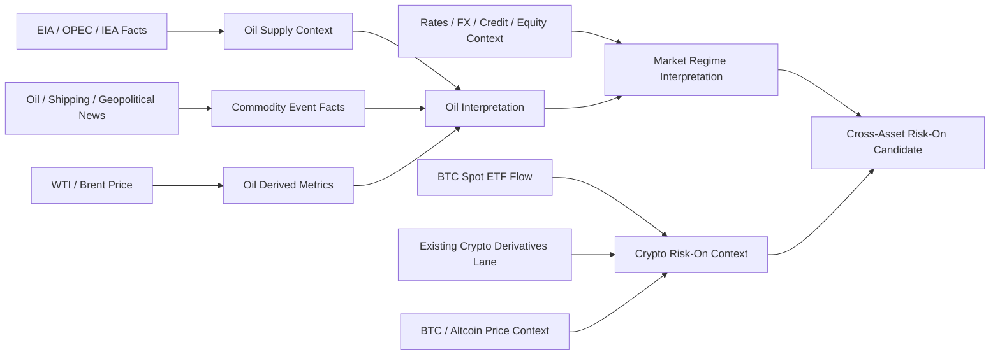

# OrderScope — BTC Risk-On / Oil / Commodity Market Structure Extension

Status: **WBS/CP-unreflected design input**
Date: 2026-09-22
Scope: Macro / Commodity Intelligence, Crypto Market Structure, Cross-Market Interpretation, Worker/D1 capacity

## 1. Purpose

This report captures the missing scope exposed by the 2026-09-22 BTC macro-analysis discussion: direct oil-market monitoring, oil-supply and geopolitical news normalization, BTC institutional spot-flow context, and a reusable cross-asset Risk-On interpretation path.

The source discussion used the following causal hypothesis as a motivating case:

```text
oil / geopolitical risk premium eases
  -> inflation / rate concern eases
  -> broad risk appetite improves
  -> BTC and high-beta assets reprice
```

That chain is **not** accepted as a Fact or a universal rule. OrderScope must preserve the existing Fact / Derived Metric / Interpretation / Prediction separation and validate each link independently.

The uploaded 2026-09-22 BTC report is a provenance source for the hypothesis only. Its claims about CLARITY Act interpretation, Hormuz routing, diplomatic intervention, ETF-flow support, and supply shock require independent source validation before promotion to project Fact.

## 2. Existing coverage and identified gaps

Existing project coverage already includes:

- BTCUSD, ETHUSD and crypto-linked equities.
- USO as a daily Macro / Cross-Asset instrument.
- XLE, XOM and CVX as energy-market context.
- rates / FX / carry-unwind work under the A0 / UWBS-011..015 lane.
- crypto derivatives and BTC leader/follower work under UWBS-036..047.
- News / Official Signal / SEC source boundaries.

Missing or incomplete coverage:

1. Direct WTI and Brent observation rather than ETF proxy-only oil context.
2. Structured EIA / OPEC / IEA supply-demand inputs.
3. Oil-specific supply-restoration, disruption, shipping, sanctions and infrastructure event normalization.
4. A source-grounded distinction between "oil down because supply risk eased" and "oil down because growth expectations deteriorated".
5. BTC spot ETF flow ingestion as a reusable Fact / Derived Metric path.
6. Cross-asset Risk-On / Crypto Risk-On interpretation that combines commodity, rates/credit/equity context and crypto-specific flow without collapsing them into one causal Fact.
7. Capacity acceptance for the additional Worker/Cron/D1 workload.

The existing crypto derivatives lane remains the contract owner for OI, funding, basis, liquidation and position-map work. This report does not duplicate UWBS-036 or UWBS-041..046.

## 3. Proposed architecture



The diagram is dependency structure, not causal proof.

## 4. Direct oil-market observations

### 4.1 Instruments

Add source-neutral Macro Instrument identities for:

- WTI
- Brent

USO remains a tradable ETF proxy and must not be treated as the canonical oil price.

Candidate cadence:

- acquisition: 1m or 5m depending on provider cost / terms;
- durable local analysis: session-aware intraday plus 1d;
- Worker/D1 hot-state retention: bounded and compatible with the existing D1-drain lifecycle.

### 4.2 Derived metrics

Candidate metrics:

- 1h / 1d / 5d / 20d return;
- realized volatility;
- drawdown from recent local high;
- breakout / failed-breakout state;
- WTI-Brent spread and change;
- price reaction around source-grounded supply/geopolitical events.

Do not encode a fixed USD 100 "oil ceiling". The 2026-09 case may be retained as a historical fixture; generic rules must use local high / breakout / drawdown semantics.

## 5. Commodity supply / official-source layer

Structured candidates:

- EIA Weekly Petroleum Status Report and related official series;
- U.S. crude inventory;
- gasoline / distillate inventory;
- U.S. crude production;
- crude imports / exports;
- refinery utilization;
- OPEC / OPEC+ official production policy;
- OPEC Monthly Oil Market Report;
- IEA Oil Market Report where terms and retrieval policy permit.

Proposed provider boundary:

```text
MacroDataProvider
CommodityFundamentalProvider
```

A later implementation may merge these interfaces if the accepted source adapters show no useful semantic distinction.

## 6. Commodity event taxonomy

Normalize source-grounded news / official releases into explicit event classes rather than generic "oil news":

- `SUPPLY_DISRUPTION`
- `SUPPLY_RESTORATION`
- `PRODUCTION_CUT`
- `PRODUCTION_INCREASE`
- `EXPORT_RESTRICTION`
- `EXPORT_RESUMPTION`
- `PIPELINE_OUTAGE`
- `PIPELINE_RESTART`
- `REFINERY_OUTAGE`
- `REFINERY_RESTART`
- `SHIPPING_DISRUPTION`
- `SHIPPING_NORMALIZATION`
- `SANCTION_CHANGE`
- `OPEC_POLICY_CHANGE`

Candidate entity / route context includes Hormuz, Red Sea, Suez, terminals, refineries, pipelines and major producing/exporting countries. Geographic or political context must not be converted into supply impact without explicit evidence.

## 7. Oil-down reason separation

"Oil down" must not directly produce Risk-On.

Minimum interpretation split:

```text
A. supply-risk easing candidate
   oil down
   + supply restoration / lower disruption evidence
   + credit/equity stabilization
   -> inflation/geopolitical premium easing candidate

B. growth-risk deterioration candidate
   oil down
   + growth-sensitive assets / credit weakening
   + demand-deterioration evidence
   -> growth-risk / risk-off candidate
```

Both remain Interpretation until evidence thresholds and historical fixtures are accepted.

## 8. BTC institutional spot-flow extension

UWBS-038 already surveys institutional-flow / market-structure sources. Missing implementation scope is normalization and acquisition of accepted BTC spot ETF flow observations.

Candidate facts:

- fund / issuer identity where available;
- trading date / as-of time;
- net flow;
- source / retrieval timestamp;
- revision status;
- aggregate flow with no double counting.

Candidate derived metrics:

- 1d / 5d cumulative net flow;
- flow acceleration / reversal;
- price-flow divergence;
- ETF-flow breadth across issuers.

ETF flow must not be described as the identity of all buyers, and flow values must not be naively added to derivatives OI or market-cap change as one "capital inflow" number.

## 9. Cross-asset market-regime interpretation

Candidate states:

- `RISK_ON_CANDIDATE`
- `RISK_OFF_CANDIDATE`
- `CRYPTO_RISK_ON_CANDIDATE`
- `INFLATION_RISK_CANDIDATE`
- `GEOPOLITICAL_SUPPLY_RISK_CANDIDATE`
- `GROWTH_RISK_CANDIDATE`
- `LIQUIDITY_EXPANSION_CANDIDATE`

Promotion / rejection must expose supporting, partial, contradictory and unknown evidence.

No state is a trading instruction.

## 10. Worker / D1 capacity impact

Capacity reference date: 2026-09-22.

Official Cloudflare limits used for this planning pass:

- Workers Free: 100,000 requests/day, 10 ms CPU/invocation, 50 subrequests/request, 5 Cron Triggers/account.
- Workers Paid Standard: 10 million requests/month included, 30 million CPU-ms/month included; paid limits allow up to 5 minutes CPU per ordinary invocation and up to 15 minutes for Cron Trigger / Queue Consumer execution; 250 Cron Triggers/account and 10,000 subrequests/request.
- D1 Free: 5 million rows read/day, 100,000 rows written/day, 500 MB max/database, 5 GB account storage, 50 queries per Worker invocation.
- D1 Paid: 25 billion rows read/month included, 50 million rows written/month included, 10 GB max/database, 1 TB account storage limit, 1000 queries per Worker invocation. First 5 GB stored is included; additional D1 storage is usage billed.

Official references:

- https://developers.cloudflare.com/workers/platform/limits/
- https://developers.cloudflare.com/workers/platform/pricing/
- https://developers.cloudflare.com/d1/platform/limits/
- https://developers.cloudflare.com/d1/platform/pricing/

### 10.1 Planning workload estimate — not measured usage

The following values are **engineering estimates**, not production measurements.

Assume:

- WTI + Brent at 1-minute cadence for approximately 23 h/day: about 2,760 raw price observations/day total.
- EIA/OPEC/IEA structured updates: low-frequency and negligible relative to minute data.
- oil/geopolitical news: metadata/event-driven; request load depends on provider polling design.
- BTC spot ETF flow: daily / low-frequency.
- existing crypto-derivatives proposal: 3 venues, BTC + one target asset, 5-minute OI/funding/basis snapshots: about 1,728 venue-symbol snapshot opportunities/day.
- if liquidation is persisted as 1-minute venue-symbol buckets for the same 3 venues x 2 symbols: up to about 8,640 bucket opportunities/day before normalization/deduplication.
- existing 106-instrument equity universe remains the dominant broad market workload; the accepted W1/R0 design already relies on batching, bounded D1 operations and local-history drain.

These counts are observation opportunities; actual D1 rows/writes can be higher when receipts, checkpoints, provenance and operational evidence are stored separately.

### 10.2 Most likely Free-plan pressure points

#### A. Cron Trigger count — **first structural limit if jobs are separated**

Free allows 5 Cron Triggers/account. The project already has market/news operational scheduling, and the extension naturally wants separate cadences for oil price, commodity official data/news, BTC ETF flow and crypto derivatives.

This limit can be avoided by keeping one or a few shared scheduler triggers and dispatching due jobs internally. If operational isolation requires separate schedules, Workers Paid removes the practical constraint by increasing the account limit to 250.

#### B. Worker CPU 10 ms/invocation — **high risk**

10 ms is small for a scheduler invocation that performs due-job selection, normalization, hashing, validation, checkpoint handling and multiple D1 operations across several source families. Network wait does not equal CPU time, but JSON parsing, loops, normalization, crypto/hash work and SQL-result processing consume CPU.

This must be measured with live/Canary metrics. The extension should not assume Free remains safe merely because request counts are low.

#### C. D1 queries per invocation / Worker subrequests — **high risk for one large shared tick**

Free D1 allows only 50 queries per Worker invocation and Workers Free permits 50 subrequests/request. Existing OrderScope work already uses explicit per-invocation D1 budgets and batching. Adding oil + macro + crypto jobs to the same due tick can exhaust the free per-invocation envelope even when daily totals remain low.

Paid raises D1 queries/invocation to 1000 and Worker subrequests/request to 10,000. Simultaneous outgoing connections remain 6 on both Free and Paid, so concurrency still requires bounded design.

#### D. D1 writes/day — **medium risk, especially after crypto expansion**

The 100,000 rows-written/day Free quota is probably not the first limit for the proposed initial oil + BTC ETF scope alone. It becomes material when 24/7 multi-venue crypto snapshots/liquidations, market bars, receipts/checkpoints and news events are retained together or the crypto symbol set expands.

Heavy historical analytics must remain local; Worker-side repeated historical scans would also threaten the 5 million rows-read/day Free limit.

#### E. D1 database size 500 MB — **long-run risk**

Minute bars plus continuous derivatives snapshots eventually make 500 MB/database a retention constraint. The accepted D1 hot-store -> local immutable custody -> bounded purge design is the correct mitigation. Paid increases per-database capacity to 10 GB but should not replace retention discipline.

#### F. Request/day — **low risk for the planned scheduler architecture**

100,000 inbound Worker requests/day is not expected to be the first bottleneck if Cron invokes a shared scheduler and provider subrequests are batched. Provider API quotas and D1/CPU limits are more likely to bind first.

## 11. Paid-plan recommendation boundary

### Workers Paid Standard

Planning recommendation: **the first paid tier to evaluate is Workers Paid Standard, minimum monthly billing USD 5**, not Workers for Platforms.

Why it is relevant to OrderScope:

- removes the practical 5-Cron account bottleneck (250);
- substantially relaxes per-invocation CPU;
- raises Worker subrequests/request from 50 to 10,000;
- raises D1 queries/invocation from 50 to 1000;
- converts D1 daily Free caps into large monthly included allowances;
- raises D1 database size from 500 MB to 10 GB.

Workers for Platforms at USD 25/month is not required for this architecture because OrderScope is not currently a multi-tenant platform executing user-owned Worker scripts.

### When to upgrade

Do not treat the USD 5 upgrade as automatically required by task count alone.

Recommended gate:

1. implement the new workload behind Shadow / dry-run scheduling;
2. measure per-tick CPU, subrequests, D1 queries, D1 rows read/written and daily storage growth;
3. upgrade before activation if any accepted normal workload would require:
   - more than 5 independent Cron Triggers; or
   - repeated near-limit CPU / D1-query operation; or
   - more than 100,000 D1 rows written/day after safe batching; or
   - retention incompatible with the 500 MB/database boundary.

Given the current 106-instrument scheduler plus planned multi-source macro/crypto expansion, Paid Standard should be treated as the **likely production tier**, while Free can remain useful for bounded development / Shadow validation.

## 12. WBS-unreflected task decomposition

### UWBS-048 — Direct WTI / Brent Macro Instrument contract and provider survey

Define source-neutral WTI/Brent identity, cadence, timestamps, revisions, accepted price fields and provider/terms/cost survey. Preserve USO as a proxy rather than canonical oil.

### UWBS-049 — Commodity official supply / fundamental acquisition

Implement/survey accepted EIA/OPEC/IEA structured facts for inventory, production, flows, refinery utilization and production policy with revision/provenance semantics.

### UWBS-050 — Commodity supply / shipping / geopolitical event taxonomy

Normalize source-grounded disruption/restoration, production, export, pipeline, refinery, shipping, sanctions and OPEC-policy events. No inferred physical supply impact may be stored as Fact.

### UWBS-051 — Oil-down-reason and inflation / growth-risk interpretation

Combine direct oil metrics, structured supply facts and existing rates/credit/equity context to distinguish supply-risk easing from growth-demand deterioration. Interpretation only.

### UWBS-052 — BTC spot ETF flow acquisition / normalization

Using the source decision from UWBS-038, ingest and normalize issuer/aggregate spot ETF flows, revisions and derived flow windows without double counting.

### UWBS-053 — Cross-asset Risk-On / Crypto Risk-On market-regime contract

Define evidence-backed cross-asset candidate states using commodity, macro, credit/equity, BTC flow, price and the existing crypto-derivatives lane. Preserve SUPPORT/PARTIAL/CONTRADICT/UNKNOWN.

### UWBS-054 — Oil/BTC cross-asset Canary + Worker/D1 capacity acceptance

Replay the 2026-09 motivating case and false positives, and measure the actual Worker/Cron/D1 resource envelope. Produce a go/no-go capacity finding for Free vs Workers Paid Standard without changing live Worker/Cron state.

## 13. CP candidate

```text
UWBS-048 -> UWBS-051
UWBS-049 -> UWBS-051
UWBS-050 -> UWBS-051

UWBS-038 -> UWBS-052
UWBS-036 / UWBS-041..045 -> UWBS-053
UWBS-051 -> UWBS-053
UWBS-052 -> UWBS-053

UWBS-053 -> UWBS-054
existing Worker/D1 instrumentation -> UWBS-054
```

This is a CP candidate only. It does not change the normative project critical path until a formal WBS/CP revision adopts it.

## 14. Explicit non-goals

- no trading recommendation;
- no assumption that lower oil is always Risk-On;
- no fixed USD 100 oil ceiling rule;
- no inference of trader identity from ETF, derivatives or time-zone data;
- no AIS/tanker-tracking implementation in this first extension;
- no duplication of existing crypto OI/funding/liquidation contracts;
- no live Worker/Cron/provider activation from this report.

## 15. Acceptance direction

The implementation is ready for formal WBS design when:

1. WTI/Brent and commodity-source provider boundaries are selected;
2. ETF-flow source terms/cost are recorded under UWBS-038/052;
3. event taxonomy and Fact-vs-Interpretation tests are frozen;
4. historical positive / negative / contradiction fixtures exist;
5. Shadow capacity measurements establish CPU, subrequest, D1-query/write/read and storage headroom;
6. the Free-vs-Paid activation decision is evidence-based.
